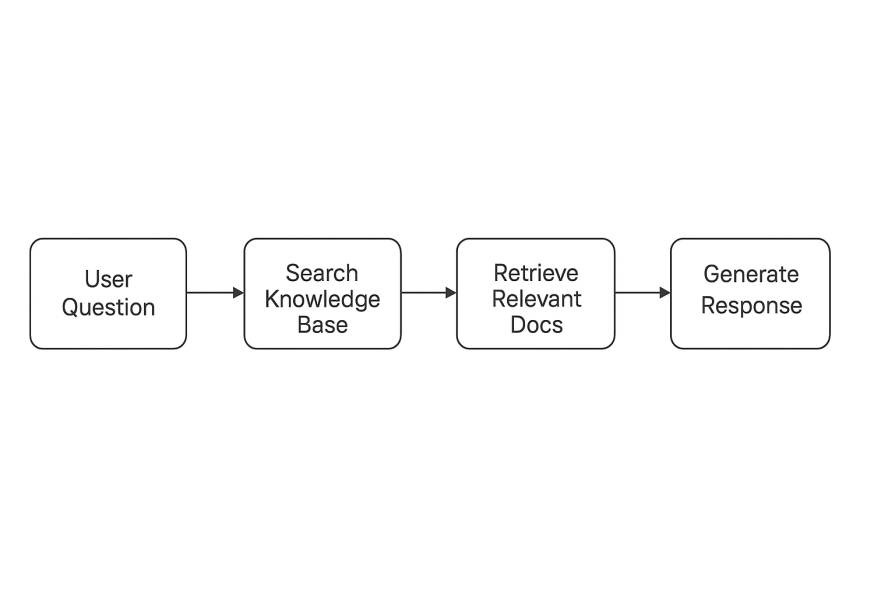

# 用 RAG 和 LangChain.js 打造更聪明的前端聊天机器人

> 原文： [How to build smarter frontend chatbots with RAG and LangChain.js](https://blog.logrocket.com/frontend-chatbots-rag-langchain/)
>
> 翻译： [樱吹雪](https://juejin.cn/user/1179091901098269)

大多数聊天机器人失败的原因很简单：它们忽略了用户的实际使用情况。想象一下，当你在浏览账户页面时寻求帮助，但机器人却回复了一个通用的常见问题解答（FAQ）。这很令人失望，因为它忽略了你所在应用内的位置、你使用的套餐计划或你刚刚执行的操作等细节。

这就是上下文的重要性所在。当聊天机器人理解了这些细节时，它就不再是障碍，而开始像一个真正的助手。

在本文中，我们将逐步介绍如何利用检索增强生成（RAG）和 LangChain.js 来构建一个能实现这个功能的聊天机器人。通过将你的知识库与来自应用的实时上下文相结合，你可以提供与每个用户情况相匹配的答案，无论他们是在免费试用、高级套餐，还是在浏览特定功能。到最后，你将拥有一个能够适应用户，而非强迫用户去迁就机器人的实用系统。

## 理解RAG（检索增强生成）

在开始编写代码之前，有必要先说明一下，与常规的聊天机器人设置相比，为什么 RAG 如此重要。

### 传统聊天机器人的问题

- **基于规则的系统**： 本质上就是决策树。虽然稳定可靠，但过于僵化。一旦问题超出了预设脚本的范围，机器人就会无能为力。
- **大模型（LLM）系统**： 即把每个问题都直接抛给 GPT-4（或类似模型）。虽然它们灵活且善于交谈，但它们并不了解你的产品、文档，也不清楚你的应用当前正在发生什么。

这两种方案都未达预期，因为它们都忽略了你的应用本身所拥有的丰富上下文信息。

### RAG 如何避免这些问题

RAG 采用了一种截然不同的方法，将问题拆分为两个步骤：

- **检索（Retrieval）**： 从你的知识库中提取最相关的信息。
- **生成（Generation）**： 让大语言模型（LLM）利用这些信息生成量身定制的回答。

这就像是与一位敏锐的研究助理合作：他们不需要死记硬背你产品的每一个细节，但当你提问时，他们确切地知道去哪里查找资料，并能清晰地加以解释。通过这种方式，你的聊天机器人既能立足于关键事实，又不会丧失自然流畅的对话能力。



## 为什么 RAG 对前端应用至关重要

- **准确性**： 聊天机器人不再提供笼统的回答，而是将回复建立在你真实的文档和产品知识基础之上。
- **定制化**： 如果需要添加新内容，只需更新知识库即可；无需进行昂贵的模型重训练。
- **性能**： 仅将最相关的片段传递给 LLM，从而保持快速的响应速度。
- **成本控制**： 更小的上下文窗口意味着发送给 API 的 Token 更少，从而直接降低了费用。
- **实时更新**： 文档或产品知识的任何变更，都会立即反映在聊天机器人的回答中。

这种组合使得 RAG 在那些同时看重速度与准确性的应用中，显得尤为强大。

## 什么是LangChain.js？

LangChain.js 是一个 JavaScript 框架，可以更轻松地使用大语言模型构建应用程序。最初的 LangChain 专注于 Python，但 JS 版本将相同的功能带到了前端和 Node.js 环境，非常适合构建 Web 应用程序且不想经历后端繁琐过程的情况。

以下是你将用到的关键构建模块：
- **链 (Chains)**：一种将数据传递经过多个步骤的管道 (pipeline)，其中的每一步都基于上一步的结果构建。
- **文档 (Documents)**：构成你知识库的结构化信息片段（如文档、常见问题解答或产品详情）。
- **检索器 (Retrievers)**：用于搜索这些文档并提取最相关内容的组件。
- **记忆 (Memory)**：一种在对话过程中维护上下文 (context) 的机制，确保机器人不会忘记之前的交互内容。
- **嵌入 (Embeddings)**：表示语义的数值向量，使系统能够在关键词不匹配的情况下也能找到相关内容。

### 为什么 LangChain.js 非常适合前端

- 模块化导入 (Modular imports) 可有效控制打包体积 (bundle size)。
- 浏览器 + Node.js 支持意味着同一套代码几乎可以在任何地方运行。
- TypeScript 支持提供了类型安全 (type safety)，从而减少运行时出现的意外错误。
- 异步优先 (Async-first) 设计天然契合 JavaScript 的事件驱动模型。

## 设计智能聊天机器人用户界面

在深入编写代码之前，先来看看智能聊天机器人的架构设计。一个具备上下文感知能力的 RAG聊天机器人通常按以下方式运作：

### 系统流程


- **上下文丰富化 (Context enrichment)**：将用户的提问与应用当前的运行状态（如当前路由、订阅等级、会话信息）相结合。
- **文档检索 (Document retrieval)**：使用经过丰富化处理的查询语句在知识库中进行搜索。
- **响应生成 (Response generation)**：将上下文信息和检索到的文档一并传递给大语言模型 (LLM)，以生成有理有据且量身定制的回答。
- **UI 更新**：在对话式界面中显示回答。

### 实战示例

1. 用户提问：在浏览“分析 (Analytics)”页面时问道：“我该如何制作自定义报告？”
2. 系统丰富上下文：“用户当前位于分析页面，订阅的是专业版 (Pro) 套餐，正在询问关于自定义报告的事宜。”
3. 检索器查找：搜索关于分析功能以及专业版套餐权益的相关文档。
4. 生成器回复：“鉴于您当前位于分析页面且使用的是专业版账号，您可以按照以下步骤创建自定义报告……”

## 存储与性能考量

为了确保系统在真实应用中具备实用性，存储和嵌入方面值得特别关注：

- 模型托管 (Model hosting)
  - 基于 API 的模型（如 OpenAI、Anthropic 等）通常是生产环境的最佳选择：它们能带来更小的打包体积和更好的性能。
  - 本地模型虽然可以在浏览器中运行，但会带来巨大的性能开销和资源负担。

- 向量存储选项 (Vector store options)
  - 内存 (In-memory)：非常适合快速开发，但不具备持久化能力（刷新即丢失）。
  - 浏览器存储 (IndexedDB)：适合需要持久化的小型数据集。
  - 服务端 (Server-side)：生产就绪的选项，如 Pinecone、Weaviate 或自托管数据库，适合需要高可扩展性的场景。
- 嵌入策略 (Embedding strategy)
  - 构建时 (Build-time)：为静态文档预先计算嵌入向量。
  - 运行时 (Runtime)：为用户创建的内容或动态内容实时生成嵌入向量。
  - 混合模式 (Hybrid)：根据内容类型，混合使用上述两种策略。

## 教程演练

让我们动手构建它吧。我们将搭建一个 SaaS 仪表盘，并配备一个能够感知用户当前位置及意图的支持聊天机器人。

### 第一步：创建项目

```sh
# 创建一个新的 Next.js 项目
npx create-next-app@latest smart-chatbot --typescript --tailwind --eslint
cd smart-chatbot

# 按照 LangChain.js 生态包
npm install langchain @langchain/openai @langchain/community
npm install @langchain/core
npm install faiss-node  # 生成环境向量存储
```

将你的 OpenAI API 密钥添加到 `.env.local` 文件中：

```env
NEXT_PUBLIC_OPENAI_API_KEY=your_openai_api_key_here
```

## 第二步：创建知识库

你的聊天机器人好坏取决于你提供给它的知识。这意味着需要清晰、结构化的文档。每个 `Document` 应描述一个功能或流程，元数据将有助于后续的检索。

```js
import { Document } from '@langchain/core/documents';

const knowledgeBase = [
  new Document({
    pageContent: `
      The Dashboard shows key metrics: active users, revenue, and system health. 

      Free plan:
      - Real-time metrics
      - Basic customization
      - Export to PDF

      Pro plan:
      - 12 custom widgets
      - Advanced filtering
      - Custom date ranges

      To customize widgets, click the gear icon on a card.`,
    metadata: { 
      source: "dashboard", 
      type: "feature_guide",
      user_levels: ["free", "pro", "enterprise"]
    }
  }),
  // …add analytics, billing, troubleshooting, etc.
];
```

编写文档时的几条经验法则

- 明确指出套餐（Plan）差异（这有助于上下文理解）。
- 保持清晰并分步骤描述。LLM 能够整合信息，但无法修复模糊不清的内容。
- 包含元数据（如来源 `source`、用户等级 `user_levels`）以提升检索精准度。

### 第三步：RAG 核心

现在，让我们来搭建聊天机器人的核心部分：构建一个 LangChain.js 管道，用于检索相关文档，并将这些文档连同用户上下文一起输入给模型。

```js
import { OpenAI } from '@langchain/openai';
import { PromptTemplate } from '@langchain/core/prompts';
import { RunnableSequence, RunnablePassthrough } from '@langchain/core/runnables';
import { StringOutputParser } from '@langchain/core/output_parsers';
import { MemoryVectorStore } from '@langchain/vectorstores/memory';
import { OpenAIEmbeddings } from '@langchain/openai';
import { formatDocumentsAsString } from 'langchain/util/document';

class ContextAwareRAGChatbot {
  constructor(openaiApiKey) {
    this.llm = new OpenAI({
      openAIApiKey,
      temperature: 0.7,
      modelName: "gpt-3.5-turbo",
      maxTokens: 500
    });

    this.embeddings = new OpenAIEmbeddings({
      openAIApiKey,
      modelName: "text-embedding-ada-002"
    });

    this.initializeVectorStore();
    this.createRAGChain();
  }

  async initializeVectorStore() {
    this.vectorStore = await MemoryVectorStore.fromDocuments(
      knowledgeBase,
      this.embeddings
    );
  }

  createRAGChain() {
    const retriever = this.vectorStore.asRetriever({ k: 3 });

    const contextPrompt = PromptTemplate.fromTemplate(`
      You are a helpful assistant for "DashboardPro".  

      CONTEXT:
      - Current page: {currentRoute}
      - Plan: {userPlan}
      - User: {userName}

      Use the context and knowledge base below to answer.  
      If you’re missing details, be upfront.  

      KNOWLEDGE:
      {context}

      QUESTION: {question}

      RESPONSE:
    `);

    this.ragChain = RunnableSequence.from([
      {
        context: (input) => this.contextualRetriever(input),
        question: new RunnablePassthrough(),
        currentRoute: (input) => input.currentRoute || 'unknown',
        userPlan: (input) => input.userPlan || 'Free',
        userName: (input) => input.userName || 'there'
      },
      contextPrompt,
      this.llm,
      new StringOutputParser()
    ]);
  }
}
```

### 第四步：上下文感知检索

这是我们让检索比"仅仅是语义搜索"更智能的地方。我们将根据用户的当前页面和套餐来提升相关性。

```js
async contextualRetriever(input) {
  const { question, currentRoute, userPlan } = input;

  const similarDocs = await this.vectorStore.similaritySearch(question, 5);

  const boostedDocs = similarDocs.map(doc => {
    let score = 0;
    if (doc.metadata.source === currentRoute) score += 0.3;
    if (doc.metadata.user_levels?.includes(userPlan.toLowerCase())) score += 0.2;
    return { ...doc, score };
  });

  const ranked = boostedDocs
    .sort((a, b) => (b.score || 0) - (a.score || 0))
    .slice(0, 3);

  if (userPlan === 'Free' && question.toLowerCase().includes('upgrade')) {
    ranked.push(new Document({
      pageContent: \`Pro ($29/month) unlocks advanced analytics and integrations. Enterprise ($99/month) adds unlimited usage and dedicated support.\`,
      metadata: { source: "billing", type: "upgrade_info" }
    }));
  }

  return formatDocumentsAsString(ranked);
}
```

为什么这样做有效：

- 语义相似度可用于查找广泛的匹配项。
- 加权使回答更具情境感知力（即更贴合具体场景）。
- 基于订阅计划的规则可避免向免费用户展示其未拥有的功能。

### 第五步：React UI

RAG 逻辑准备就绪后，让我们通过聊天界面将其呈现出来。以下是 Hook 的基础结构：

```js
function useContextAwareChatbot(apiKey) {
  const [chatbot, setChatbot] = useState(null);

  useEffect(() => {
    if (!chatbot && apiKey) {
      setChatbot(new ContextAwareRAGChatbot(apiKey));
    }
  }, [apiKey, chatbot]);

  const sendMessage = async (message, userContext) => {
    if (!chatbot) return null;
    return chatbot.ragChain.invoke({ question: message, ...userContext });
  };

  return { sendMessage };
}
```

然后将其封装在你的聊天 UI 的 React 组件中。

### 第六步：面向生产环境的增强功能

- 利用 `BufferMemory` 实现对话记忆，确保机器人不会忘记对话的上下文（Thread）。
- 持久化向量存储（例如 Faiss），避免每次启动应用时都需要重新构建嵌入。
- 兜底机制：如果 RAG 检索失败，引导用户查看文档或联系客服支持。

```js
async chat(question, userContext) {
  try {
    return await this.ragChain.invoke({ question, ...userContext });
  } catch (err) {
    console.error('Chatbot error:', err);
    return `Something went wrong. You can:  
    - Check our docs (/docs)  
    - Email support@yourapp.com  
    - Try rephrasing your question`;
  }
}
```

## 实际应用场景

我们构建的这套架构支持多种超越传统聊天机器人的强大用例。以下是一些你可以尝试的想法：

### 了解近期报错的 AI 客服助手


无需强迫用户描述具体问题，聊天机器人可以自动获取应用中最近发生的错误：

```js
// Track user errors in your app
const userContext = {
  recentErrors: [
    { type: 'api_connection_failed', timestamp: '2024-01-15T10:30:00Z' },
    { type: 'chart_render_error', page: 'analytics', timestamp: '2024-01-15T11:15:00Z' }
  ]
};

// Enhance the query with recent errors
if (input.recentErrors?.length > 0) {
  const errorContext = input.recentErrors.map(err =>
    `Recent error: ${err.type} on ${err.page || 'unknown page'}`
  ).join('. ');

  enhancedQuery = `${question}. Context: User recently experienced: ${errorContext}`;
}
```

现在聊天机器人可以说：“看起来您最近在‘分析’页面遇到了图表无法渲染的问题。让我们来看看如何解决它。”

### 智能新手引导助手

当机器人知晓用户的当前步骤时，引导新用户完成上手流程会变得更加顺畅：

```js
// Track onboarding progress
const onboardingContext = {
  completedSteps: ['account_created', 'first_login'],
  currentStep: 'data_connection',
  timeInApp: '5 minutes'
};

// Provide contextual onboarding help
if (onboardingContext.currentStep === 'data_connection' && 
    question.includes('connect')) {
  // Prioritize documents about connecting data sources
}
```

聊天机器人提供的是针对确切入门阶段的定制指导，而不是通用帮助。

### 个性化表单助手

没人喜欢跟表单较劲。具备上下文感知能力的辅助功能可以帮助实时解决验证问题。

```js
// Context-aware form assistance
const formContext = {
  currentForm: 'billing_settings',
  completedFields: ['company_name', 'email'],
  validationErrors: ['invalid_credit_card']
};

if (formContext.validationErrors.length > 0) {
  // Provide targeted guidance for fixing invalid inputs
}
```

聊天机器人可以指出问题所在，并逐步引导用户解决。

### 主动式功能发现

RAG 聊天机器人不必坐等用户提问——它们可以主动展示相关功能：

```js
// Suggest relevant features based on usage
const usageContext = {
  mostUsedFeatures: ['dashboard', 'basic_analytics'],
  planUpgradeOpportunities: ['advanced_filtering', 'custom_reports'],
  timeAsCustomer: '3 months'
};

if (usageContext.timeAsCustomer > '1 month' && 
    !usageContext.mostUsedFeatures.includes('analytics')) {
  // Suggest analytics features or upgrade opportunities
}
```

与其让用户自己摸索高级功能，聊天机器人会引导他们使用符合其需求的工具。

## 性能优化与最佳实践

### 打包体积管理

LangChain.js 虽然是模块化的，但你仍然需要留意导入方式和加载策略：

```js
// Import only what you need
import { OpenAI } from '@langchain/openai';
import { MemoryVectorStore } from '@langchain/vectorstores/memory';
// Avoid: import * from 'langchain'

// Lazy load the chatbot
const [chatbot, setChatbot] = useState(null);

const initializeChatbot = useCallback(async () => {
  const { ContextAwareRAGChatbot } = await import('./chatbot');
  const instance = new ContextAwareRAGChatbot(apiKey);
  setChatbot(instance);
}, [apiKey]);
```

### 缓存策略

通过缓存向量和回复内容，避免不必要的 API 调用：

```js
// Cache embeddings and responses
class CachedRAGChatbot extends ContextAwareRAGChatbot {
  constructor(apiKey) {
    super(apiKey);
    this.responseCache = new Map();
    this.embeddingCache = new Map();
  }

  async chat(question, userContext) {
    const cacheKey = `${question}-${userContext.currentRoute}-${userContext.user.plan}`;
    
    if (this.responseCache.has(cacheKey)) {
      return this.responseCache.get(cacheKey);
    }

    const response = await super.chat(question, userContext);
    this.responseCache.set(cacheKey, response);
    return response;
  }
}
```

### 错误监控

通过检测工具有助于追踪运行的成功与失败情况：

```js
// Add comprehensive error tracking
class MonitoredRAGChatbot extends ContextAwareRAGChatbot {
  async chat(question, userContext) {
    const startTime = Date.now();
    
    try {
      const response = await super.chat(question, userContext);
      this.logInteraction({
        question,
        responseTime: Date.now() - startTime,
        userContext,
        success: true
      });
      return response;
    } catch (error) {
      this.logError({
        error: error.message,
        question,
        userContext,
        responseTime: Date.now() - startTime
      });
      throw error;
    }
  }
}
```

## 结语

仅仅将 LLM（大语言模型）接入聊天窗口，并不能算作真正的智能助手。真正的价值在于聊天机器人对上下文的理解：用户当前所处的位置、他们试图完成的任务，以及他们已经获取了哪些信息。我们探讨的 RAG 架构展示了实现这一目标的路径：通过将知识库与实时应用上下文相结合，生成准确、相关且真正有用的回复。

### 核心要点

- **上下文至关重要**： 优秀的聊天机器人会主动适应用户，而非让用户去适应机器人。
- **RAG 为回复提供依据**： 通过直接从文档中提取内容，保证答案的可靠性。
- **LangChain.js 简化了流程编排**： 它负责处理链、检索器和向量，让你能专注于用户体验（UX）。
- **用户体验依然重要**： 快速的加载、清晰的错误提示以及灵敏的响应，与 AI 本身同样重要。
- **持续迭代**： 利用用户数据和监控反馈来指导改进。

### 后续实施建议

- 从小规模、特定领域的知识库入手，然后再逐步扩展。
- 尽早加入完善的错误处理和监控机制。
- 尝试不同的提示词模板并对比效果。
- 如果受众面向全球，请提前规划多语言支持。


