构建“巨石”：为13幕WebGL史诗打造可组合渲染系统

> 原文：[Building The Monolith: Composable Rendering Systems for a 13-Scene WebGL Epic](https://tympanus.net/codrops/2025/11/29/building-the-monolith-composable-rendering-systems-for-a-13-scene-webgl-epic/)  
> 作者：Ethan Chiu
> 日期：2025 年 11 月 29 日  
> 翻译：田八

探索如何通过可组合材质、粒子与过渡系统，将《巨石计划》（The Monolith Project）的风格化世界变为现实。


**免费课程推荐：** [通过34节免费视频课、分步项目和实操演示，掌握GSAP实现JavaScript动画。立即报名→](https://www.creativecodingclub.com/courses/FreeGSAP3Express?ref=0d0431)

为了构建这个包含 13 个不同场景的庞大项目，我们在React Three Fiber中开发了多个由可复用、可组合组件构成的系统：

- 延迟渲染与轮廓
- 可组合材质
- 可组合粒子系统
- 场景过渡系统

<iframe width="768" height="468" src="https://www.youtube.com/embed/7HvJ4jmq0bE" title="The Monolith Project" frameborder="0" allow="accelerometer; autoplay; clipboard-write; encrypted-media; gyroscope; picture-in-picture; web-share" referrerpolicy="strict-origin-when-cross-origin" allowfullscreen></iframe>

文章开篇概述项目的概念艺术与早期协作，随后分章节详解每个系统。这些章节阐述了延迟渲染和轮廓线背后的设计理念、可组合材质系统的结构、可组合粒子系统的逻辑，以及场景过渡的处理方法。

# 简介与概念艺术

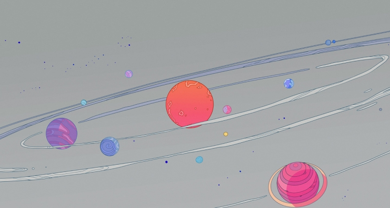

`Kehan` 通过一个朋友的朋友找到我。他对这个项目已经有了构想，并已邀请`Lin`绘制了几个场景插图。我告诉他我想要的团队配置，最终组建了一支完整的自由职业者团队：`Fabian`担任着色器开发人员，`Nando`担任创意人员，`Henry`担任`3D`艺术家，`Daisy`担任制片人，`HappyShip`在`Henry`休假期间也加入了团队。

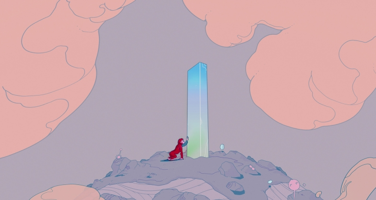

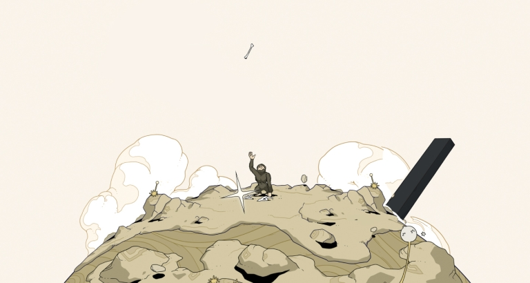

Lin的插画风格独特而富有创意，将其转化为3D模型的过程充满乐趣和挑战。团队日夜不停地讨论如何将这个项目落地，不断涌现出新的想法并分享参考资料——我的项目书签文件夹里现在已经收藏了超过50个链接。能够与这样一支充满热情和才华的团队合作，我感到无比荣幸和快乐。

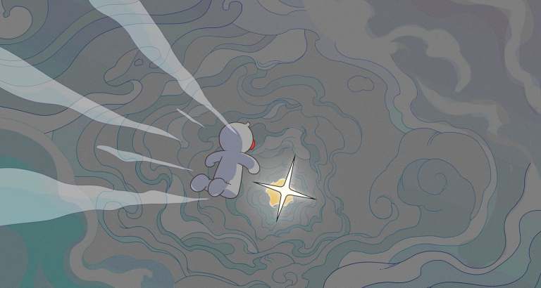

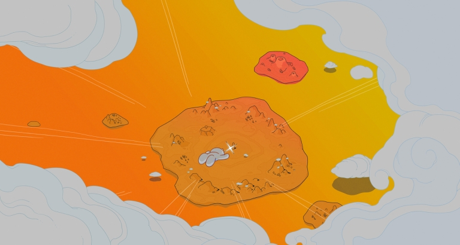

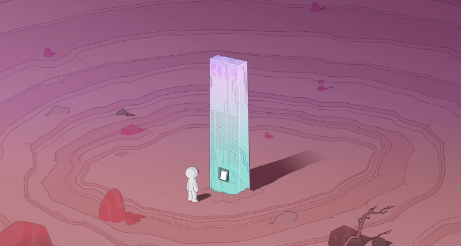

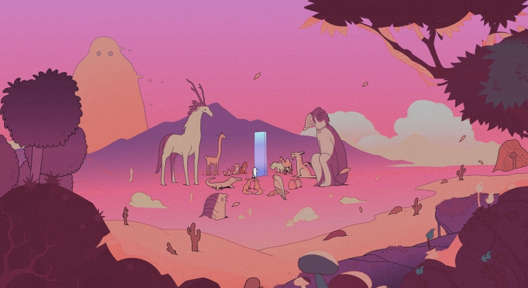

# 1. 延迟渲染与轮廓

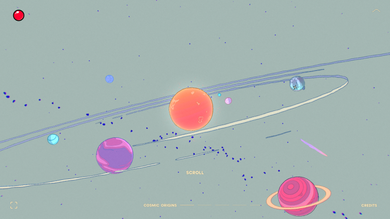

这种艺术风格的关键特征是使用彩色轮廓线。经过广泛的研究，我们找到了实现这一目标的三种主要方法：

1. 基于深度与法线的边缘检测
2. 逆壳法（Inverse Hull）
3. 基于材质ID的边缘检测


我们选择第一种方法，原因有二：逆壳法会导致相机远近变化时，相机靠近或远离物体都会导致轮廓宽度看起来变粗或变细。其次，材质ID则不适用于基于粒子的云朵。

# 法线处理

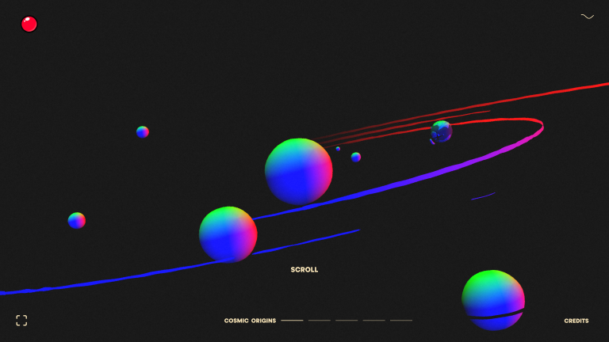

<center><a src="https://themonolithproject.net/?normal">https://themonolithproject.net/?normal</a></center>

在`Three.js`中使用延迟渲染时，需在`WebGLRenderTarget`中设置`count`（计数），每个`count`代表一个`G-Buffer`（几何缓冲区）。我们可为每个`G-Buffer`定义纹理类型与格式以减少内存占用。

在本例中，我们用`G-Buffer`存储法线，并采用[“八面体法向量编码”（octahedron normal vector encoding）](https://knarkowicz.wordpress.com/2014/04/16/octahedron-normal-vector-encoding/)的内存优化技术，该技术允许用更少的比特来编码法线，但代价是增加了编码和解码时间。

# 轮廓颜色

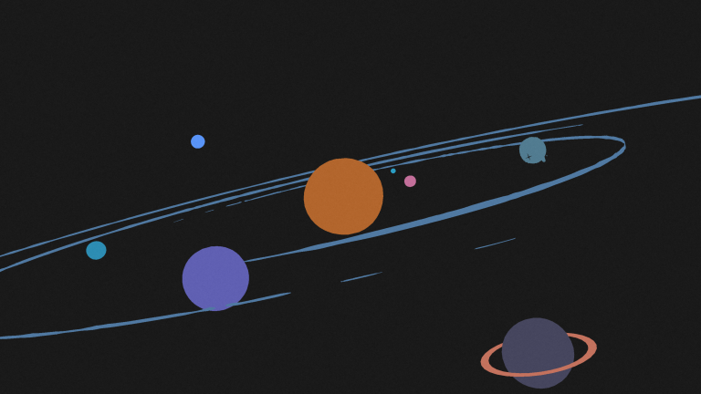

<center><a src="https://themonolithproject.net/?outlineColor">https://themonolithproject.net/?outlineColor</a></center>

我们希望不同物体有不同颜色轮廓，因此用额外`G-Buffer`存储。由于我们只使用了少量颜色，一种优化方法是使用颜色查找纹理，从而将`G-Buffer`减少到比特，但是，为了简化操作并方便调整，我们使用了完整的 `RGB` 色域。

轮廓生成

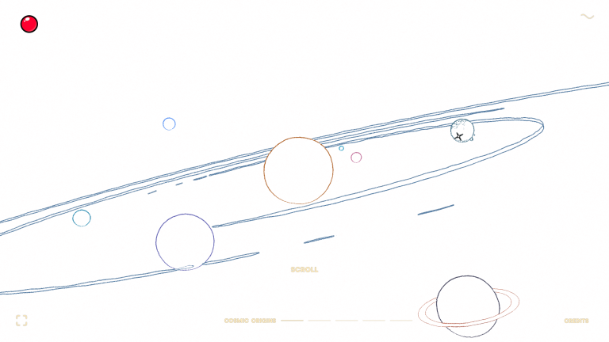

<center><a src="https://themonolithproject.net/?outline">https://themonolithproject.net/?outline</a></center>

准备好`G-Buffer`后，对深度与法线数据应用卷积滤波器检测边缘，再将轮廓颜色`G-Buffer`的颜色应用到边缘。[Maxime Heckel的《Moebius风格后处理》](https://blog.maximeheckel.com/posts/moebius-style-post-processing/)和[Visual Tech Art的《轮廓风格材质》](https://www.youtube.com/watch?v=Ptuw9mxekh0)等资源提供了巨大帮助。

# 注意事项

在使用`Three.js`中的`WebGLRenderTarget`的`count`属性有个问题：默认情况下，`MeshBasicMaterial`等核心材质不再渲染。需为`G-Buffer`位置赋值才能恢复显示。为避免污染缓冲区，可简单设置为自身值：

```glsl
layout(location = 1) out vec4 gNormal;

void main() {
  gNormal = gNormal;
}
```

# 2. 可组合材质

由于本项目包含许多场景，每个场景都有大量使用不同材质的物体，因此我希望创建一个系统，将着色器功能及其所需的任何数据和逻辑封装到一个组件中。这些组件可以组合起来形成材质。`React`与`JSX`让这种组合性变得直观，带来高效开发体验。

注：本项目开发于 2024 年初，当时 TSL（Three.js着色器库） 尚未推出。如今，开发方式可能会有所不同。

# GBufferMaterial

该系统的核心是组件`GBufferMaterial`。它本质上是一个`ShaderMaterial`带有有用统一变量和预计算值的组件，以及模块可以用来在其上添加额外着色器代码的插入点。

```glsl
uniform float uTime;
/// insert <setup>

void main() {
  vec2 st = vUv;

  /// insert <main>
}
```

# MaterialModule

本项目创建了大量可重用模块，以及一些定制的一次性模块。最基础的是`MaterialModuleColor`：

```jsx
export const MaterialModuleColor = forwardRef(({ color, blend = '' }, ref) => {
  // 颜色处理
  const _color = useColor(color);

  const { material } = useMaterialModule({
    name: 'MaterialModuleColor',
    uniforms: {
      uColor: { value: _color },
    },
    fragmentShader: {
      setup: /*glsl*/ `
        uniform vec3 uColor;
      `,
      main: /*glsl*/ `
        pc_fragColor.rgb ${blend}= uColor;
      `,
    },
  });

  useEffect(() => {
    material.uniforms.uColor.value = _color;
  }, [_color]);

  useImperativeHandle(ref, () => _color, [_color]);

  return <></>;
});
```

它只是简单地添加一个统一`uColor`值，并将其写入输出颜色。

# 使用示例

<video src="./img/monolith.mp4"></video>

以下是“巨石”物体的材质代码：

```jsx
<mesh geometry={nodes.MONOLITHClean.geometry}>
  <GBufferMaterial>
    <MaterialModuleNormal />
    <MaterialModuleOutline color={0x547694} />

    <MaterialModuleUVMap map={tUV} />
    <MaterialModuleGradient
      color1={'#71b3dd'}
      color2={'#acc9ad'}
      mixFunc={'st.y;'}
    />
    <MaterialModuleAnimatedGradient
      color1={'#71b3dd'}
      color2={'#acc9ad'}
      color3={'#ffffff'}
      speed={0.4}
      blend="*"
    />

    <MaterialModuleBrightness amount={2} />

    <MaterialModuleUVOriginal />
    <MaterialModuleMap
      map={tDetails}
      blend="*"
      oneMinus={true}
      color={lineColor}
      alphaTest={0.5}
    />

    <MaterialModuleFlowMap />
    <MaterialModuleFlowMapColor
      color={'#444444'}
      blend="+"
    />

  </GBufferMaterial>
</mesh>
```

这些都是通用模块，在整个网站的许多不同网格中重复使用。
- `MaterialModuleNormal`：将世界法线并写入法线`G-Buffer`
- `MaterialModuleOutline`：将轮廓色写入轮廓色`G-Buffer`
- `MaterialModuleUVMap`：基于纹理设置当前`st`值（影响后续用`st`的模块）
- `MaterialModuleGradient`：绘制渐变
- `MaterialModuleAnimatedGradient`：绘制动态渐变
- `MaterialModuleBrightness`：提亮输出色
- `MaterialModuleUVOriginal`：重置`st`为原始UV
- `MaterialModuleMap`：绘制纹理
- `MaterialModuleFlowMap`：添加流图纹理到`uniform`变量中
- `MaterialModuleFlowMapColor`：基于流图激活区域添加颜色

此外，还创建了影响顶点着色器的模块，例如：

- `MaterialModuleWind`：移动顶点实现风吹效果（用于树木、灌木）
- `MaterialModuleDistort`：扭曲顶点（用于行星）

借助该系统，复杂的着色器功能（例如风）被封装到一个可重用且易于管理的组件中。然后，它可以与其他顶点着色器和片段着色器模块结合使用，轻松创建各种各样的材质。

# 3. 可组合粒子系统
同样，“可组合、可复用”理念延伸至粒子系统。

## ParticleSystem

核心`ParticleSystem`组件用`WebGL`编写，包含用“乒乓渲染法”计算位置、速度、旋转和生命周期的逻辑。特性包括预热、自然启停（剩余粒子完成生命周期）、未使用的爆发模式。

与`GBufferMaterial`类似，位置着色器、旋转着色器和生命着色器都包含供模块使用的插入点。例如：

```glsl
void main() {
  vec4 currPosition = texture2D(texturePosition, uv);
  vec4 nextPosition = currPosition;

  if (needsReset) {
    /// insert <reset>
  }

  /// insert <pre_execute>

  nextPosition += currVelocity * uDelta;
    
  /// insert <execute>

  gl_FragColor = vec4(nextPosition);
}
```

支持两种模式：点集（points）或实例网格（instanced mesh）。

## ParticleSystemModule

系统受`Unity`启发，包含定义发射形状的模块以及影响位置、速度、旋转和缩放的模块。

## 发射模块

`EmissionPlane`模块允许我们根据平面的大小和位置来设置粒子起始位置。

`EmissionSphere`模块允许我们设置粒子在球体表面上的起始位置。

最强大的模块是`EmissionShape`模块。它允许我们传入几何体，并使用该几何体计算起始位置`MeshSurfaceSampler`。

## 位置/速度/旋转/缩放模块

其他常用模块包括：
- `VelocityAddDirection`（叠加方向速度）
- `VelocityAddOverTime`（随时间叠加速度）
- `VelocityAddNoise`（叠加噪声速度）
- `PositionAddMouse`：根据鼠标位置增加粒子数量，并且可以将粒子推离或拉向鼠标。
- `PositionSetSpline`：设置粒子跟随的样条路径，忽略速度。

# 小行星应用案例

<video src="./img/asteroids.mp4"></video>

例如，这就是小行星带：

```jsx
<ParticleSystem
  _key={_key}
  enabled={true}
  maxParticles={amount}
  lifeTime={[20, 200]}
  rate={amount / 200}
  looping={true}
  prewarm={true}
  geometry={geometry}
  speed={0.2}
>
  <EmissionSphere radius={2} />

  <PositionSetSpline
    debug={debug}
    randomRotation={true}
    spline={[
      new Vector4(-distance, 0, 0, 0.1),
      new Vector4(0, -distance, 0, 0.8),
      new Vector4(distance, 0, 0, 2),
      new Vector4(0, distance, 0, 0.8),
    ]}
    closed={true}
  />

  <RotationSetRandom speed={1.5} />

  <GBufferMaterial
    depthWrite={false}
    transparent={true}
  >
    <MaterialModuleWorldPos />
    <MaterialModuleParticle />
    <MaterialModuleMap map={tAsteroids} />
    <MaterialModuleColor color={color} blend="*" />
    <MaterialModuleFlowMap />
    <MaterialModuleFlowMapColor blend="+" />
  </GBufferMaterial>
</ParticleSystem>
```

粒子从一个小球发射出来，然后沿着随机旋转的样条路径运动。

它也适用于`GBufferMaterial`，允许我们使用相同的模块对其进行着色。这就是鼠标悬停流图应用于这个粒子系统的方式——这里也使用了与单体相同的材质模块。

# 落叶案例

<video src="./img/leafs.mp4"></video>

```jsx
<ParticleSystem
  _key={`SceneSwampOverview-Leafs`}
  enabled={true}
  maxParticles={32 * 32 * 0.5}
  looping={true}
  prewarm={true}
  lifeTime={20}
  rate={(32 * 32 * 0.5) / 20}
  geometry={leafGeometry}
  {...props}
>
  <EmissionShape geometry={leafEmitterGeometry} />

  <VelocitySetDirection direction={[0, -1, 0]} />
  <VelocityAddOverTime direction={[-0.1, 0, 0]} />

  <RotationSetRandom speed={[0.3, 3]} />
  
  <PositionGroundLimit y={0.4} />
  <RotationGroundLimit y={0.4} />

  <PositionUtilCamera />
  <PositionAddMouse distance={0.5} strength={0.03} />
  <PositionAddAttractor ref={refParticleAttractor1} geometry={monolithGeometry} strength={0} />

  <ParticleSystemSpriteMaterial map={tLeafs} cols={8} alphaTest={0.5} outlineColor={0x428385} />
</ParticleSystem>
```


# 4. 场景过渡系统

由于场景数量众多，且我们需要创建多种不同的转场效果，因此我们专门构建了一个用于场景转场的系统。项目中的每个转场效果都使用了这个系统，包括：

- **太阳系→行星**：向上擦除
- **行星→骨骼**：缩放模糊
- **历史→石板**：遮罩
- **石板→坠落**：遮罩
- **坠落→概览**：缩放模糊
- **沙漠→沼泽**：径向过渡
- **冬季→森林**：球体过渡
- **世界→结局**：遮罩

首先，我们使用延迟渲染绘制场景 A，包括深度和法线。然后，我们对场景 B 执行相同的操作。

接下来，我们使用一个全屏三角形，并为其添加一个材质来混合两个场景。我们创建了四种材质来支持所有的转场效果。


- `MaterialTransitionMix`（基础混合）
- `MaterialTransitionZoom`（缩放过渡）
- `MaterialTransitionRadialPosition`（径向过渡）
- `MaterialTransitionRaymarched`（光线追踪过渡）

其中最简单的是`MaterialTransitionMix`，但它功能也相当强大。它接收场景 A 的纹理、场景 B 的纹理以及一个额外的灰度混合纹理，然后根据 0 到 1 之间的进度值将它们混合在一起。

对于太阳系到行星的过渡，混合纹理是在运行时使用向上移动的矩形生成的。

<video src="./img/solar-planet.mp4"></video>

对于历史到石板的过渡，混合纹理也是在运行时生成的，方法是在特殊的遮罩模式下渲染相同的石板场景，将石板输出为从黑到白的范围。

<video src="./img/history-tablet.mp4"></video>

石板到坠落的过渡效果，以及世界到终结的过渡效果，都是以相同的方式处理的，即使用运行时生成的混合纹理。

<video src="./img/tablet-fall.mp4"></video>

<video src="./img/world-ending.mp4"></video>


# 延迟渲染，使其可组合

采用与可组合材质和粒子系统相同的插入技术，延迟渲染工作流程也实现了可组合性。

项目结束时，我们为延迟渲染系统创建了以下模块：

- `DeferredOutline`（轮廓）
- `DeferredLighting`（光照）
- `DeferredChromaticAberration`（色差）
- `DeferredAtmosphere`（大气，沙漠开场最明显）
- `DeferredColorCorrect`（色彩校正）
- `DeferredMenuFilter`（菜单滤镜）

# 用例

例如，太阳系场景包含以下模块：

```jsx
<RenderTextureDeferred>
  <DeferredChromaticAberration maxDistortion={0.03} />
  <DeferredLighting ambient={1} />
  <DeferredOutline depthThreshold={0.1} normalThreshold={0.1} />
  <DeferredColorCorrect />
  <DeferredMenuFilter />
  <SceneSolar />
</RenderTextureDeferred>
```

# 结语

这些系统具有封装性、可组合性和可重用性，有助于加快开发速度。

这意味着可以独立添加和测试各项功能。不再需要包含过多 `uniform` 变量和数百行 `GLSL` 代码的庞大材质文件。修复特定功能也不再需要跨多个材质复制代码。着色器所需的任何 `JS` 逻辑都与使用它的顶点或片段代码片段紧密耦合。

当然，由于这一切都是用 `React` 构建的，所以我们可以享受热重载功能。能够针对特定场景修改特定着色器并立即看到结果，这让工作流程更加有趣、轻松愉快且高效。
