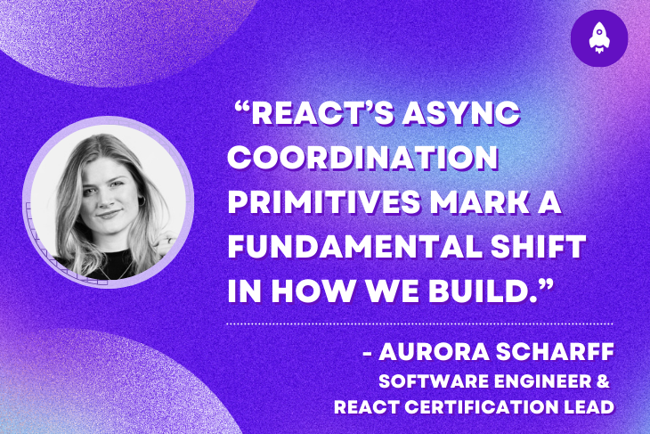

# React 的新时代已经到来：你需要知道的一切

> 原文： [The next era of React has arrived: Here&#39;s what you need to know](https://blog.logrocket.com/the-next-era-of-react/)
>
> 翻译： [嘿嘿](https://blog.heyfe.org/blog)

构建异步 UI 向来都是一件非常困难的事情。导航操作将内容隐藏在加载指示器之后，搜索框在响应无序到达时会产生竞态条件，表单提交则需要手动管理每一个加载状态标志和错误信息。每个异步操作都迫使你手动进行协调。



这不是一个性能问题，而是一个协调问题。现在，React 的原语声明式地解决了它。

对于开发团队而言，这标志着我们构建方式的一次根本性转变。React 不再需要每位开发者在每个组件中重新发明异步处理逻辑，而是提供了标准化的原语来自动处理协调。这意味着更少的 Bug、更一致的用户体验，以及更少的调试竞态条件的时间。

## React 的异步协调原语

在 React Conf 2025 上，来自 React 团队的 Ricky Hanlon 演示的 [Async React 示例](https://async-react.dev/)，展示了未来的可能性：一个包含搜索、标签页和状态变更的课程浏览应用，在快速网络下感觉即时，在慢速网络下也能保持流畅。UI 更新自动协调，不会闪烁。

这不是一个新库，而是 [React 19](https://blog.logrocket.com/react-19-2-is-here/) 的协调 API 与 [React 18 的并发特性](https://react.dev/blog/2022/03/29/react-v18#what-is-concurrent-react) 的结合。它们共同构成了 React 团队称之为 **“异步 React（Async React）”** 的完整系统，通过可组合的原语来构建响应式的异步应用程序：

-   **`useTransition`**：跟踪待处理的异步工作。
-   **`useOptimistic`**：在状态变更期间提供即时反馈（乐观更新）。
-   **`Suspense`**：声明式地处理加载边界。
-   **`useDeferredValue`**：在快速更新期间保持稳定的用户体验。
-   **`use()`**：使数据获取（和上下文读取）变得声明式。

理解这些部分如何协同工作是关键，它使我们能从命令式的异步代码转向声明式的协调。

## 问题：手动的异步协调

在这些原语出现之前，开发者必须手动编排每一个[异步操作](https://blog.logrocket.com/react-19-2-the-async-shift/)。表单提交需要显式的加载和错误状态：

```javascript
function SubmitButton() {
    const [isLoading, setIsLoading] = useState(false);
    const [error, setError] = useState(null);

    async function handleSubmit() {
        setIsLoading(true);
        setError(null);
        try {
            await submitToServer();
            setIsLoading(false);
        } catch (e) {
            setError(e.message);
            setIsLoading(false);
        }
    }

    return (
        <div>
            <button onClick={handleSubmit} disabled={isLoading}>
                {isLoading ? '提交中...' : '提交'}
            </button>
            {error && <div>错误：{error}</div>}
        </div>
    );
}
```

数据获取也遵循类似的命令式模式，使用 [`useEffect`](https://blog.logrocket.com/15-common-useeffect-mistakes-react/)：

```javascript
function UserProfile({ userId }) {
    const [user, setUser] = useState(null);
    const [isLoading, setIsLoading] = useState(true);
    const [error, setError] = useState(null);

    useEffect(() => {
        setIsLoading(true);
        setError(null);
        fetchUser(userId)
            .then(data => {
                setUser(data);
                setIsLoading(false);
            })
            .catch(e => {
                setError(e.message);
                setIsLoading(false);
            });
    }, [userId]);

    if (isLoading) return <div>加载中...</div>;
    if (error) return <div>错误：{error}</div>;

    return <div>{user.name}</div>;
}
```

每个异步操作都重复这个模式：跟踪加载状态、处理错误、协调状态更新。当这种模式扩展到几十个组件时，就会导致不一致的加载状态、被遗忘的错误处理，以及难以调试的微妙竞态条件。

## 原语详解

### **Actions 自动跟踪异步工作**

React 19 引入了 Actions 来声明式地处理异步协调。将一个异步函数包装在 [`startTransition`](https://react.dev/reference/react/useTransition) 中，可以让 React 跟踪整个操作：

```javascript
const [isPending, startTransition] = useTransition();

function submitAction() {
    startTransition(async () => {
        await submitToServer();
    });
}
```

`isPending` 标志在 Promise 解决之前一直为 `true`。React 会自动处理此状态，并且在 Transition 中抛出的错误会冒泡到错误边界（Error Boundary），而不是在分散的 `try/catch` 块中处理（你仍需自己处理预期的错误，如验证失败）。

React 将在 Transition 中调用的任何函数被称为 “Action”。命名约定很重要：为函数添加 “Action” 后缀表示它们运行在 Transition 中（例如，`submitAction`、`deleteAction`）。

以下是使用 Actions 重写的相同按钮：

```javascript
function SubmitButton() {
    const [isPending, startTransition] = useTransition();

    function submitAction() {
        startTransition(async () => {
            await submitToServer();
        });
    }

    return (
        <button onClick={submitAction} disabled={isPending}>
            {isPending ? '提交中...' : '提交'}
        </button>
    );
}
```

另一种选择是使用 React 19 的 `<form>` 组件，它可以通过接受一个 `action` 属性并将其自动包装在 Transition 中来为你处理：

```javascript
async function submitAction(formData) {
    await submitToServer(formData);
}

<form action={submitAction}>
    <input name='username' />
    <button>提交</button>
</form>;
```

与手动 Action 一样，错误仍会冒泡到错误边界。当你希望在 UI 中反映表单状态时，React 19 提供了表单实用程序：[`useFormStatus`](https://react.dev/reference/react-dom/hooks/useFormStatus) 让子组件可以访问表单的待处理状态，而 [`useActionState`](https://react.dev/reference/react/useActionState) 则允许你根据 Action 的结果更新组件状态（例如显示验证错误或“点赞”计数）。

相同的模式也适用于按钮、输入框和标签页等可复用组件。你的设计组件可以暴露 `action`、`submitAction` 或 `changeAction` 等 Action 属性，并在内部使用 Transitions 来管理待处理状态和其他异步行为。我们稍后将回到这个模式。

### **乐观更新提供即时反馈**

Actions 提供了待处理状态，但“待处理”并不总是正确的反馈。当你点击复选框来标记任务完成时，它应该立即切换。等待服务器的响应很可能会破坏流程导致竟态问题。

[`useOptimistic()`](https://react.dev/reference/react/useOptimistic) 在 Transitions 内部工作，用于在异步 Action 在后台运行时显示即时更新：

```javascript
function CompleteButton({ complete }) {
    const [optimisticComplete, setOptimisticComplete] = useOptimistic(complete);
    const [isPending, startTransition] = useTransition();

    function completeAction() {
        startTransition(async () => {
            setOptimisticComplete(!optimisticComplete);
            await updateCompletion(!optimisticComplete);
        });
    }

    return (
        <button onClick={completeAction} className={isPending ? 'opacity-50' : ''}>
            {optimisticComplete ? <CheckIcon /> : <div></div>}
        </button>
    );
}
```

复选框会立即切换。如果请求成功，服务器状态将与乐观更新匹配。如果失败，服务器状态保持旧值，因此复选框会自动恢复其原始状态。

与 `useState`（它会延迟 Transition 内部的更新）不同，`useOptimistic` 会立即更新。Transition 边界定义了乐观状态的生命周期：它仅在异步 Action 处于待处理状态时持续存在，一旦 Transition 完成，就会自动“落定”到事实来源（props 或服务器状态）。（注：简单说就是当 transition 为 pending 时 optimisticComplete 为 startTransition 中设定的值，而一旦 transition 完成即 pending 为 false 时，optimisticComplete 会放弃 startTransition 的状态而使用传入的值及为例子中的 complete）

### **Suspense 声明式地协调加载状态**

乐观更新处理了状态变更，但初始数据加载呢？`useEffect` 模式迫使我们手动管理 `isLoading` 状态。[`Suspense`](https://react.dev/reference/react/Suspense) 通过允许我们声明式地定义加载边界来解决这个问题。我们需要控制显示什么后备 UI 以及如何分割加载，因此应用的独立部分可以并行加载。

Suspense 与“支持 Suspense”的数据源协同工作：异步服务器组件、使用 `use()` API 读取的 Promise（我们接下来会介绍），以及像 [TanStack Query](https://blog.logrocket.com/using-tanstack-query-next-js/) 这样的库（它提供了用于缓存和去重的 `useSuspenseQuery`）。

以下是 Suspense 如何协调多个独立数据流：

```javascript
function App() {
    return (
        <div>
            <h1>仪表板</h1>
            <Suspense fallback={<ProfileSkeleton />}>
                <UserProfile />
            </Suspense>
            <Suspense fallback={<PostsSkeleton />}>
                <UserPosts />
            </Suspense>
        </div>
    );
}
```

每个组件都可以通过自己的后备方案独立挂起。父组件通过 Suspense 边界处理加载状态，而不是协调多个 `useEffect` 调用。但有个问题：当你触发导致组件重新获取数据的更新时（如切换标签页或导航），加载后备方案会再次显示，隐藏你已经看到的内容，并产生突兀的加载状态。

### **结合 Transition 与 Suspense**

将 Transition 与 Suspense 结合可以解决这个问题，它告诉 React 保持现有内容可见，而不是立即再次显示后备方案。以下是一个针对标签页切换的适配示例：

```javascript
function App() {
    const [tab, setTab] = useState('profile');
    const [isPending, startTransition] = useTransition();

    function handleTabChange(newTab) {
        startTransition(() => setTab(newTab));
    }

    return (
        <div>
            <nav>
                <button onClick={() => handleTabChange('profile')}>个人资料</button>
                <button onClick={() => handleTabChange('posts')}>帖子</button>
            </nav>
            <Suspense fallback={<LoadingSkeleton />}>
                <div style={{ opacity: isPending ? 0.7 : 1 }}>{tab === 'profile' ? <UserProfile /> : <UserPosts />}</div>
            </Suspense>
        </div>
    );
}
```

现在，加载后备方案仅在初始加载时显示。当你切换标签页时，Transition 会在新数据在后台加载时保持当前内容可见。不透明度样式使其变暗，以表示更新正在进行。一旦就绪，React 会自动无缝地换入新内容。没有突兀的加载状态，没有卡顿。

关键在于：Transitions 会“暂缓”UI 更新，直到异步工作完成，从而防止 Suspense 边界在导航期间回退到后备状态。像 Next.js 这样的框架使用此功能在新路由加载时保持页面可见。

### **`use()` 直接读取异步数据**

早些时候，我们看到了 Suspense 如何与“支持 Suspense”的数据源协同工作。[`use()` API](https://react.dev/reference/react/use) 就是这样的数据源之一：它为数据获取提供了 `useEffect` 的替代方案，允许你在渲染期间读取 Promise。

以下是用 Suspense 和 `use()` 重写的最初的 `useEffect` 示例：

```javascript
function UserProfile({ userId }) {
    const user = use(fetchUser(userId));
    return <div>{user.name}</div>;
}

function App({ userId }) {
    return (
        <ErrorBoundary fallback={<div>加载用户时出错</div>}>
            <Suspense fallback={<div>加载中...</div>}>
                <UserProfile userId={userId} />
            </Suspense>
        </ErrorBoundary>
    );
}
```

组件在读取 Promise 时挂起，触发最近的 Suspense 边界，然后在 Promise 解决时带着数据重新渲染。错误被错误边界捕获。与 Hooks 不同，`use()` 可以条件调用。

一个注意事项：**Promise 需要被缓存**。否则，每次渲染都会重新创建它。在实践中，你可以使用像 Next.js 这样处理缓存和去重的框架。

### **延迟值防止 UI 过载**

Actions 和 Suspense 处理离散的操作：点击、提交、导航。但快速输入（如搜索）需要不同的方法，因为你希望输入框即使在结果加载时也能保持响应。

一种方法可以是设计一个 `SearchInput` 组件，通过内部乐观状态保持输入响应，并在 Transition 中调用 `changeAction`，这样父组件只需传递 `value` 和 `changeAction`。

当你没有设计组件时，[`useDeferredValue()`](https://react.dev/reference/react/useDeferredValue) 提供了类似的拆分效果。虽然你可以用它来延迟昂贵的 CPU 计算（性能），但此处的目标是稳定的用户体验。

结合 Suspense、`use()` 和[ErrorBoundary](https://blog.logrocket.com/signals-fix-error-boundaries/)，我们可以获得完整的搜索体验：

```javascript
function SearchApp() {
    const [query, setQuery] = useState('');
    const deferredQuery = useDeferredValue(query);
    const isStale = query !== deferredQuery;

    return (
        <div>
            <input value={query} onChange={e => setQuery(e.target.value)} />
            <ErrorBoundary fallback={<div>加载结果时出错</div>}>
                <Suspense fallback={<div>搜索中...</div>}>
                    <div style={{ opacity: isStale ? 0.5 : 1 }}>
                        <SearchResults query={deferredQuery} />
                    </div>
                </Suspense>
            </ErrorBoundary>
        </div>
    );
}

function SearchResults({ query }) {
    if (!query) return <div>开始输入以搜索</div>;
    const results = use(fetchSearchResults(query));
    return (
        <div>
            {results.map(r => (
                <div key={r.id}>{r.name}</div>
            ))}
        </div>
    );
}
```

Suspense 后备方案仅在初始加载时显示。在后续搜索期间，`useDeferredValue` 会在新结果于后台加载时保持旧结果可见（通过 `isStale` 降低不透明度）。错误边界隔离了失败，即使数据请求失败，搜索输入也能保持功能正常。

## 综合应用：Async React 示例

到目前为止，我们分别了解了每个原语。[Async React 示例](https://async-react.dev/) 展示了当一个框架将它们整合到路由、数据获取和设计系统中时会发生什么：


尝试切换网络速度以查看 UI 如何适应：在快速连接下即时，在慢速连接下流畅。

### **路由器将导航包装在 Transitions 中：**

```javascript
function searchAction(value) {
    router.setParams('q', value);
}
```

更新搜索参数是异步的，会更改 URL 并触发数据重新获取，同时 Transition 会跟踪这一切。

### **数据层将** `use()` **与缓存的 Promise 结合使用：**

```javascript
function LessonList({ tab, search, completeAction }) {
    const lessons = use(data.getLessons(tab, search));
    return (
        <Design.List>
            {lessons.map(item => (
                <Lesson item={item} completeAction={completeAction} />
            ))}
        </Design.List>
    );
}
```

当数据加载时，组件会挂起，Suspense 在初始加载时显示后备方案，但在切换标签页和搜索期间，Transitions 会保持旧内容可见。

### **Design 组件暴露 Action 属性：**

```javascript
<Design.SearchInput value={search} changeAction={searchAction} />
```

`SearchInput` 在内部使用 `useOptimistic`，以便在新的 URL 的 Transition 处于待处理状态时立即更新输入值。`TabList` 同样乐观地更新选中的标签页。

命名约定（“changeAction”）表示传递的函数将在 Transition 中运行。

### **状态变更以相同方式工作：**

```javascript
async function completeAction(id) {
    await data.mutateToggle(id);
    router.refresh();
}
```

这个 `completeAction` 通过 `LessonList` 传递给 `Design.CompleteButton`，该按钮也暴露了一个 `action` 属性。该按钮在 Action 运行时乐观地更新完成状态。

---

这是一个简化版的课程应用示例：

```javascript
export default function Home() {
    const router = useRouter();
    const search = router.search.q || '';
    const tab = router.search.tab || 'all';

    function searchAction(value) {
        router.setParams('q', value);
    }

    function tabAction(value) {
        router.setParams('tab', value);
    }

    async function completeAction(id) {
        await data.mutateToggle(id);
        router.refresh();
    }

    return (
        <>
            <Design.SearchInput value={search} changeAction={searchAction} />
            <Design.TabList activeTab={tab} changeAction={tabAction}>
                <Suspense fallback={<Design.FallbackList />}>
                    <LessonList tab={tab} search={search} completeAction={completeAction} />
                </Suspense>
            </Design.TabList>
        </>
    );
}
```

协调发生在每个层面：

-   **路由**：导航被包装在 Transitions 中。
-   **数据获取**：数据层使用 Suspense 和缓存的 Promise。
-   **设计组件**：组件暴露“Action”属性以在内部处理乐观更新。

在快速网络上，更新是即时的。在慢速网络上，乐观 UI 和 Transitions 在没有手动逻辑的情况下保持响应性。原语的复杂性由路由器、数据获取设置和设计系统处理。应用代码只需将它们连接起来。

---

## 构建自定义异步组件

大多数应用可能会使用已经实现了这些模式的库中的组件。但你也可以自己实现它们来构建自定义异步组件。

这是一个针对 Next.js 的实用示例：一个与 URL 参数同步的可复用选择组件。

这对于过滤器、排序或任何你希望持久化在 URL 中的 UI 状态很有用：

```javascript
import { useRouter, useSearchParams } from 'next/navigation';

export function RouterSelect({ name, value, options, selectAction }) {
    const [optimisticValue, setOptimisticValue] = useOptimistic(value);
    const [isPending, startTransition] = useTransition();
    const router = useRouter();
    const searchParams = useSearchParams();

    function changeAction(e) {
        const newValue = e.target.value;
        startTransition(async () => {
            setOptimisticValue(newValue);
            await selectAction?.(newValue);

            const params = new URLSearchParams(searchParams);
            params.set(name, newValue);
            router.push(`?${params.toString()}`);
        });
    }

    return (
        <select name={name} value={optimisticValue} onChange={changeAction} style={{ opacity: isPending ? 0.7 : 1 }}>
            {options.map(opt => (
                <option key={opt.value} value={opt.value}>
                    {opt.label}
                </option>
            ))}
        </select>
    );
}
```

该组件在内部处理协调。父组件可以通过 `selectAction` 注入副作用：

```javascript
function Filters() {
    const [progress, setProgress] = useState(0);
    const [optimisticProgress, incrementProgress] = useOptimistic(progress, (prev, increment) => prev + increment);

    return (
        <>
            <LoadingBar progress={optimisticProgress} />
            <RouterSelect
                name='category'
                selected={selectedCategory}
                options={categoryOptions}
                selectAction={items => {
                    incrementProgress(30);
                    setProgress(100);
                }}
            />
        </>
    );
}
```

在这个例子中，进度条的乐观更新和路由器导航被协调在一起。传递给 `selectAction` 的任何内容都受益于相同的异步协调。命名约定（“Action”）表示它在 Transition 中运行，并且我们可以在内部调用乐观更新。

这就是 Async React 示例中设计组件使用的模式。`SearchInput`、`TabList` 和 `CompleteButton` 都暴露了 Action 属性，在内部处理 Transitions、乐观更新和待处理状态。

## 使用 `ViewTransition`（Canary）实现平滑动画

原语解决了更新 _何时_ 发生的问题，而 [`ViewTransition`](https://react.dev/reference/react/ViewTransition) 则解决了它们 _看起来如何_ 的问题。它包装了浏览器的 View Transition API，并专门在 React Transition（由 `useTransition`、`useDeferredValue` 或 Suspense 触发）内部更新组件时激活。

默认情况下，它在状态之间进行交叉淡入淡出，你也可以使用 CSS 自定义动画。

以下是 Async React 示例如何使用它为课程列表添加动画：

```javascript
return (
    <ViewTransition key='results' default='none' enter='auto' exit='auto'>
        <Design.List>
            {lessons.map(item => (
                <ViewTransition key={item.id}>
                    <Lesson item={item} completeAction={completeAction} />
                </ViewTransition>
            ))}
        </Design.List>
    </ViewTransition>
);
```

外层的 `ViewTransition` 在 Suspense 解析或在状态之间切换时（如显示“无结果”）为整个列表添加动画。每个项目上的内层 `ViewTransition` 为单个课程添加动画：搜索时，现有项目滑动到新位置，而新项目淡入，移除的项目淡出。

**注意：** `ViewTransition` [目前仅在](https://blog.logrocket.com/react-view-transitions-activity-api/) React 的 canary 版本中可用。

## 实际权衡

采用这些模式通常比它们所替代掉的手动逻辑更简单。你并没有增加复杂性；而是将协调工作丢给了 React。话虽如此，以 Transitions、乐观更新和 Suspense 边界的方式思考确实需要思维转变。

### **何时适用**

这些原语在具有丰富交互性的应用中表现出色：仪表板、管理面板和搜索界面。它们消除了整类的 Bug。竞态条件消失了。导航感觉无缝。你可以用更少的样板代码获得“原生应用”的感觉。

### **不要修复未损坏的东西**

如果 `useState` 和 `useEffect` 对你来说工作可靠，就没有必要拆除它们。如果你没有在处理竞态条件、突兀的加载状态或输入延迟，你就不需要解决不存在的问题。

### **迁移路径**

你可以选择渐进式的采用。下次构建具有复杂异步状态的功能时，可以尝试用 Transition 代替另一个 `isLoading` 标识。在即时反馈重要的地方添加乐观 UI。这些工具与现有代码共存，因此你可以逐个功能地采用它们。

## 结论：向声明式异步的转变

异步 React（Async React）是并发渲染和协调原语的结合，形成了一个用于处理异步工作的完整系统，而这在过去需要手动编排。

随着这些原语在整个生态系统中被采用，这种转变变得切实可行。在 React Conf 2025 上宣布的 [Async React 工作组](https://github.com/reactwg/async-react/discussions) 正在积极致力于在路由器、数据获取库和设计组件中标准化这些模式。

我们已经看到它的实际应用：

-   **路由器**（如 Next.js）默认将导航包装在 Transitions 中。
-   **数据库**（如 TanStack Query 和 SWR）深度集成了对 Suspense 的支持。
-   **设计系统**预计将跟进，暴露 Action 属性以在内部处理待处理状态和乐观更新。

最终，这将异步处理的复杂性从应用代码转移到了框架。你描述 _应该发生什么_（Action、状态变更、导航），而 React 协调 _它如何发生_（待处理状态、乐观更新、加载边界）。React 的下一个时代不仅是关于新功能；更是关于让无缝的异步协调成为应用功能的默认方式。
