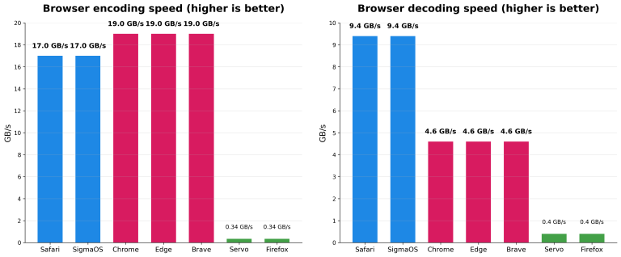

浏览器处理Base64数据的速度有多快？

> 原文：[How fast can browsers process base64 data?](https://lemire.me/blog/2025/11/29/how-fast-can-browsers-process-base64-data/)  
> 作者：Daniel Lemire  
> 日期：2025年11月30  
> 翻译：田八  

Base64是一种二进制到文本的编码方案，它使用由64个字符组成的字母表（A - Z、a - z、0 - 9、+、/），将任意二进制数据（如图像、文件或任何字节序列）转换为安全、可打印的`ASCII`字符串。浏览器在`JavaScript`中会用到它，用于将二进制数据直接嵌入代码或`HTML`中，或者以文本形式传输二进制数据。

最近，浏览器新增了处理Base64的便捷且安全的方法，即`Uint8Array.toBase64()`和`Uint8Array.fromBase64()`。尽管涉及多个参数，但归根结底就是编码和解码这两个函数。

```javascript
const b64 = Uint8Array.toBase64(bytes);      // 字符串          
const recovered = Uint8Array.fromBase64(b64); // Uint8Array
```

编码时，它从输入中取出24位数据。这24位数据被分成四个6位段，每个6位值（范围在0到63之间）会被映射到`Base64`字母表中的特定字符：前26个字符是大写字母`A-Z`，接下来的26个是小写字母`a-z`，然后是数字`0 - 9`，接着是第62个字符（+）和第63个字符（/）。当输入长度不是3字节的倍数时，会使用等号（=）作为填充字符。

它们的速度能有多快呢？

假设每个`CPU`周期处理3字节输入并生成4字节输出。在`4.5GHz`的频率下，编码成`Base64`的速度将达到`13.5GB/s`。我们预期反向操作（解码）的性能会低一些。编码时，任何输入都是有效的，任何二进制数据都可以。然而，解码时，我们必须处理错误并跳过空格。

[我编写了一个浏览器内的基准测试程序](https://simdutf.github.io/browserbase64/)。你可以在自己喜欢的浏览器中尝试一下。

我决定在我的苹果M4处理器上测试一下，看看不同浏览器的表现如何。我使用`64KB`的数据块进行测试。速度是针对二进制数据来测量的。

| 浏览器 | 编码速度 | 解码速度 |
|----|----|----|
|Safari | 17GB/s | 9.4GB/s |
|SigmaOS | 17GB/s | 9.4GB/s |
|Chrome | 19GB/s | 4.6GB/s |
|Edge | 19GB/s | 4.6GB/s |
|Brave | 19GB/s | 4.6GB/s |
|Servo | 0.34GB/s | 0.40GB/s |
|Firefox | 0.34GB/s | 0.40GB/s |



`Safari`的编码速度似乎比基于`Chromium`的浏览器（`Chrome`、`Edge`、`Brave`）稍慢，但其解码速度大约是这些浏览器的两倍。`Servo`和`Firefox`的性能同样不佳，而且出现了意想不到的结果，即它们的解码速度比编码速度快。我本可以测试其他浏览器，但大多数浏览器似乎是`Chromium`或`WebKit`的衍生版本。

作为参考，一台性能不错的笔记本电脑的磁盘读写速度可持续超过`3GB/s`。一些高端笔记本电脑的磁盘速度超过`5GB/s`。理论上，使用`Wi-Fi 7`时，你的`Wi-Fi`连接速度可能接近`5GB/s`。一些互联网服务提供商可能提供类似的网络速度，尽管你的互联网连接速度可能比这慢几倍。

大多数浏览器的速度比你想象的要快得多。它们的速度比网络或磁盘速度还要快。

**注意：** 基于`Chromium`的浏览器解码速度较慢，这似乎与`v8 JavaScript`引擎有关，该引擎会先将字符串解码到一个临时缓冲区，然后再从临时缓冲区复制到最终目标位置。（参见v8/src/builtins/builtins-typed-array.cc中的BUILTIN(Uint8ArrayFromBase64)。）

**注：** `Mozilla`的`Denis Palmeiro`告诉我，`Firefox`即将进行的更新将加快Base64函数的性能。我在 `Firefox nightly` 版本中测试发现，性能提高了约`20%`。