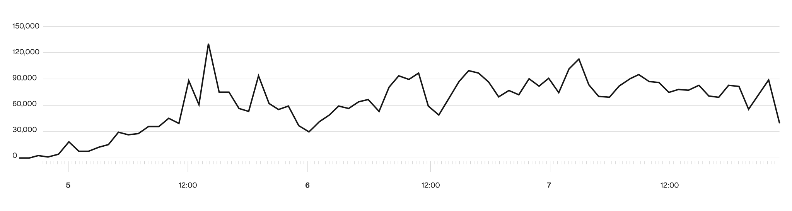
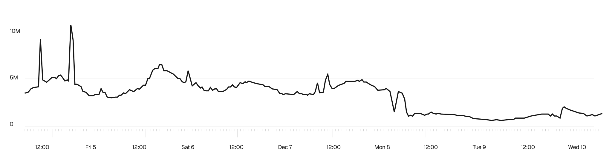
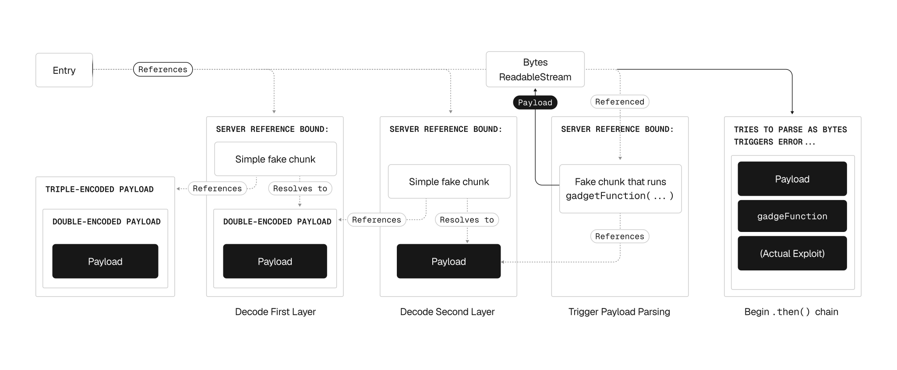

Vercel：我们为 React2Shell 发起了一项价值 100 万美元的黑客挑战

> 原文：[Our $1 million hacker challenge for React2Shell](https://vercel.com/blog/our-million-dollar-hacker-challenge-for-react2shell)  
> 作者：Malte Ubl  
> 日期：2025年12月19日  
> 翻译：田八  

在`React2Shell`漏洞披露后的数周内，我们的防火墙拦截了超过600万次针对运行存在漏洞版本`Next.js`部署的攻击尝试，其中在高峰期的24小时内就拦截了230万次。

这得益于`Seawall`，它是`Vercel Web`应用防火墙（`WAF`）的深度请求检测层。我们与116名安全研究人员合作，找出他们能想到的所有`WAF`绕过方法，支付了超过100万美元的赏金，并在48小时内发布了20个独特的`WAF`更新，因为不断有新方法被报告。他们发现的绕过技术现已永久集成到我们的防火墙，保护着平台上的每一项部署。

但`WAF`规则只是第一道防线。 **现在，我们首次披露了`Vercel`平台上针对远程代码执行（`RCE`）的另一层深度防御措施，** 该措施直接作用于计算层。这层深度防御提供的数据让我们有十足把握称，`WAF`在抵御`React2Shell`漏洞利用方面极为有效。

本文将介绍我们为保护客户所构建的防护措施，以及这对`Vercel`未来安全意味着什么。

# 我们正在防御的是什么

这个看起来怪异的攻击载荷让整个行业许多人都夜不能寐：

```json
{
  0: {
    status: "resolved_model",
    reason: 0,
    _response: {
      _prefix: "console.log('☠️')//",
      _formData: {
        get: "$1:then:constructor",
      },
    },
    then: "$1:then",
    value: '{"then":"$B"}',
  },
  1: "$@0",
}
```

<center>React2Shell漏洞利用示例概念验证（PoC）</center>

这就是`React2Shell`攻击载荷。将其发送到任何运行存在漏洞的`React`服务器组件的服务器上，`console.log('☠️')`字符串就会在服务器端执行。这个字符串可以被替换成几乎任何内容，比如运行程序、提取机密信息、发起网络调用。`CVE-2025-55182`的严重程度评分为10.0分（满分10分），情况糟糕透顶。

在`CVE`被负责任地披露后，倒计时开始。我们知道恶意攻击者会争分夺秒地利用该漏洞，因此在公众知晓问题之前，我们就与`AWS`、`Google`、`Microsoft`、`Cloudflare`、`Netlify`、`Fastly`、`Deno`等行业合作伙伴展开合作。这种相互协作意味着，在协调一致的公开披露之前，所有主要平台提供商都已采取了缓解措施，确保在他们发布补丁之前，尽可能多的用户都得到了保护。

但我们也知道接下来会发生什么。一旦漏洞被披露，安全研究人员、恶意攻击者和好奇的旁观者会开始检查受影响的代码路径，寻找绕过方法和相关漏洞。几天内，研究人员就在`React`服务器组件中发现了另外两个漏洞，需要更多补丁和`WAF`更新。


<center>在公开披露后的前 72 小时内阻止了利用漏洞的尝试</center>


<center>接下来一周内阻止了多次攻击尝试。</center>

我们需要能够适应变化的防御措施。

# 5万美元的赏金

与其等待 `WAF` 绕过漏洞在网络上出现，我们决定掌控补丁周期，并聘请世界上最好的安全研究人员为我们率先发现这些漏洞。

在做出决定后的几小时内，我们就在`HackerOne`上启动了公开的漏洞赏金计划。通常启动这样一个计划需要数周时间，`HackerOne`团队夜以继日地工作才得以实现。据联合创始人米希尔·普林斯（`Michiel Prins`）称，这是他们历史上最快的公开计划启动之一。

我们为每一种能绕过我们`WAF`防护的独特技术提供5万美元赏金。这笔赏金故意设置得很高，目的是引导研究人员将精力转向负责任的披露，而非在黑市上售卖，同时让那些原本会试探我们防御的人成为我们的合作者。

该计划奏效了。116名研究人员参与其中，提交了156份报告。计划结束时，我们验证了38份负责任的披露报告，为20种独特的绕过技术支付了100万美元赏金。我们将这些技术分享给了其他平台提供商，以便他们加强自身防御。我们的所学不仅保护了`Vercel`的客户。

# Seawall：强化我们的WAF

`Seawall`是我们`WAF`的深度请求检查层，检查请求载荷而不仅仅是请求头，在恶意模式到达您的应用之前就将其拦截。

每次收到`HackerOne`的报告后，我们都会遵循一个可重复的流程：重现绕过方法；将其转化为测试用例；更新规则以拦截该方法；全球部署；等待下一份报告；重复。在赏金计划启动后的头48小时内，我们为`Seawall`发布了20次更新，随着流程的优化，每个发现的平均响应时间从两小时缩短到三十分钟。

大多数报告在头24小时内提交，研究人员测试各种新奇变体。第二个24小时内提交的报告数量较少。随后几天，随着人们深入挖掘边缘情况，提交的报告数量逐渐减少，涉及的技术也越来越复杂。

让我们惊讶的是，人工智能在重现报告方面非常有用。提交内容通常依赖于细微差别，这些差别很容易被忽略，而且利用条件可能非常特定。现代人工智能模型非常善于梳理出这些细节，并将其转化为可重现的测试用例。每个验证通过的报告都变成了一个基于`Go语言`的单元测试，现在每当`Seawall`发生变化时，这些测试都会在持续集成（`CI`）环境中运行。研究人员在此次漏洞赏金计划中发现的技术，即使在赏金计划结束后，也将继续为用户提供保护。

# 进一步加强我们的深度防御策略

为进一步保护客户，我们部署了第二层防御措施，直接作用于计算层。这个运行时缓解层在应用内部运行，而非在`WAF`层。因此，它不依赖启发式规则，而是直接消除攻击所针对的代码评估途径。

`React2Shell`利用了`JavaScript`函数具有`constructor`属性，该属性可用于在运行时评估代码。运行时缓解措施在`React`渲染过程中禁止这种代码执行，从根本上破坏了攻击途径。我们预计合法应用永远不会使用这种能力，在试用该缓解措施时，我们未发现任何实际应用会触及此代码路径，因此我们知道部署它是安全的。

`Deno`团队率先部署了运行时缓解措施，他们乐于分享细节，这让我们对之前探索的方向更有信心。我们针对`Node.js`调整了实现方式，在大规模验证其部署安全性后，又将其分享给其他平台提供商，让他们也能从中受益。

我们设置了专用日志记录，以便在运行时缓解措施触发时立即启动，并自动向安全团队发出警报。如果攻击者找到一种在生产环境中实际有效的`WAF`绕过方法，运行时缓解措施会将其捕获，我们也会立即知晓。

如今，这一缓解措施覆盖了`Vercel`上96%的流量。通过第二层防御措施的日志记录，我们实际上知道`WAF`在实践中何时被绕过，因此我们有十足把握称，`Vercel`的`WAF`在抵御`React2Shell`漏洞利用方面极为有效。

# 阻止最复杂的绕过方法

`HackerOne`项目吸引了来自世界各地的优秀研究人员。感谢所有参与者，是你们的付出让`Seawall`变得更加强大。

保护`React2Shell`免受攻击的`WAF`的核心任务是识别恶意载荷，同时允许合法载荷通过。由于无法实际执行恶意代码进行检查，因此必须依靠模式匹配和解析。对于研究人员来说，这意味着要找到隐藏攻击以躲避模式匹配的方法。

[拉赫兰·戴维森（`Lachlan Davidson`）](https://github.com/lachlan2k/)是`React2Shell`的最初发现者，他和研究伙伴[西尔维（`Sylvie`）](https://hackerone.com/sy1vi3)提交了两种绕过方法，我们想在此详细介绍。它们既体现了构建安全`WAF`面临的挑战，也展示了安全研究人员的创造力。

# 递归UTF编码

许多绕过方法试图通过用`JSON`中的`Unicode`表示替换常规字符来迷惑解析器。这相对容易进行规范化处理，大多数 `Web` 应用防火墙 (`WAF`) 默认都会这样做。

但如果你能对`Unicode`编码再进行`Unicode`编码呢？然后再重复一次呢？

拉赫兰和西尔维发现了一种利用漏洞工具，它可以强制`React`飞行协议对同一字符串进行多次`JSON`解码。任何能够抵御`N`层`Unicode`编码的 `Web` 应用防火墙 (`WAF`) ，都可以通过使用该工具`N + 1`次来绕过。`Seawall`现在会递归解码，直到载荷完全规范化，从而彻底关闭了这类绕过途径。

值得注意的是，这类绕过方法以及其他类似方法还依赖于`JavaScript`内置`ReadableStream`类的极其细微行为，该类可以构造错误的流块，这些流块与默认行为相反，不会终止流处理，然后利用流错误消息中的字符串化特性，将其转化为函数调用漏洞利用工具。



# 不使用冒号访问constructor属性

`React2Shell`的核心远程代码执行（`RCE`）工具通过`React`飞行协议的基于冒号的属性访问语法访问函数的`constructor`属性。这就是为什么攻击中包含字符串`:constructor`，`WAF`防护也是基于检测这个字符串来识别恶意载荷。

一种绕过方法可能是找到一条完全不同的不使用`constructor`属性的攻击链，但至今无人找到。拉赫兰找到了另一种方法：从`:constructor`变为`constructor`。注意缺少冒号了吗？

他们通过发现一种使用特定于`RSC`解析的`webpack`模块的类似工具进行属性访问和字符串操作来实现这一点。`WAF`可以通过针对攻击链上游的字符串来检测这种方法，但这表明攻击者在混淆有效载荷方面拥有强大的能力，其效果远超最初的概念验证。

# 帮助客户升级：将安全作为产品体验

深度防御争取了时间，但真正的解决方案是促使用户升级。我们发布了[安全公告](https://vercel.com/kb/bulletin/react2shell)，作为权威信息来源；在仪表盘上添加横幅，帮助识别存在漏洞的部署；提供命令行工具（`npx fix-react2shell-next`）帮助修补存在漏洞的应用；通过`Vercel Agent`实现自动提交 `PR`，尽可能自动化这一过程。

# 展望未来

`React2Shell`以我们无法模拟的方式考验了我们的安全基础设施。我们从中获得了经过实战检验的`WAF`、一个可针对未来漏洞进行调整的运行时防御层，以及应对下一个关键`CVE`的应对方案。

研究人员在`HackerOne`计划中发现的绕过技术现已永久集成我们的防火墙。这项跨行业合作树立了平台在网页遭受攻击时如何协作的典范。帮助客户升级的工具现在成为我们应对任何安全事件的一部分。

但平台防护只能争取时间。它们是第一道防线，而非补丁的替代品。如果您正在运行存在漏洞版本的`Next.js`，请立即打补丁。

下一个关键漏洞将会出现，当它出现时，`Vercel`客户可以放心，在他们打补丁期间，我们会有防护措施到位。

# 致谢

首先，感谢[拉赫兰·戴维森（Lachlan Davidson）](https://github.com/lachlan2k/)负责任地披露了`React2Shell`漏洞。他在披露后继续试探我们的防御，并提交了一些我们见过的最复杂的绕过方法。

感谢每一位参与我们`HackerOne`计划的研究人员：hakikiwidya、[luhko](https://hackerone.com/luhko)、[lachlan2k](https://hackerone.com/lachlan2k)、[sy1vi3](https://hackerone.com/sy1vi3)、[maple3142](https://hackerone.com/maple3142)、[hacktronresearch](https://hackerone.com/hacktronresearch)、[bugra](https://hackerone.com/bugra)、[lonecat](https://hackerone.com/lonecat)、[ryotak](https://hackerone.com/ryotak)、[ch1axan](https://hackerone.com/ch1axan)、[chilaxan](https://hackerone.com/chilaxan)、[cjm00n](https://hackerone.com/cjm00n)、[francisconeves97](https://hackerone.com/francisconeves97)、[phithon](https://hackerone.com/phithon)、[shubs](https://hackerone.com/shubs)和[hashkitten](https://hackerone.com/hashkitten)。

没有以下合作伙伴，我们的应对措施不可能成功：

- `HackerOne`动员团队在不到六小时内启动了我们的漏洞赏金计划。这一过程通常需要数周时间。
- `Latacora IntrusionOps`提供了关键的事件响应支持，帮助我们在收到提交内容时进行分类、验证和重现。

特别感谢`Vercel`首席财务官[马滕·亚伯拉罕森（Marten Abrahamsen）](https://www.linkedin.com/in/martenabrahamsen)批准了100万美元的赏金支出。