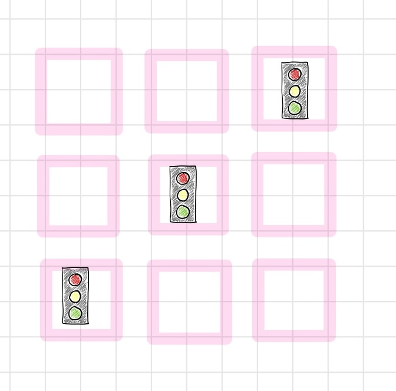
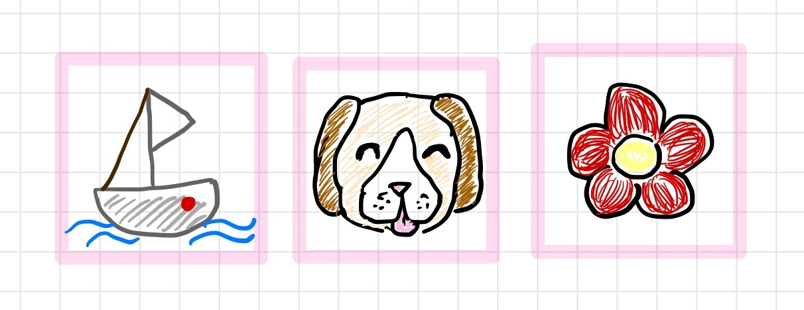
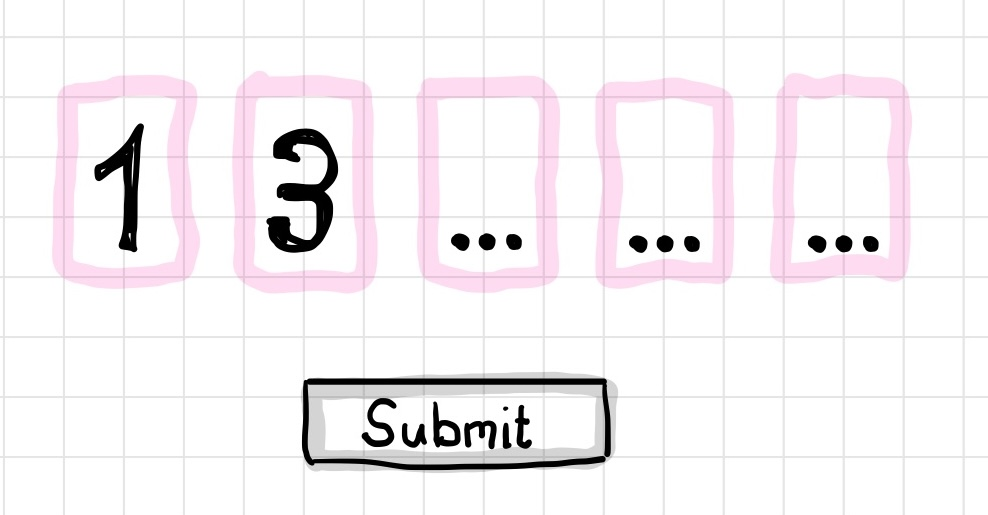

WCAG 3.3.9（Going for Gold）可访问性指南

> 原文：[An Accessible Guide to WCAG 3.3.9: Going for Gold](https://auth0.com/blog/an-accessible-guide-to-wcag-3-3-9/)  
> 作者：Ramona Schwering  
> 日期：2025年12月15日  
> 翻译：田八  

大家好，今天我们来聊聊无障碍访问。几周前，你可能在本博客上看到过有关[WCAG 3.3.8（无障碍认证）](https://auth0.com/blog/an-accessible-guide-to-wcag-3-3-8-authentication-without-frustration/)主题的文章。该标准聚焦于确保有认知障碍的用户无需解谜或记忆复杂文本字符串就能登录的最低要求。这就像是“达到合规标准”。今天，我们将迈向“追求卓越”。

WCAG 也持类似观点，并未将可访问性仅仅视为一项成功标准。如果说 WCAG 3.3.8 是基准，那么[WCAG 3.3.9（可访问身份验证 - 增强版）](https://www.w3.org/WAI/WCAG22/Understanding/accessible-authentication-enhanced.html)则是高级模式。

# 了解等级划分

从AA级合规升级到AAA级合规会带来很大的不同。但这些级别究竟意味着什么呢？

- **合规等级：** WCAG定义了三个合规等级：A（最低）、AA（中级）和AAA（最高）。
- **二级AA（法律基准）：** 大多数政府和公司都要求达到此级别（例如美国的《美国残疾人法案》或欧洲的《无障碍法案》）。它确保大多数人都能使用网络。
- **三级AAA（黄金标准）：** 标准更严格、更专业，而且通常是可选的。但是，它有助于让所有人都能访问网络。

让我们从认证的角度来看：

- **二级AA（3.3.8）规定：** “不要让我解谜……除非是特定类型的谜题。”
- **三级AAA（3.3.9）规定：** “禁止任何谜题。绝对禁止。”

你可能会问：“如果AA就能让我的法律团队满意，我为什么还要关注AAA呢？”原因很简单：最低标准中的例外情况仍可能给有严重认知障碍的用户造成障碍。WCAG 3.3.9敦促你彻底消除这些障碍。

# 核心差异：不再有捷径

要理解 3.3.9，你必须看看 3.3.8 允许你做了什么。

在最低标准（3.3.8）中，要求你提供一种不依赖“认知功能测试”的登录方法。然而，这一规则也有例外。只要属于特定类别，如物体识别或个人内容识别，你实际上仍可以使用认知测试来通过3.3.8。

WCAG 3.3.9 取消了这些例外情况。在这个更严格的标准下，安全保障机制已不复存在。

- **取消物体识别：** 您不能再要求用户“选择所有包含人行横道的照片”或识别模糊的形状。
- **取消个人内容识别：** 您不能再要求用户“选择您注册时选择的安全图片”。

# 陷阱场景：现在哪些情况会失败？

许多开发者认为他们当前的设置是可访问的，因为它通过了标准的AA检查。然而，在尝试达到AAA时，有一些常见模式会让你陷入困境。

# 陷阱一：视觉验证码



你肯定见过那种图片网格，让你识别交通信号灯、公共汽车或楼梯的场景。

- **根据 3.3.8 条款：** 由于物体识别例外情况，这通常是允许的。只要用户只需识别一辆汽车，就满足了最低要求。
- **3.3.9 项：** 此项测试**不及格**。患有视觉处理障碍或严重学习障碍的个体可能难以可靠地解决这些谜题。增强版标准将其视为一项认知测试，无一例外。

# 陷阱二：安全图像



一些银行和安全应用要求用户在注册时选择特定图片（例如狗或帆船）。之后登录时，用户必须从列表中选择同一张图片。这是个人内容识别的典型例子。

- **3.3.8：** 这是个人内容例外情况所允许的。
- **3.3.9 项：** 此题**失败**。它需要记忆回忆。用户必须记住他们过去建立的某种关联。

# 陷阱三：分割字段输入



你可能见过（或构建过）一个两步验证（2FA）界面，它要求输入6位代码，但不是一个输入框，而是六个单独的框。

- **问题：** 除非你编写特定的JavaScript来处理粘贴事件，否则这些字段通常会破坏复制粘贴功能。用户尝试粘贴“123456”，但只有“1”出现在第一个框中。
- **结论：** 如果用户被迫从短信中读取代码并逐位输入，这就是一项转录任务。这不符合无障碍认证的要求。

# 机制漏洞

了解了所有这些陷阱后，你可能会问：“等等，密码不就是记忆测试吗？WCAG 3.3.9是否禁止使用密码？”

虽然密码是一种认知测试，但**如果存在辅助用户记忆的机制**，它是被允许的。在这种情况下，密码管理器就是这种机制。如果你的网站支持自动填充属性并允许粘贴，用户就不必使用记忆。

这有助于浏览器和密码管理器正确填充字段：

```html
<label for="username">用户名：</label>
<input type="text" id="username" name="username" autocomplete="username">

<label for="password">密码：</label>
<input type="password" id="password" name="password" autocomplete="current-password">
```

如果你以这种方式帮助用户，他们就会使用工具而不是依赖记忆。这就是为什么禁止复制/粘贴是一个如此严重的失误。它破坏了密码安全机制。

# 达到 WCAG 3.3.9 标准的解决方案：如果您上次听取了意见，那么您已经达到了

这听起来可能有些限制。您或许会觉得安全工具箱里的所有工具都被禁用了。但好消息是，适用于 WCAG 3.3.8 的最佳解决方案同样也适用于 3.3.9。您无需使用新技术，只需更加专注于正确的技术即可。

# 通行密钥

这是最终解决方案。密码密钥依赖于设备所有权（即拥有您的设备）和生物识别信息（例如您的指纹或面部识别）。它构成了一个由设备解决的加密难题。用户无需进行任何认知活动。无需输入文字，无需记忆，也无需识别物体。

# 社交登录（OAuth）

允许用户“使用 Google 登录”或“使用 Apple 登录”是一种有效的策略。它将身份验证的负担转移到服务提供商，而服务提供商（希望）会负责处理辅助功能。如果服务提供商使用密码或双因素身份验证 (2FA)，您无需构建用户界面即可享受这些好处。

# 魔法链接

需要注意的是，生物识别技术并非完美无缺。有时，由于各种原因，例如佩戴口罩但未启用特定的面部识别设置，生物识别技术可能无法正常工作。某些伤病也可能改变面部或眼睛的外观。在我看来，这凸显了提供多种身份验证方式的重要性。

电子邮件魔法链接是另一种可靠的选择。用户输入邮箱地址，点击收件箱中的链接即可登录。这完全消除了密码和谜题带来的认知负担，同时又兼顾了生物识别技术的局限性。

# 隐形安全与二维码

为了增强对机器人的防护，考虑从传统的技巧-响应模型转向风险分析方法。像隐形reCAPTCHA（例如谷歌的reCAPTCHA v3）这样的工具就是通过后台行为分析来体现这一点的。

[我们已经在第一篇文章中介绍过谷歌的reCAPTCHA](https://auth0.com/blog/an-accessible-guide-to-wcag-3-3-8-authentication-without-frustration/#Five-ways-to-build-accessible-and-compliant-logins)。我们不妨快速回顾一下：这种隐形验证码通过分析用户行为生成风险评分。开发者可以利用这个评分来决定是否允许用户继续操作。这些风险分析系统会在后台利用设备信号和用户行为来评估潜在威胁，只有在可能存在威胁时才会介入。

通过消除谜题带来的认知挑战，这种方法创造了更流畅、更包容的用户体验，因为完全避免了摩擦点。

为了实现跨设备身份验证，请考虑使用二维码。用户无需手动从身份验证器应用中读取代码并将其输入到电脑，只需用手机扫描电脑屏幕上显示的二维码即可。这样就用简单的物理操作（扫描）取代了容易出错的转录过程（读取和输入）。

# 小贴士：“别让我阅读”原则

理解 WCAG 3.3.9 最简单的方法是消除转录的必要性；换句话说，它遵循清晰沟通的原则，不建议强迫受众花费额外精力来理解内容。这意味着在身份验证方面：如果用户必须在一个设备（或屏幕）上读取代码，然后再输入到另一个设备（或屏幕）上，则很可能验证失败。其目标是让每个操作都成为“点击”、“轻触”或“扫描”，而不是“读取并输入”。

# 如何审核WCAG 3.3.9合规性

准备好了解您的现状了吗？这里有一份清单，可以帮助您评估您的身份验证流程是否符合 AAA 级标准。

- 你是否使用了视觉验证码？如果是，用无形的技巧或通行密钥替换它。
- 你是否使用了安全问题或安全图像？如果是，请用标准的多因素认证（MFA）替换它们。
- 你的输入字段是否启用了复制粘贴功能？这一点很重要。特别测试你的6位输入字段，确保它们接受完整字符串的粘贴。
- 您的多因素身份验证 (MFA) 是否需要手动输入验证码？请考虑使用推送通知或一次性密码 (OTP) 链接来避免手动输入。

# 真实性检验：何时自建与何时购买

管理所有这些认证方法，包括密码、通行密钥和社交登录，需要大量的开发工作。最明智的做法是使用专家构建的身份平台。这样，你可以避免自行开发已存在的解决方案，加快无障碍访问进程，同时保持安全性，并专注于你的核心业务。

- [使用像Auth0的通用登录这样的服务](https://auth0.com/docs/authenticate/login/auth0-universal-login)，你可以立即获得一个可访问、合规的登录页面。它自动处理基本任务：登录、单点登录、无密码选项和可访问的多因素认证。
- 对于需要更大用户界面定制的使用案例，可以直接将Auth0实验室的[UI组件](https://a0.to/ui-content)集成到应用程序中。这些单一、可访问的组件支持自定义登录体验，并由Auth0安全可靠的后端提供支持。

# 让你的身份验证面向未来

追求WCAG 3.3.9不仅仅是为了获得合规分数；它是为了达到更高的无障碍访问标准。

消除残障用户的认知障碍，就能消除所有人的使用阻力。没人喜欢费力辨认人行横道，也没人喜欢记住三年前选的安保图片。遵循最严格的无障碍标准进行设计，必然能打造最流畅的用户体验。

[如果您正在使用 Auth0](https://a0.to/ui-content)，那么您已经领先一步。Universal Login 支持密码和机器人检测功能，开箱即用，满足这些需求。您可以实现高安全性、低摩擦的登录流程，而无需构建自己的隐式验证机制。

不要等到 AAA 成为法律才开始构建。现在就应该按照 AAA 标准进行开发，因为它能带来显著更好的用户体验。

# 延伸阅读

- [《网页内容无障碍访问指南》（WCAG）2.2](https://www.w3.org/TR/WCAG22/)
- [理解成功标准3.3.9：无障碍认证（增强版）](https://www.w3.org/WAI/WCAG22/Understanding/accessible-authentication-enhanced.html)