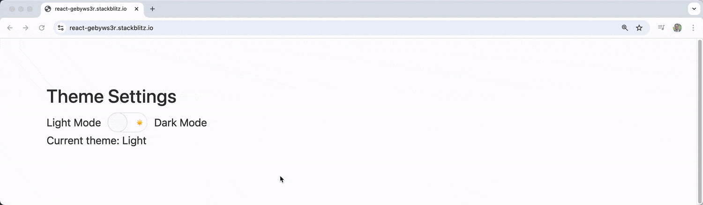

# Zustand 入门指南

> 原文：[An Introduction to Zustand](https://www.telerik.com/blogs/introduction-zustand)
>
> 翻译：[嘿嘿](https://blog.heyfe.org/blog)

了解状态管理库 Zustand，并通过一个实用的 UI 演示（使用 KendoReact Switch 组件切换全局主题）来掌握它的用法。

React 应用的状态管理在这些年里发生了很大变化。虽然 [Redux](https://redux.js.org/) 长期占据主导地位，但开发者们一直都在寻找更简单、更轻量，且不牺牲功能的替代方案。

根据最近的 [State of React 2024](https://2024.stateofreact.com/en-US/libraries/state-management/) 调查显示，Zustand 已成为开发者的“新宠”，使用率从 2023 年的 28% 飙升到了 42%。在这篇文章中，我们将探讨 Zustand 的魅力所在、如何上手，并结合 KendoReact 的 [Switch 组件](https://www.telerik.com/kendo-react-ui/components/inputs/switch) 做一个切换全局主题的实战演示。

## Zustand 是什么？

[Zustand](https://zustand.docs.pmnd.rs/getting-started/introduction) 是一个非常小巧的状态管理库。它提供了一套基于 Hook 的简单 API，专门用于处理 React 应用中的全局状态。和 Redux 那套需要 Action、Reducer 和大量样板代码（Boilerplate code）的复杂逻辑不同，Zustand 让你只用几行代码就能创建 Store，同时它又足够强大，能应对复杂的状态场景。

## 为什么选 Zustand 而不是其他方案？

在深入研究用法之前，我们先聊聊为什么你应该在众多状态管理方案中选择 Zustand。

* **对比原生 Hook：** 相比 React 自带的 `useState` 和 `useContext`，Zustand 的性能更好。因为组件只有在它所订阅的特定状态发生变化时才会重新渲染（Rerender）。
* **对比 Redux：** 相比 Redux，Zustand 的学习曲线非常平缓，理解和实现起来都容易得多。

当然，如果你只是做个超级简单、几乎不需要共享状态的小应用，那直接用 `useState` 和 `useContext` 就行啦！

## 创建你的第一个 Store

首先，在 React 项目中安装 Zustand：

```bash
npm install zustand
```

安装好后，我们就可以直接开始创建 Store 并在组件里使用了。

Zustand 的核心概念是 [Store](https://zustand.docs.pmnd.rs/guides/flux-inspired-practice#single-store)，它其实就是一个包含状态和更新状态函数的 Hook。我们来写一个简单的例子：利用 KendoReact 的 Switch 组件来控制主题切换。

先安装 KendoReact 的 Switch 组件：

```bash
npm install @progress/kendo-react-inputs
```

接着，创建一个简单的主题 Store：

```js
import { create } from 'zustand';

// 创建一个用于管理主题的 Store
const useThemeStore = create((set) => ({
  // 初始状态
  isDarkMode: false,
  // 切换主题的操作
  toggleTheme: () => set((state) => ({ isDarkMode: !state.isDarkMode })),
  // 设置特定主题的操作
  setTheme: (isDark) => set({ isDarkMode: isDark }),
}));
```

在这个例子中，`create` 函数接收一个回调，该回调会拿到一个 `set` 函数。我们通过 `set` 来更新 Store 的状态。这个 Store 包含：

* `isDarkMode`: 一个布尔值，表示是否开启暗黑模式。
* `toggleTheme`: 一个翻转当前主题状态的函数。
* `setTheme`: 一个将主题设为特定值的函数。

## 在组件中使用 Store

现在，我们可以在组件里调用这个主题 Store，并配合 KendoReact 的 Switch 组件一起使用：

```js
import React from 'react';
import { Switch } from '@progress/kendo-react-inputs';
import { useThemeStore } from './store';

const ThemeToggle = () => {
  // 从 Store 中解构出状态和方法
  const { isDarkMode, toggleTheme } = useThemeStore();

  return (
    <div style={{ 
      padding: '20px', 
      backgroundColor: isDarkMode ? '#333' : '#fff',
      color: isDarkMode ? '#fff' : '#333',
      borderRadius: '8px',
      margin: '20px'
    }}>
      <h3>主题设置</h3>
      <div style={{ display: 'flex', alignItems: 'center', gap: '10px' }}>
        <span>白天模式</span>
        <Switch 
          checked={isDarkMode}
          onChange={(event) => toggleTheme()}
          onLabel="🌙"
          offLabel="☀️"
        />
        <span>暗黑模式</span>
      </div>
      <p>当前主题：{isDarkMode ? '暗黑' : '白天'}</p>
    </div>
  );
};

export default ThemeToggle;
```

组件通过 `useThemeStore` 拿到 `isDarkMode` 和 `toggleTheme`。我们根据 `isDarkMode` 的值来动态设置容器样式。Switch 组件则负责触发状态切换，并配上了太阳和月亮的 Emoji，看起来更直观。



## 进阶：一个更复杂的例子

为了展示 Zustand 的更多威力，我们来做一个稍微复杂的 Store，用于管理用户偏好设置：

```js
import { create } from 'zustand';

const usePreferencesStore = create((set, get) => ({
  // 状态数据
  user: {
    name: '访客',
    email: '',
  },
  settings: {
    notifications: true,
    autoSave: false,
    darkMode: false,
    language: 'zh',
  },
  
  // 操作方法（Actions）
  // 更新用户信息
  updateUser: (userData) => set((state) => ({
    user: { ...state.user, ...userData }
  })),
  
  // 切换单个设置项
  toggleSetting: (settingKey) => set((state) => ({
    settings: {
      ...state.settings,
      [settingKey]: !state.settings[settingKey]
    }
  })),
  
  // 批量更新设置
  updateSettings: (newSettings) => set((state) => ({
    settings: { ...state.settings, ...newSettings }
  })),
  
  // 重置所有偏好
  resetPreferences: () => set({
    user: { name: '访客', email: '' },
    settings: {
      notifications: true,
      autoSave: false,
      darkMode: false,
      language: 'zh',
    }
  }),
  
  // 计算值（Computed values）
  getDisplayName: () => {
    const state = get(); // 使用 get() 获取当前状态
    return state.user.name || '匿名用户';
  },
}));
```

这个 Store 结构更深，包含了嵌套的用户对象和设置对象。我们定义了多种 Action 来处理不同类型的更新，还通过 `get` 函数实现了一个“计算值”。

接下来，我们用这个 Store 配合多个 KendoReact Switch 组件打造一个完整的设置面板：

```js
import React from 'react';
import { Switch } from '@progress/kendo-react-inputs';
import { usePreferencesStore } from './store';

const SettingsPanel = () => {
  const { 
    settings, 
    user,
    toggleSetting, 
    updateUser,
    resetPreferences,
    getDisplayName 
  } = usePreferencesStore();

  return (
    <div style={{ 
      padding: '20px', 
      maxWidth: '400px',
      backgroundColor: settings.darkMode ? '#2d2d2d' : '#f5f5f5',
      color: settings.darkMode ? '#fff' : '#333',
      borderRadius: '8px',
      fontFamily: 'Arial, sans-serif'
    }}>
      <h2>个人偏好设置</h2>
      
      {/* 用户信息部分 */}
      <div style={{ marginBottom: '20px' }}>
        <h3>欢迎, {getDisplayName()}!</h3>
        <input
          type="text"
          placeholder="输入你的姓名"
          value={user.name}
          onChange={(e) => updateUser({ name: e.target.value })}
          style={{
            padding: '8px',
            borderRadius: '4px',
            border: '1px solid #ccc',
            width: '100%',
            marginBottom: '10px'
          }}
        />
        <input
          type="email"
          placeholder="输入你的邮箱"
          value={user.email}
          onChange={(e) => updateUser({ email: e.target.value })}
          style={{
            padding: '8px',
            borderRadius: '4px',
            border: '1px solid #ccc',
            width: '100%'
          }}
        />
      </div>

      {/* 设置部分 */}
      <div style={{ marginBottom: '20px' }}>
        <h3>系统设置</h3>
        
        <div style={{ marginBottom: '15px' }}>
          <div style={{ display: 'flex', justifyContent: 'space-between', alignItems: 'center' }}>
            <label>暗黑模式</label>
            <Switch
              checked={settings.darkMode}
              onChange={() => toggleSetting('darkMode')}
              onLabel="🌙"
              offLabel="☀️"
            />
          </div>
        </div>

        <div style={{ marginBottom: '15px' }}>
          <div style={{ display: 'flex', justifyContent: 'space-between', alignItems: 'center' }}>
            <label>通知提醒</label>
            <Switch
              checked={settings.notifications}
              onChange={() => toggleSetting('notifications')}
              onLabel="🔔"
              offLabel="🔕"
            />
          </div>
        </div>

        <div style={{ marginBottom: '15px' }}>
          <div style={{ display: 'flex', justifyContent: 'space-between', alignItems: 'center' }}>
            <label>自动保存</label>
            <Switch
              checked={settings.autoSave}
              onChange={() => toggleSetting('autoSave')}
              onLabel="💾"
              offLabel="📝"
            />
          </div>
        </div>
      </div>

      <button
        onClick={resetPreferences}
        style={{
          padding: '10px 20px',
          backgroundColor: '#ff4444',
          color: 'white',
          border: 'none',
          borderRadius: '4px',
          cursor: 'pointer'
        }}
      >
        恢复默认设置
      </button>
    </div>
  );
};

export default SettingsPanel;
```

> **注：** 为了简洁，代码中使用了内联样式，实际开发中建议使用独立的 CSS 文件或 CSS-in-JS。

这个组件展示了如何从 Store 中提取多个状态和 Action。我们把三个 KendoReact Switch 组件分别绑定到不同的偏好项上，实现了一站式的设置管理。


## 深入理解状态更新

Zustand 的一大优势在于它处理更新的方式非常灵活。`set` 函数在第一层会自动合并新旧状态（类似于 React 类组件的 `setState`）。但如果是更新嵌套对象，我们就得手动处理合并了：

```js
// 更新顶层属性，直接传就行，Zustand 会自动合并
set({ isDarkMode: true });

// 更新嵌套对象，需要手动解构（Spread）旧状态
set((state) => ({
  settings: {
    ...state.settings,
    darkMode: true
  }
}));
```

如果你想彻底替换整个 Store 的内容，可以给 `set` 传第二个参数 `true`：

```js
set(newState, true); // 这将用 newState 覆盖掉所有的旧状态
```

## Store 组织架构与最佳实践

在大应用里折腾 Zustand 时，有几条建议可以参考：

### 1. 单 Store 还是多 Store？

Zustand 并不强制你非得怎么做，但通常推荐：

* **单 Store：** 如果状态之间互相关联，或者经常需要互相引用，放在一个 Store 里比较好。
* **多 Store：** 如果功能模块完全独立（比如购物车和用户信息），分开写更清晰。

### 2. Store 切片 (Slicing)

如果 Store 变得非常庞大，你可以使用[切片模式（Slices Pattern）](https://zustand.docs.pmnd.rs/guides/slices-pattern#slices-pattern)来拆分逻辑：

```js
const createUserSlice = (set, get) => ({
  user: null,
  setUser: (user) => set({ user }),
  clearUser: () => set({ user: null }),
});

const createSettingsSlice = (set, get) => ({
  settings: { theme: 'light', notifications: true },
  updateSettings: (newSettings) => set((state) => ({
    settings: { ...state.settings, ...newSettings }
  })),
});

// 将切片组合在一起
const useAppStore = create((...a) => ({
  ...createUserSlice(...a),
  ...createSettingsSlice(...a),
}));
```

### 3. 在 Store 外部定义 Action

如果你不喜欢把逻辑都塞在 `create` 回调里，也可以把 Action 放在外面：

```js
const useCounterStore = create(() => ({
  count: 0,
}));

// 外部 Action
export const increment = () => 
  useCounterStore.setState((state) => ({ count: state.count + 1 }));

export const reset = () => 
  useCounterStore.setState({ count: 0 });
```

## 总结

Zustand 代表了 React 状态管理的一种新趋势：**回归简洁，但不失灵活**。它的 Hook API 让 React 开发者感到非常亲切，而极高的性能表现和极少的样板代码，使其成为无论是小型项目还是大型应用的绝佳选择。

如果你想了解更多，可以去翻翻它们的官方文档：

* [Zustand 官方文档](https://zustand.docs.pmnd.rs/)
* [KendoReact Switch 组件文档](https://www.telerik.com/kendo-react-ui/components/inputs/switch/)
