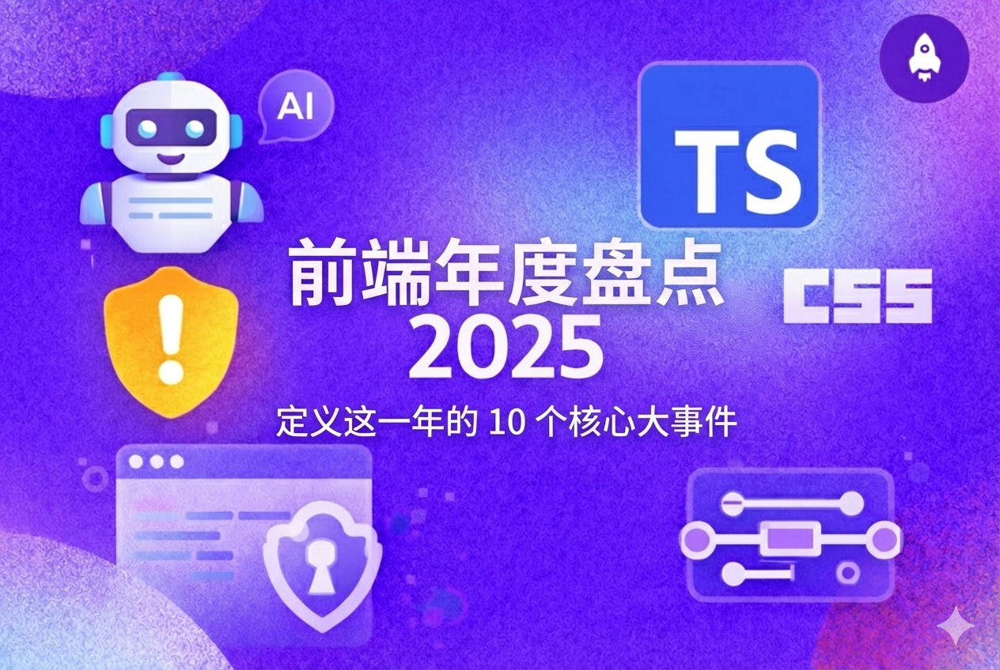

# 前端年度盘点 2025：定义这一年的 10 个核心大事件

> 原文：[Frontend Wrapped 2025: The 10 storylines that defined the year - LogRocket Blog](https://blog.logrocket.com/frontend-wrapped-2025/)
>
> 翻译：[嘿嘿](https://blog.heyfe.org/blog)

2025 年对前端开发者来说简直是一场情绪过山车。过去这一年里，我们见证了各个角落的疯狂改进、大规模安全漏洞，以及框架的重新发明。AI 霸占了头条，改变了我们构建应用的方式。一些大牌（TanStack、CSS、TypeScript）带来了重大更新，为 2026 年及以后开辟了新的可能性。

这次我不打算做传统的年度回顾，而是根据两个标准对今年最重大的前端事件进行排名：它们引发的热度以及对我们构建 Web 应用方式的持久影响。我们从第 10 位最重要的故事线开始，一路倒数到我认为最能定义 2025 年前端开发的那个事件。

## 10. TypeScript 继续统治地位

TypeScript 在 2025 年[表现得太好了](https://github.blog/developer-skills/programming-languages-and-frameworks/typescripts-rise-in-the-ai-era-insights-from-lead-architect-anders-hejlsberg/)：

-   npm 每周下载量达 6000 万次（2021 年为 2000 万次）
-   420 万个 GitHub 仓库在使用 TypeScript
-   前 100 个 npm 库中超过 80% 都附带 TypeScript 类型定义

TypeScript 并不是要取代 JavaScript；它就是开发者现在编写 JavaScript 的方式。大多数代码库都是用 TypeScript 编写，然后编译成 JavaScript（就像 Sass 编译成 CSS 一样）。你能获得类型安全、更好的工具、真正好用的自动补全，以及在有类型代码下性能提升 20% 的 AI 编码助手。

## 9. Tailwind CSS 地位稳固

Tailwind 在 2025 年获得了大规模采用，而 styled-components 和其他运行时 CSS 解决方案则失宠了。现在有超过 61.7 万个网站在使用 Tailwind，它已经成为现代 React 应用的默认样式选择。"写内联样式"的批评声彻底消失了；我觉得现在大家都默认用 Tailwind 了，这已经不是个需要争论的问题。

## 8. 服务端渲染（SSR）无处不在

SSR 在 2025 年不再是"锦上添花"，而是成了必需品。每个主流框架都全力投入：Next.js 将其设为默认，[Remix](https://blog.logrocket.com/remix-3-ditched-react/)/React Router v7 围绕它构建一切，[TanStack Start](https://blog.logrocket.com/tanstack-start-overview/) 开箱即带 SSR，就连 SvelteKit 和 Astro 也加倍押注服务器优先架构。

性能和 SEO 不再是可选项。Google 的 Core Web Vitals 变得更严格，用户期待页面秒开。但 2025 年的 SSR 不是 2015 年那种笨重的服务器渲染。

现代 SSR 很聪明：框架现在支持部分水合（只有交互部分需要 JavaScript）、流式 SSR（HTML 准备好就发送）和选择性水合（先水合可见部分）。React Server Components 更进一步，让你可以在服务器上获取数据，而不用把那些逻辑发送到客户端。

## 7. Shai Halud npm 攻击事件

React 在 2025 年末在安全方面遇到了麻烦（稍后会详细说）——但今年它们不是唯一的受害者。

npm 生态系统也遭遇了不少攻击。9 月份，攻击者发起了一场[协同供应链攻击](https://www.youtube.com/watch?v=Fi5d83gi9cM)，分两波展开。首先，9 月 8 日，chalk、debug 和 ansi-styles 等包——这些库每周总下载量达 26 亿次——通过对维护者账户的钓鱼攻击被攻陷。

注入的恶意软件针对加密货币交易。然后出现了 Shai Hulud 蠕虫（以《沙丘》中的沙虫命名）。这个自我复制的恶意软件攻击了超过 180 个包，窃取凭证并自动传播到被攻陷维护者控制的其他包。

与传统攻击不同，这是蠕虫式的：当它在环境中发现 npm token 时，会自动发布任何可访问包的恶意版本，无需人工干预就能指数级传播。可怕的是规模和自动化程度。

如果你在攻击窗口期运行 npm install，就可能拉取到恶意代码。npm 团队和维护者反应迅速，但损害已经造成；数千个项目暴露在风险中，整个生态系统花了几周时间审计依赖项和替换凭证。

## 6. CSS 干掉了更多 JavaScript

2025 年的 CSS 不再只是关于样式；它变成了一门编程语言。浏览器厂商全力投入原生 CSS API，这些 API 能消除整个 JavaScript 库的存在，说实话，早该如此了。口号很明确：[少用 JavaScript，多用 CSS](https://blog.logrocket.com/stop-using-js-for-css)。

### **Anchor Positioning（锚点定位）**

Anchor Positioning 在 2025 年在 Safari 中达到生产就绪状态，加入了 Chrome 的现有支持。虽然 Firefox 还只是实验性支持，但该功能现在可以在支撑大部分 Web 的两个浏览器中使用。它允许开发者相对于其他元素定位工具提示、弹出框和下拉菜单，无需 JavaScript。

### **Scroll-Driven Animations（滚动驱动动画）**

[这些动画](https://blog.logrocket.com/implementing-scroll-aware-ui-state-css/)在 2025 年显著成熟，在主线程外运行，实现丝滑的 60fps 性能。你不用再写 Intersection Observer JavaScript，可以使用 `animation-timeline: scroll()` 或 `view()` 将动画直接绑定到滚动位置。

Chrome 提供了完整支持，你甚至可以基于哪个元素被吸附或滚动器是否可滚动来制作动画，使用 Chrome 133 中引入的新 `@container scroll-state()` 查询。

### **Container Queries（容器查询）**

[容器查询](https://blog.logrocket.com/css-container-queries-guide/)达到了 100% 的浏览器支持，成为基于组件设计的默认选择。组件现在可以响应**父元素的宽度**而不是视口宽度（`@container (min-width: 600px)`），使真正可复用的组件成为可能。再配合**CSS 嵌套**（现在所有浏览器都原生支持），你就能在不用 Sass 的情况下编写组件作用域样式。

### **CSS `if()` 函数**

它[终于来了](https://blog.logrocket.com/css-if-function-conditional-styling-2025/)，将**条件逻辑直接带入 CSS**。你现在可以写 `background: if(style(--theme: dark), black, white)` 来根据自定义属性或样式查询有条件地应用值。

## 5. Rust 的复兴

前端工具在 2025 年经历了我所说的身份危机，而 Rust 就是我们需要的疗法。以前需要几分钟的构建工具现在几秒钟就完成了，因为生态系统意识到用 JavaScript 来构建 JavaScript 不够快。

始于 2024 年末的 Rust 浪潮在 2025 年成为标准。Rspack 在 2024 年 8 月发布 1.0 版本，构建速度提升 23 倍（Webpack 的 6.5 秒 → 282ms），在 2025 年获得了大规模企业采用。

Vercel 的 [Turbopack](https://blog.logrocket.com/turbopack-adoption-guide/) 成为 Next.js 15 的默认选择，提供快 700 倍的 HMR。SWC 取代 Babel 成为默认转译器，编译速度快 20 倍。Biome 作为 ESLint 和 Prettier 的 Rust 驱动替代品出现，而 Oxc 提供了用于解析、检查、格式化和压缩的完整 Rust 工具链。

微软、亚马逊、Discord、TikTok 和抖音等公司在 2025 年都在生产环境中采用了这些工具。Rust 复兴不是选择；这是必然。当你的构建耗时，CI 流水线花钱时，你要么用 Rust 重写，要么接受现状。2025 年证明了，如果性能很重要，就会用 Rust 重写。欢迎来到锈化时代。

## 4. TanStack 生态系统的崛起

TanStack 在 2025 年悄悄接管了 React 开发，说实话，大多数开发者（包括我）甚至没看到它的到来。最初作为 React Query（一个数据获取库）起步的东西，演变成了一个完整的生态系统，现在正在取代 Redux、React Router 和开发者多年来一直使用的其他一堆工具。

TanStack 创建者 Tanner Linsley 两年前全力投入开源，这次押注大获成功。TanStack 现在有超过 40 亿次下载，涵盖从数据获取（TanStack Query）、路由（TanStack Router）、表格（[TanStack Table](https://blog.logrocket.com/tanstack-table-formerly-react-table/)）、表单、虚拟化，甚至还有一个叫 [TanStack Start](https://blog.logrocket.com/full-stack-app-with-tanstack-start/) 的全栈框架。

最疯狂的是什么？他们今年在路由匹配上实现了 20,000 倍的性能提升，只是通过追求正确性而非速度。每个库都是无头的、类型安全的、框架无关的，这意味着你能获得完全控制而不会被框架锁定。

到 2025 年底，TanStack 成为需要认真处理数据的 React 应用的默认推荐。Next.js 等框架仍然占主导地位，但如果你用 Vite 构建自定义技术栈或想完全控制架构，TanStack 就是新标准。要说 TanStack Router 的最大的问题，就是一旦你用过它，回到其他路由解决方案就会感觉很痛苦；你会被它的开发体验和类型安全宠坏。

## 3. React 19.2 带来无处不在的异步

[React 19.2 版本](https://blog.logrocket.com/react-19-2-is-here/)引发了巨大关注，理由充分。在它发布之前，每一次表单提交、导航点击和搜索框都需要一套组合拳：用 `useState` 处理加载状态，用 try-catch 处理错误，用 `useEffect` 协调，然后祈祷你没制造出竞态条件。

React 19 [彻底改变了游戏规则](https://blog.logrocket.com/the-next-era-of-react/)。在 React Conf 2025 上，团队发布了"Async React"，这是一个使用 React 19 的新原语（如 `useTransition`、`useOptimistic` 和 `use()`）以及 React 18 的 Suspense 和并发特性来声明式处理异步操作的完整系统。

现在 Actions 自动跟踪异步工作（再见 `isLoading` 标志），乐观更新让 UI 在服务器请求后台运行时感觉即时响应，Suspense 处理加载状态而不会出现刺眼的加载动画闪烁，`useDeferredValue` 让搜索框即使在慢速连接下也保持流畅。[Async React 演示](https://async-react.dev/)展示了其可能性：在任何网络速度下都有流畅的用户体验，零手动状态跟踪。

最棒的部分是框架为我们内置了这些。Next.js 现在默认将导航包装在 transitions 中。TanStack Query 内置了 Suspense 支持。设计系统开始暴露"action"属性，所以按钮和标签页能处理自己的乐观更新。

所有那些异步协调的复杂性从我们的代码转移到了框架层。我们从手动跟踪每个加载状态，变成只需描述应该发生什么，React 处理其余部分。大量样板代码就这么消失了，太疯狂了。我不知道为什么花了这么长时间，但说实话，我们不能否认[异步协调](https://blog.logrocket.com/react-19-2-the-async-shift/)终于感觉像是属于 2025 年的东西了。

## 2. React2Shell 漏洞

第二个最能定义这一年的故事是 [React 2Shell](https://blog.logrocket.com/react2shell-exploit/)——也就是 CVE-2025-55182——漏洞。

React 经历了有史以来最糟糕的 12 月！11 月 29 日，安全研究员 Lachlan Davidson 在 React Server Components 中发现了一个严重漏洞，CVSS 评分达到完美的 **10.0**，这是可能的最高严重级别。这不是随机的：这是一个未经身份验证的远程代码执行（RCE）漏洞，让攻击者只需一个恶意 HTTP 请求就能在服务器上运行任意代码。

金融应用成为主要目标；一个精心制作的请求就能暴露敏感的银行信息、操纵交易或植入后门以持续访问。运行 React Server Components 的企业仪表板、医疗门户和 SaaS 平台突然成了活靶子。

React 19 的 Server Components 本应改变全栈开发。结果它们成了 React 有史以来最大的安全危机。整个生态系统在 2025 年的最后几天都处于紧急补丁模式。

教训？能力越大（Server Components）责任越大，而且永远、永远要更新你的依赖项。不过值得一提的是，React 团队行动如闪电：从报告到补丁只用了四天。到 12 月 3 日，修复已经发布。

## 1. AI 编码工具的持续演进

我们今年见证了超过 30 个 AI 模型发布：GPT 5、Claude Opus 4.5，以及最近的 Gemini 3 Pro，还有一波中国公司发布的 DeepSeek、Qwen、ByteDance 和 Moonshot。

还不止于此：[Windsurf 和 Cursor](https://blog.logrocket.com/windsurf-vs-cursor-when-to-choose-the-challenger/) 之间的智能体大战愈演愈烈，甚至引发了投资者之间的[竞价战](https://techfundingnews.com/code-wars-openais-3b-bid-for-windsurf-puts-cursor-microsoft-and-anthropic-on-alert/)。

我们看到 [Bolt](https://blog.logrocket.com/build-deploy-web-app-bolt-new/) 和 v0 引领了从编程到生产的一站式编码理念。我们的 [CLI](https://blog.logrocket.com/tested-5-ai-cli-tools/) 也转变成了编码智能体。我们看到 Claude Code 主导了这个领域，还引入了 MCP 的使用。自然地，其他模型也跟进了：Gemini CLI、Qwen CLI、Kimi CLI 和 Codex。

这些行业在改变我们编写前端代码的方式上投入了最多的工作。今年我们几乎每隔一周就有 2 个模型发布，它们专门被增强来取代开发者。我不知道为什么它们这么想抢我们的饭碗，但说实话，我们不能否认它们让我们的生活更轻松了。就像 Spotify 等其他"年度总结"一样，你也得承认这些模型和工具是你今年最常用的 !😂

## 结论

2025 年真是不平凡的一年！

无论是 AI 进步、安全漏洞，还是不断演进的框架，我们经历了大量改变我们对 Web 开发思考方式的事件。

我漏掉了哪些故事？我的排名哪里不对？哪些故事会定义 2026 年？在评论区发声，让我知道你的看法。新年快乐！
