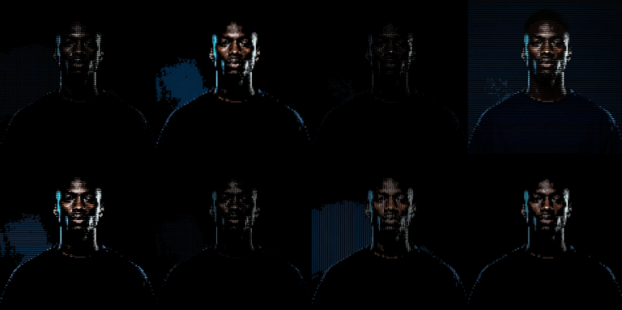

> 原文：[Efecto: Building Real-Time ASCII and Dithering Effects with WebGL Shaders](https://tympanus.net/codrops/2026/01/04/efecto-building-real-time-ascii-and-dithering-effects-with-webgl-shaders/)  
> 作者：Pablo Stanley  
> 日期：2026年1月4日  
> 翻译：田八


[](https://efecto.app/)

我是设计师。我不会写着色器。或者至少，以前我不会。

但我到处都能看到这种抖动（dithered）那种颗粒感十足、像素化的质感，既复古又新颖。我想自己也制作这种图像。不是通过某种滤镜处理图像，而是实时地在3D模型上进行处理，并控制各种参数进行调整。

我的第一个实验实际上是为 [Lummi](https://www.lummi.ai/) 做的，我在那用 [v0](https://v0.dev/) 快速搭了个 [特效工具](https://www.lummi.ai/fx/woman-in-wheat-field-q9ohx?effect=halftone&params=%7B%22dotRadius%22%3A5.5%2C%22angle%22%3A45%2C%22colorMode%22%3Atrue%2C%22shapeType%22%3A0%7D)。它很简陋，功能也很有限，但效果还不错，让我彻底迷上了特效工具。

<video controls autoplay loop muted playsinline src="./videos/lummi-fx-demo.mp4">你的浏览器不支持 video 标签。</video>

于是我开始开发 [Efecto](https://efecto.app/)。最初只是一个快速的实验，但随着我阅读各种算法并对其工作原理产生好奇，它逐渐发展壮大。

如果没有其他人的分享，我不可能完成这一切。我通过阅读 [Shadertoy](https://www.shadertoy.com/) 上其他人的代码学习。`Patricio Gonzalez Vivo` 的 [The Book of Shaders](https://thebookofshaders.com/) 教会了我基础知识。像 [postprocessing](https://github.com/pmndrs/postprocessing) 和 [React Three Fiber](https://docs.pmnd.rs/react-three-fiber) 这样的库则提供了构建的基础。

下面是我一路摸索总结出的要点。

  
*相同图像，不同算法：Floyd–Steinberg、Atkinson、Jarvis–Judice–Ninke、Stucki、Burkes 和 Sierra。*


## 从抖动（dithering）开始

抖动是一种产生比实际颜色更多色彩错觉的技术。如果你只有黑白像素，你无法直接显示灰色。但如果你把黑白像素按一定模式排列，大脑会将它们混合，进而感知为灰色。

这种技术来自报纸。在数字化普及之前，印刷厂必须思考如何仅用黑色墨水在白纸上重现照片。它们的解决方案是半色调（halftones）：用大小不一的细小墨点来欺骗眼睛，使人眼看到连续的色调变化。


这项技术的数字版本始于 1976 年，由 罗伯特·弗洛伊德 (Robert Floyd) 和 路易斯·斯坦伯格 (Louis Steinberg) 的论文提出。
他们的见解：当你把像素四舍五入到最近的可用颜色时，会产生“误差”（想要的颜色和实际得到的颜色之间的差值）。
与其丢弃这个误差，不如把它扩散到相邻像素上。这样就能创造出自然的图案，而不是生硬的色带。

下面是在代码中的基本思路：

```typescript
// For each pixel...
const [r, g, b] = getPixel(x, y)

// Find the nearest color in our palette
const [qR, qG, qB] = findNearestColor(r, g, b, palette)

// Calculate the error
const errR = r - qR
const errG = g - qG
const errB = b - qB

// Spread that error to neighbors (Floyd-Steinberg weights)
addError(x + 1, y,     errR * 7/16, errG * 7/16, errB * 7/16)
addError(x - 1, y + 1, errR * 3/16, errG * 3/16, errB * 3/16)
addError(x,     y + 1, errR * 5/16, errG * 5/16, errB * 5/16)
addError(x + 1, y + 1, errR * 1/16, errG * 1/16, errB * 1/16)
```

这些权重（`7/16`，`3/16`，`5/16`，`1/16`）之和为 `1`，因此您重新分配了 `100%` 的误差。这种非对称分布可以避免出现明显的对角线图案。

**[试试使用 1976 年的原始 Floyd–Steinberg 误差扩散算法进行抖动](https://efecto.app/?v=1&in=3d&model=/models/statue.glb&eid=dither-floyd-steinberg&dx=3)** 


## 其他算法

我成功运行了 `Floyd-Steinberg` 算法后，我想尝试其他算法。每种算法对误差的分配方式不同，产生不同的纹理：

**Atkinson**（1984）由 `Bill Atkinson` 为初代 `Macintosh` 电脑开发的，当时的 `Macintosh` 只能显示黑白图像。他的技巧是只分配 `75%` 的误差。这会产生对比更强、略带“颗粒感”的图像。

```typescript
const atkinson = {
  kernel: [
    [1, 0, 1],   // right
    [2, 0, 1],   // two right
    [-1, 1, 1],  // bottom-left
    [0, 1, 1],   // bottom
    [1, 1, 1],   // bottom-right
    [0, 2, 1],   // two below
  ],
  divisor: 8,  // 6 neighbors × 1 = 6, but divisor is 8
}
```

注意只有 `6/8` 的误差被分配。那“丢失”的 `25%` 就是 `Atkinson` 分布图独特之处。

**试试 [Bill Atkinson](https://efecto.app/?v=1&col=7006ed&bg=000000&rs=0.6&eid=dither-atkinson&db=0.850631438104049&dc=0.9682271180080689&dth=0.4188409138425236&ac=7&dpal=ink&dcol=1a1a2e%2Cf5f5dc&dbi=0&dbr=20&ggr=0.23477857190368584&gbl=1.9320275429071307&grs=0.6468975876862986&gsl=0.6496341022362215&gno=0.336245005075387&gdi=0.9168255507885725&gbs=0.2628280222796208&gdp=0.7161712434533489&gbo=0.7960554858606979&gsp=1.2409267754851316&pp=sl%3A1%3A0.66%2C290%7Ccu%3A1%3A0.25%7Cvi%3A1%3A0.7%2C0.75%7Cca%3A1%3A0.013%2C0)（初代 Macintosh）中提出的抖动算法。** 


**Jarvis–Judice–Ninke** 将误差分配到 3 行的 12 个相邻元素。虽然速度较慢，但可以生成更平滑的渐变：

<video controls autoplay loop muted playsinline src="./videos/dither-jarvis.webm">你的浏览器不支持 video 标签。</video>  
*Jarvis–Judice–Ninke 动图。注意梯度有多平滑。*

**试试 [Jarvis–Judice–Ninke](https://efecto.app/?v=1&svg=%2Fassets%2Fsvg%2Fheart.svg&col=7006ed&bg=000000&rs=0.6&eid=dither-jarvis-judice-ninke&dx=4&db=0.850631438104049&dc=0.9682271180080689&dth=0.4188409138425236&ac=7&dbi=0&dbr=20&ggr=0.23477857190368584&gbl=1.9320275429071307&grs=0.6468975876862986&gsl=0.6496341022362215&gno=0.336245005075387&gdi=0.9168255507885725&gbs=0.2628280222796208&gdp=0.7161712434533489&gbo=0.7960554858606979&gsp=1.2409267754851316&pp=sl%3A1%3A0.66%2C290%7Ccu%3A1%3A0.25%7Cvi%3A1%3A0.7%2C0.75%7Cca%3A1%3A0.013%2C0) 的 12 个相邻元素算法以获得超平滑的梯度：** 

我最终实现了 8 种不同的算法。每一种都有自己的风格。哪一种最好看取决于图片本身。


## 添加颜色

双色抖动（黑白）是经典，但多色调板则打开了更多可能。`Efecto` 包含 `31` 个预设调色板，按类别组织：经典终端色、暖色系、冷色系、霓虹／合成波、土壤色和单色。你也可以创建 2 到 6 种颜色的自定义调色板。

<video controls autoplay loop muted playsinline src="./videos/dither-palettes-demo.mp4">你的浏览器不支持 video 标签。</video>  
*实时在不同调色板之间切换的演示。*

`Game Boy` 只有四种绿调。仅此而已。但艺术家们却在如此有限的条件下创作出了令人难忘的游戏。有限的色彩反而激发了创造力。

**[试试 1989 年经典的 Game Boy 四色调色板](https://efecto.app/?v=1&in=3d&model=/models/statue.glb&eid=dither-atkinson&dx=4&dpal=gameboy)** 

你选择的色调会彻底改变氛围。暖色调给人怀旧的感觉，霓虹色调给人赛博朋克的感觉，单色色调则给人一种复古印刷的感觉。

  
*同一幅肖像，不同的配色：合成波、金色、赛博朋克、黑色电影、篝火和深海。*

`Efecto` 使用亮度来映射颜色。首先计算每个像素的亮度：

```typescript
const luminance = 0.299 * r + 0.587 * g + 0.114 * b
```

然后将该亮度映射到调色板索引。调色板按从暗到亮的顺序排列，因此暗像素从调色板的开头选取颜色，亮像素从调色板的结尾选取颜色：

```typescript
const index = Math.floor(luminance * palette.length)
const color = palette[Math.min(index, palette.length - 1)]
```

这意味着调色板的顺序很重要。把颜色顺序颠倒过来，就会得到反转的图像。

此外，还有一个像素化控制（块大小 `1–10`），它会将图像分块处理，而不是逐个像素处理。数值越高，图像看起来就越粗糙、分辨率越低。误差扩散仍然有效，但它会在块中心之间扩散，而不是在单个像素之间扩散。

**[试试带有粉紫青渐变的 Synthwave 调色板](https://efecto.app/?v=1&in=3d&model=/models/statue.glb&eid=dither-floyd-steinberg&dx=4&dpal=synthwave)** 


## Bloom（泛光）技巧

我想模拟CRT显示器的视觉效果，而泛光效果（bloom）是关键。抖动会产生高对比度的像素图案。泛光能让亮像素向暗区域发散发光，既柔化了锐利的边缘，又保留了抖动纹理。


<video controls autoplay loop muted playsinline src="./videos/dither-bloom.webm">你的浏览器不支持 video 标签。</video>  
*泛光能柔化尖锐的像素边缘，类似老式 CRT 显示器的效果。*

**[应用绿色单色外观，并添加 CRT 风格的光晕和抖动效果以及光晕。](https://efecto.app/?v=1&in=3d&model=/models/statue.glb&eid=dither-atkinson&dx=4&dpal=terminal&dbe=1&dbi=1.5&dbr=60)**


## 然后我想要 ASCII 码

在成功实现抖动效果后，我对ASCII艺术产生了兴趣。基本思路相同（用图案表示亮度），但使用文本字符来替代像素排列。

  
*一个实时渲染为 ASCII 字符的 3D 模型。*

挑战在于：着色器里没有字体。你不能直接调用 `drawText()`。一切都必须用数学公式来表示。

解决方案是按 `5×7` 像素网格逐字符地程序化绘制。每个字符成为一个函数，针对任意位置返回 `1`（填充）或 `0`（空）：

```typescript
// 冒号：两个点垂直居中
if (grid.x == 2.0 && (grid.y == 2.0 || grid.y == 4.0)) {
  return 1.0;
}
return 0.0;
```

```glsl
// 星形：中心+臂+对角线
bool center = (grid.x == 2.0 && grid.y == 3.0);
bool vert = (grid.x == 2.0 && (grid.y >= 2.0 && grid.y <= 4.0));
bool horiz = (grid.y == 3.0 && (grid.x >= 1.0 && grid.x <= 3.0));
bool diag1 = ((grid.x == 1.0 && grid.y == 2.0) || (grid.x == 3.0 && grid.y == 4.0));
bool diag2 = ((grid.x == 1.0 && grid.y == 4.0) || (grid.x == 3.0 && grid.y == 2.0));

return (center || vert || horiz || diag1 || diag2) ? 1.0 : 0.0;
```

着色器将屏幕分割成网格状的单元格。对于每个单元格，它会：

1. 在单元格中心采样颜色
2. 计算亮度
3. 根据亮度选择字符

较暗的区域使用更密集的字符（比如 `@`、`#`、`8`），较亮的区域使用更稀疏的字符（比如 `.`、`:`、空格）。

```glsl
float brightness = dot(cellColor.rgb, vec3(0.299, 0.587, 0.114));
```

这些系数（`0.299`、`0.587`、`0.114`）来自人眼对颜色的感知。我们对绿色最敏感，然后是红色，最后是蓝色。这提供了符合感知的灰度转换。

  
*在旋转 3D 对象上的 ASCII 渲染。*

`Efecto` 有 `8` 种不同的 `ASCII` 风格。每种使用不同的字符集和排列：

  
*同一张图片以 8 种样式渲染：标准、密集、极简、块状、盲文、技术、矩阵和阴影线。*


## CRT 效果

抖动和 `ASCII` 都让人联想到早期计算机技术，所以我添加了一些后期效果来完善整体效果：

**扫描线（Scanlines）** 是模拟 `CRT` 荧光粉行的水平暗带。

**屏幕曲率（Screen curvature）** 模拟旧显示器的弧形玻璃：

```glsl
vec2 centered = uv * 2.0 - 1.0;
float dist = dot(centered, centered);
centered *= 1.0 + curvature * dist;
uv = centered * 0.5 + 0.5;
```

这会使像素从中心向外扩散，边缘部分扩散得更明显。简单的数学原理，却能产生逼真的效果。

**色差（Chromatic aberration）** 稍微分离 RGB 通道，像廉价光学镜头一样。

**暗角（Vignette）** 使画面边缘变暗，从而将视线吸引到中心。

搭配绿色荧光或琥珀色调色板，整个感觉就像一个老式终端。

  
*原图、扫描线、曲率、色差、暗角，以及所有效果的组合。*


## Efecto 的实现方式

**抖动运行在 CPU 上。** 误差扩散本质上是顺序的，因为每个像素依赖于已处理的像素。实际的抖动算法在 `JavaScript` 中运行，处理内存中的像素数据。`WebGPU` 处理纹理管理和泛光效果（`GPU` 加速）。当 `WebGPU` 不可用（例如 `Firefox`）时，提供 `Canvas 2D` 回退方案。

**ASCII 在 WebGL 着色器中运行。** 与抖动不同，每个单元格是独立的，因此可以完全在 `GPU` 上运行。着色器用 `Three.js` 和 `postprocessing` 库构建。字符在 `GLSL` 中按程序生成，而不是用位图字体。

**有些特效对性能要求很高。** 复杂的着色器和大量后期处理可能会显著降低帧率，尤其是在老旧硬件上。这是视觉复杂度与性能之间的权衡。


## 试试吧

以下是一些切入点：

  
*原图*

  
*抖动后*

[照片：带有微妙光晕--弗洛伊德-斯坦伯格的作品](https://efecto.app/?v=1&in=media&media=%2Fassets%2Fportrait-new.webp&mt=image&fit=contain&eid=dither-floyd-steinberg&dbe=1&dbi=0.25&dbr=41) ↗


  
*原图*

  
*抖动后*

[插图：带有定制墨水图案--阿特金森](https://efecto.app/?v=1&in=media&media=%2Fassets%2Fpanda.mp4&eid=dither-atkinson&dx=5&dpal=ink) ↗


  
*原图*

  
*抖动后*

[复古风：Stucki 搭配 Game Boy 调色板](https://efecto.app/?v=1&in=media&media=%2Fassets%2Fmotorcycle.mp4&eid=dither-stucki&dx=5&dpal=gameboy&dbe=1&dbi=0.25) ↗


## 我学到的

**历史悠久的算法经得起时间的考验。** `1976` 年的 `Floyd–Steinberg` 仍然是最好的算法之一。原始论文值得一读。

**限制能激发创造力。** 在技术限制下工作会逼出不同的解决方案。着色器不能使用字体，所以字符必须用数学绘制。误差扩散不容易并行化，所以它在 `CPU` 上运行，而泛光在 `GPU` 上运行。

**细节决定成败。** 这些亮度权重（`0.299`、`0.587`、`0.114`）的存在，是因为有人研究过人类视觉的工作原理。`Floyd-Steinberg`算法中非对称误差分布的存在，是因为有人注意到了对角线伪影。这些看似微小的决定，最终会产生巨大的影响。

如果你想深入了解：

**论文：**

- [Floyd & Steinberg (1976)](https://en.wikipedia.org/wiki/Floyd%E2%80%93Steinberg_dithering)：“空间灰度自适应算法”
- [Jarvis, Judice & Ninke (1976)](https://www.sciencedirect.com/science/article/abs/pii/S0146664X76800032)：“双层显示器上连续色调图像显示技术综述”
- [Donald Knuth (1987)](https://dl.acm.org/doi/epdf/10.1145/35039.35040)：“基于点扩散的数字半色调”——一种值得探索的不同方法

**学习资源：**

- [着色器之书(The Book of Shaders)](https://thebookofshaders.com/)作者：帕特里西奥·冈萨雷斯·维沃
- [Shadertoy](https://www.shadertoy.com/)，用于带来灵感和借鉴他人代码
- [Inigo Quilez](https://iquilezles.org/articles/)，关于着色器技术的文章

**我使用的库：**

- [postprocessing](https://github.com/pmndrs/postprocessing)：用于 Three.js 的后期处理效果
- [React Three Fiber](https://docs.pmnd.rs/react-three-fiber)：用于 React + Three.js 的整合

如果你用这些技术做了什么作品，我很想看看。
