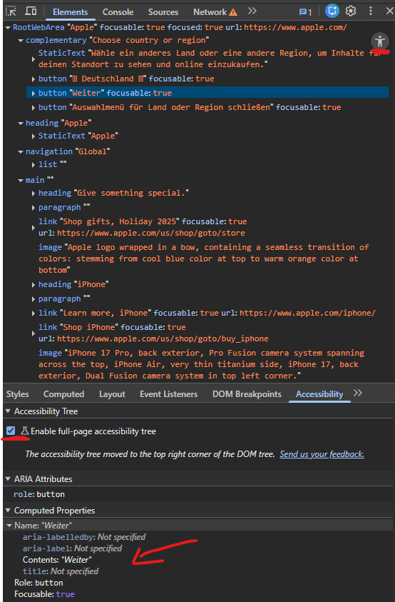
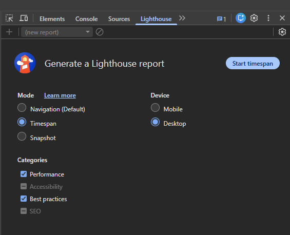
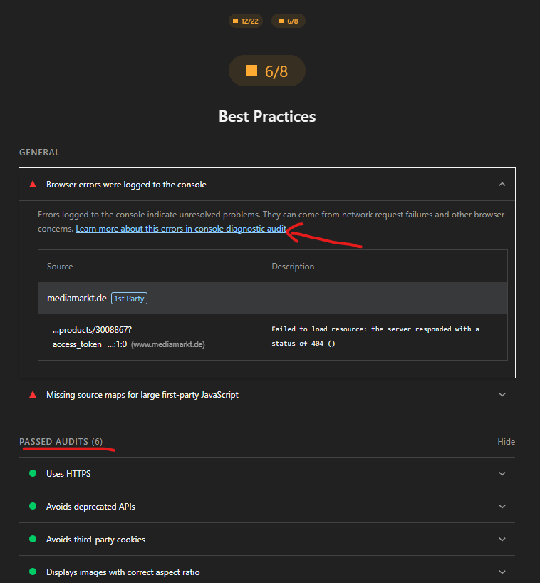
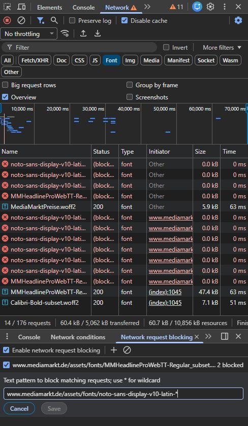
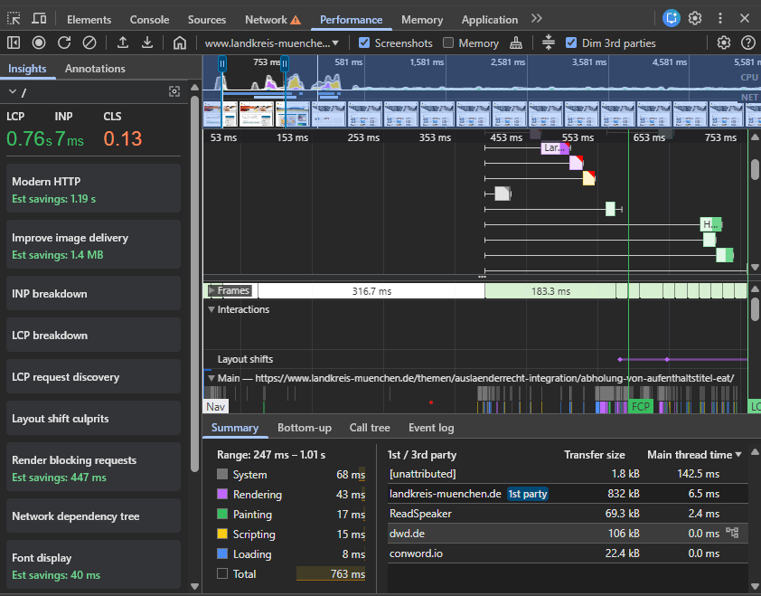
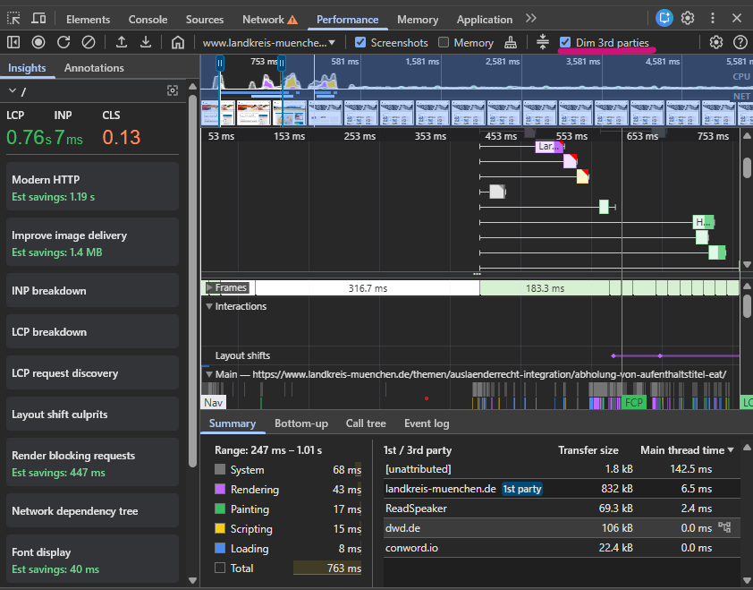
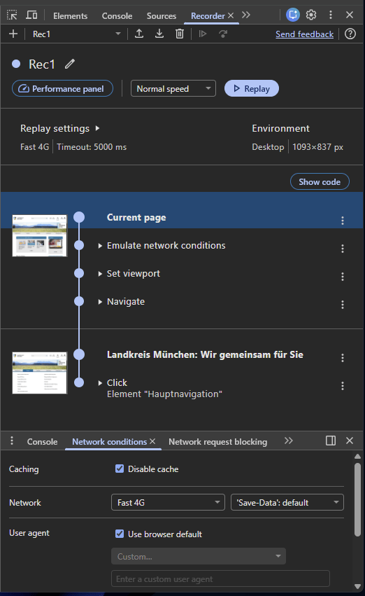
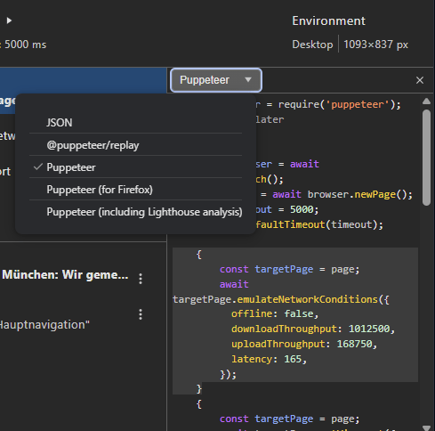
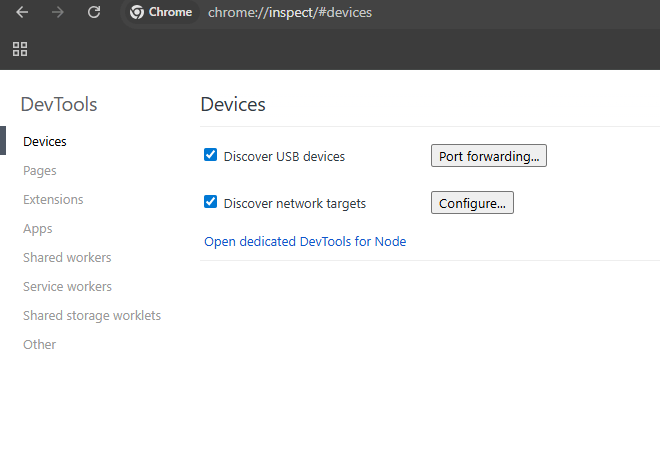

# 我一直在用的 Chrome DevTools 宝藏功能（为什么你也该试试）

> 原文：[Chrome DevTools Features I Use All the Time (and Why You Should Too)](https://calendar.perfplanet.com/2025/chrome-devtools-all-the-time/)
>
> 翻译：[嘿嘿](https://blog.heyfe.org/blog)

大多数开发者打开 Chrome DevTools（开发者工具），无非就是看几个网络请求，顶多再刷一两次页面 —— 基本也就这样了。

我以前也是如此。

但随着时间的推移，DevTools 对我来说已经完全变成了另一种存在。它不仅仅是一个调试工具，更是我理解浏览器如何运行我的代码、以及用户如何体验产品的窗口。

以下是我一直反复使用的 Chrome DevTools 功能。推荐它们不只是因为它们看起来很酷，而是因为它们改变了我对构建网页的思考方式。

## 1. 无障碍树（Accessibility Tree）：DOM 没告诉你的一切

DOM 树并不是屏幕阅读器看到的样子。

辅助技术依赖的是**无障碍树（Accessibility Tree）**，这是从 DOM 派生出的一种语义化表示。在 Chrome DevTools 的 **Elements（元素）**面板中，点击右上角的小“人像”图标，就可以直接检查它。

一旦切换过去，你就会发现很多问题：

* 缺失或不清晰的无障碍名称（Accessible names）
* 错误的 Role 角色
* 那些并没起作用的 ARIA 属性

对比 DOM 树和无障碍树，是判断你的 UI 除了视觉效果外是否真的“有意义”的最快方法之一。

如果你在意无障碍访问（说实话，你确实应该在意），这个视图简直是无价之宝。

## 2. Lighthouse 用户流程（User Flows）：不只是页面加载性能

大家通常把 Lighthouse 当成一次性的审计工具，只在页面初始加载时跑一下。

但用户体验网站的方式并不是静态的。他们会点击、打字、跳转、等待。

**Lighthouse 的时段模式（Timespans）** 让你能够测量真实交互过程中的性能：

* 提交表单
* 与 UI 组件交互

这对于需要登录后的体验、控制面板（Dashboards）以及结账流程特别有用 —— 这些地方往往隐藏着性能瓶颈。

Lighthouse 审计会根据一套标准的性能理想状态和最佳实践进行评估，并在违反规则时给出详细的改进建议。

## 3. 屏蔽网络请求：测试真实的极端情况

在 **Network（网络）** 面板中，你可以右键点击任何请求并选择屏蔽（Block）。

这听起来很简单，但它能帮你验证一些关键问题：

* 如果第三方脚本加载失败会发生什么？
* 现代图片格式是否有合适的备用方案（Fallbacks）？
* 当“非关键”资源消失时，应用还能正常工作吗？

你甚至可以使用通配符屏蔽整个 URL 模式。

这个功能会强迫你不再像一个用着高速 Wi-Fi 的开发者那样思考，而是像一个网络不稳定的真实用户那样去考虑问题。

## 4. Performance（性能）面板：理解浏览器运行逻辑的核心

**Performance** 面板起初确实让人望而生畏。到处都是火焰图、时间线和花花绿绿的颜色。

但这里也是浏览器行为变得可视化的地方。

我主要用它来做以下几件事：

* 弄清楚为什么 **LCP（最大内容绘制）** 这么慢
* 追踪 **INP（交互到下次绘制）** 的延迟
* 寻找导致 **CLS（累积布局偏移）** 的布局抖动

除了这些指标，该面板还能让你了解浏览器的运作方式：

* 是什么阻塞了渲染
* JavaScript 何时在与渲染争夺资源
* 为什么“微小”的脚本有时会产生巨大的开销

如果你关注性能，花点时间研究这个面板是非常值得的。

## 5. 淡化第三方代码：瞬间减少干扰

现代网站充斥着各种第三方脚本：统计分析、广告、插件、A/B 测试工具等等。

它们会让性能分析图表变得非常混乱。

Chrome DevTools 在 Performance 面板中有一个简单的选项：**Dim 3rd parties（淡化第三方代码）**。

一旦启用：

* 第三方代码会褪色到背景中
* 你的应用代码会变得非常显眼
* 火焰图突然间就变得好懂了

这是一个对阅读体验有巨大影响的小开关。

## 6. Recorder（录制器）：从手动调试到可复现的流程

**Recorder** 面板是 DevTools 中最被低估的功能之一。

它可以让你：

* 录制真实的用户操作流程
* 逐步回放
* 慢速回放
* 在流程中设置断点
* 在查看录制步骤的同时检查生成的代码

你甚至可以将流程导出为 **Puppeteer 脚本**，或者基于这些流程生成性能分析报告。

Recorder 弥补了“我能手动复现”和“我们可以将其自动化并分享”之间的鸿沟。

## 7. Android 远程调试：看清真实的性能表现

桌面端的 Chrome 用起来很方便，但移动设备才是现实。

通过 **远程调试（Remote debugging）**，你可以通过 `chrome://inspect` 直接检查在 Android 设备上运行的 Chrome。

这很重要，因为：

* 低端设备的表现与电脑完全不同
* CPU 和内存限制是真实存在的
* 性能问题会暴露得非常迅速

如果你从未在真实的手机上调试过，那你其实遗漏了很重要的一环。

## 写在最后

Chrome DevTools 不仅仅是为了更快地修复 Bug。

它更是关于：

* 理解浏览器的运行原理
* 以用户的视角观察你的产品
* 作为一个开发者做出更明智的权衡

这篇文章提到的内容只是个起点。但如果你能养成经常使用其中哪怕几个功能的习惯，你的前端直觉也会随之提升 —— 几乎是潜移默化的。

哦对了，经常看 DevTools 的更新日志能让你在派对上变得“倍儿受欢迎”（才怪）。

*感谢阅读！*