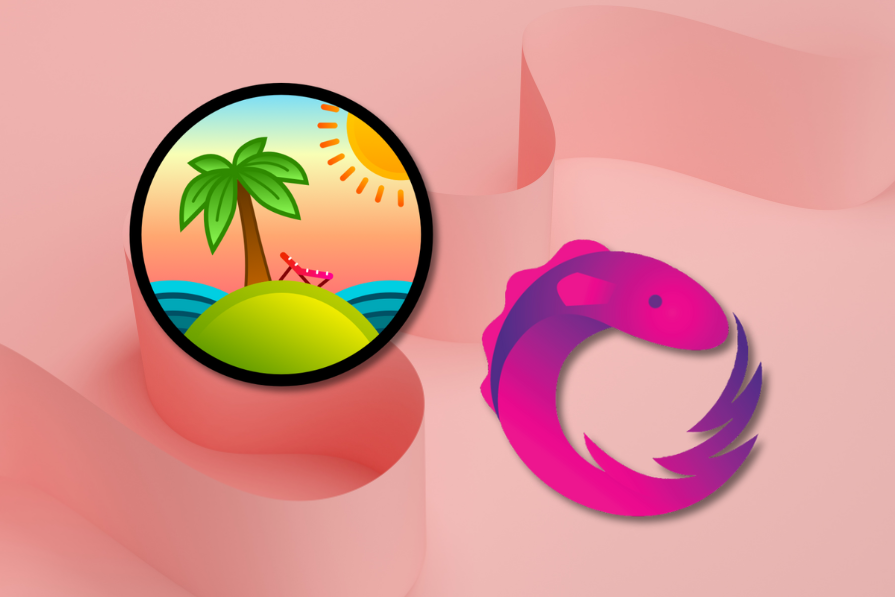
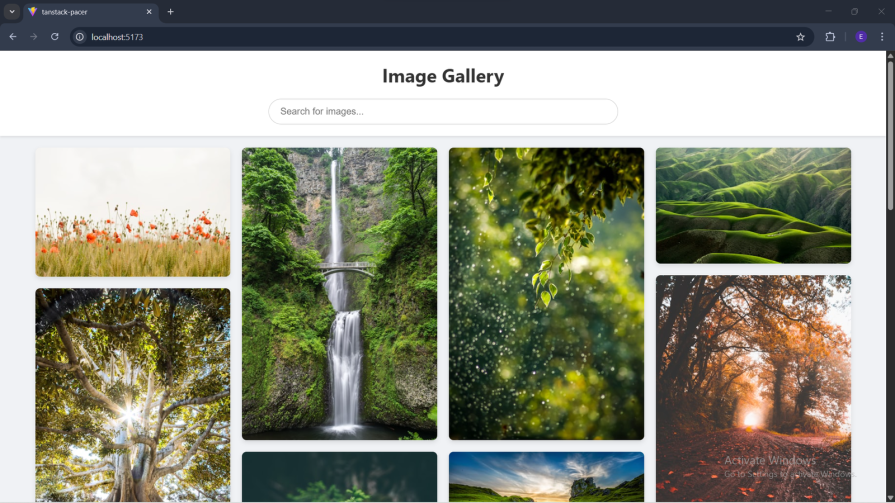
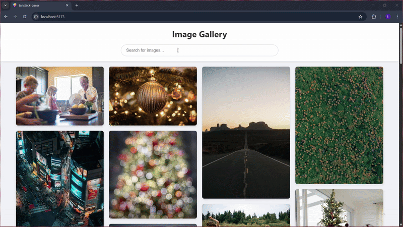
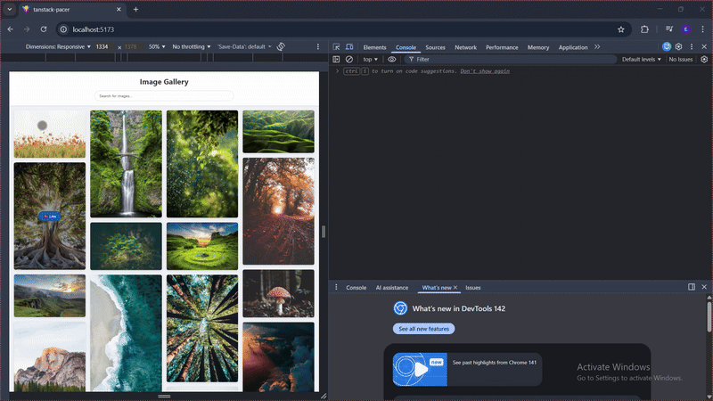
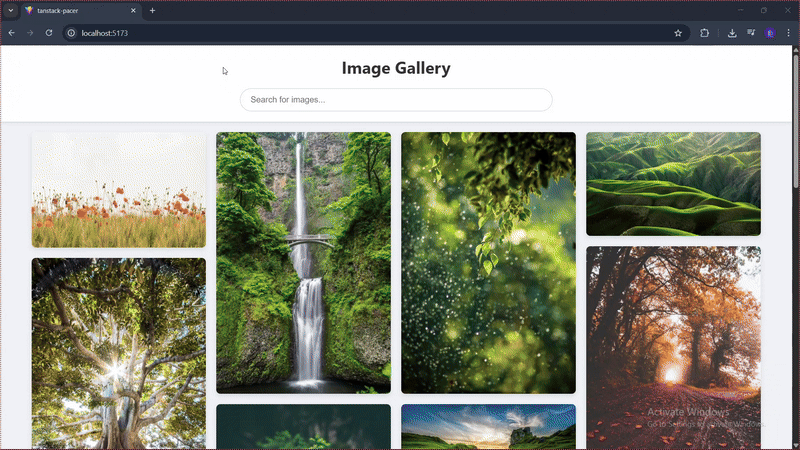

# 告别 RxJS：TanStack Pacer 使用指南

> 原文：[Moving beyond RxJS: A guide to TanStack Pacer - LogRocket Blog](https://blog.logrocket.com/beyond-rxjs-guide-tanstack-pacer/)
>
> 翻译：[嘿嘿](https://blog.heyfe.org/blog)

现代 Web 应用越来越关注任务执行的**时机**，而不仅仅是任务**本身**。用户输入、滚动事件、埋点上报以及 API 请求都在争夺主线程的有限资源。



如果时机管理不当，结果往往就是页面卡顿、请求重复，或者是那些极难调试的隐蔽竞态条件（Race conditions）。

在这篇指南中，我们将使用 React 和 TanStack Pacer 动手实现一个 Pinterest 风格的无限滚动图片库。

在这个过程中，我们会用到 Pacer 的核心工具（防抖、节流、批处理和限流）来解决常见的 UI 性能问题，且无需引入复杂的响应式编程模式。

读完本文后，你将了解如何针对特定的时机问题选择合适的 Pacer 工具，如何将其整洁地集成到 React 应用中，以及如何避免手写这类逻辑时常遇到的各种坑。

###  订阅 The Replay 周刊

[**The Replay**](https://blog.logrocket.com/the-replay-archive/) 是一份面向开发者和工程主管的每周时事通讯。

每周发送一次，为你精选前端开发、新兴 AI 工具以及现代软件现状等领域最重要的深度对话。

带 * 的字段为必填项。

## 为什么选择 Pacer 而不是 RxJS？

RxJS 在建模复杂的事件流方面非常强大，但很多 UI 性能问题其实并不需要一整套完整的响应式抽象。

TanStack Pacer 专注于解决前端应用中常见的时机问题，其心智负担和运行时占用都更小。

考虑使用 Pacer 的几个核心理由：

*   **学习曲线更平缓**：RxJS 要求你掌握 `Observable` 的心智模型。而 Pacer 就像调用一个普通的函数或 Hook 一样简单。
*   **包体积更小**：Pacer 非常轻量，且支持摇树优化（Tree-shaking）。
*   **卸载时自动清理**：无需手动管理订阅（Subscription）。
*   **React 友好**：能够自然地配合 React 的单向数据流工作。
*   **TypeScript 优先**：开箱即用的强类型推断。

## 准备工作

在开始之前，请确保你已准备好以下环境：

*   一个 React 应用（Vite、Next.js 或 Create React App 均可）。
*   安装好 Node.js，以及一个包管理器（如 npm、pnpm 或 Yarn）。
*   熟悉 React Hooks（如 `useState` 和 `useEffect`），以及异步 JavaScript 概念（如 `async/await` 和 Promise）。
*   从 Unsplash 开发者网站获取一个免费的 API 密钥（稍后会将其添加到环境变量中）。

## 什么是 Pacer？

Pacer 是一个框架无关的、专门为前端应用设计的库，旨在控制异步事件的时机，且不引入响应式编程（Reactive Programming）模式的复杂性。

虽然 RxJS 等方案为复杂的响应式场景提供了强大的 `Observable` 流，但 Pacer 将重点放在了 UI 开发中最常用的时机原语上：防抖（Debouncing）、节流（Throttling）、限流（Rate limiting）和批处理（Batching）。

Pacer 并不是为了取代响应式库，而是通过极简的抽象覆盖绝大多数 UI 时机控制的需求，作为其补充。

## 快速上手 TanStack Pacer

开始使用 TanStack Pacer 非常简单。我们将创建一个 React 项目，安装相关包，并为 Demo 搭建基础文件结构。

### 安装

如果你还没创建项目，可以先创建一个（以 Vite 为例）：

```bash
npm create vite@latest my-image-gallery -- --template react-ts
cd my-image-gallery
```

安装 TanStack Pacer：

```bash
npm install @tanstack/react-pacer
```

为了实现这个类 Pinterest 的应用，我们需要创建以下文件夹：

*   `components`
*   `hooks`
*   `services`

在 `components` 文件夹中创建以下文件：

*   `ImageCard.tsx`
*   `ImageGrid.tsx`
*   `SearchBar.tsx`

在 `hooks` 文件夹中创建：

*   `useImageSearch.ts`

在 `services` 文件夹中创建：

*   `analytics.ts`

最后，在项目根目录创建一个 `.env` 文件并添加你的 Unsplash API 密钥：

```env
VITE_UNSPLASH_API_KEY=在这里填入你的_UNSPLASH_API_KEY
```

## 我该使用哪种 Pacer 工具？

选择哪种 Pacer 工具取决于你要解决的时机问题。每种工具控制执行的方式不同，适用于不同的 UI 场景。

下表是一个快速查阅指南，帮你根据具体用例找到最合适的工具。

| 工具 | 适用场景 | 常见用例 | 解决的问题 |
| :--- | :--- | :--- | :--- |
| **Debounce (防抖)** | 等待空闲期 | 搜索输入、自动补全、窗口缩放事件 | 延迟执行，直到用户停止触发操作 |
| **Throttle (节流)** | 限制执行频率 | 无限滚动、滚动/缩放监听器 | 确保函数在给定时间间隔内最多执行一次 |
| **Batch (批处理)** | 合并多个操作 | 埋点上报、日志记录、批量更新 | 将多次调用合并为一次操作执行 |
| **Rate limit (限流)** | 强制执行上限 | API 请求、后台任务 | 限制在一段时间内可以执行多少次操作 |

接下来，我们开始构建应用。

## 设置批处理（Batching）

我们将使用 TanStack Pacer 中的 `AsyncBatcher` 来收集应用中产生的多个类似事件，并将它们一次性发送到服务器。

这是埋点分析中的常用模式，既能减少网络通信开销（Network chatter），又不会丢失事件的完整性。

在 `analytics.ts` 中粘贴以下代码：

```typescript
import { AsyncBatcher } from '@tanstack/pacer';

const analyticsBatcher = new AsyncBatcher(
  async (events: { eventName: string; payload: any }[]) => {
    console.log('正在向服务器发送批量埋点事件：', events);
    // 模拟网络请求
    await new Promise((resolve) => setTimeout(resolve, 500));
    console.log('批量埋点事件发送成功！');
  },
  {
    wait: 2000,   // 每 2 秒刷新一次
    maxSize: 10,  // 或者当积攒到 10 个事件时立即发送
  }
);

export default {
  track: (eventName: string, payload: any) => {
    analyticsBatcher.addItem({ eventName, payload });
  },
};
```

在这段代码中，我们使用 `AsyncBatcher` 创建了一个埋点队列。第一个参数是一个异步函数，定义了当一批数据准备好时该如何处理。

它会接收到自上次发送以来收集到的所有事件组成的数组。

配置项决定了何时处理批次。这个批处理器每两秒钟刷新一次，但如果在两秒内达到了 10 条数据，它也会提前发送。

最后，该文件导出了一个简单的 `track` 方法，应用的其他部分只需调用它，完全不需要关心背后是如何进行批处理的。

### 在 `ImageCard` 中记录“点赞”

接下来，我们将在图片卡片组件中使用这个埋点服务来记录点赞操作。
将以下代码粘贴到 `ImageCard.tsx`：

```tsx
import React from 'react';
import analyticsService from '../services/analytics';

interface ImageCardProps {
  image: {
    id: string;
    urls: {
      small: string;
    };
    alt_description: string;
  };
}

const ImageCard: React.FC<ImageCardProps> = ({ image }) => {
  const handleLike = () => {
    analyticsService.track('like_image', { imageId: image.id });
    alert(
      '你给这张图片点了赞！“点赞”事件已加入批处理队列，很快就会发送到服务器。'
    );
  };

  return (
    <div className="image-card">
      
      <div className="image-card-overlay">
        <button onClick={handleLike}> 点赞</button>
      </div>
    </div>
  );
};

export default ImageCard;
```

这个组件渲染一张带有“点赞”按钮的图片。当用户点击时，处理函数会调用 `analyticsService.track()`。由于背后有批处理器，这个事件会被加入队列，而不是立即触发网络请求。

## 设置防抖（Debounce）

接下来，我们将使用 `useDebouncedCallback` Hook 对搜索输入进行防抖。

这能确保 `onSearch` 回调只有在用户停止输入后才触发，从而减少冗余的 API 调用，并让 UI 表现更稳定。

在 `SearchBar.tsx` 中粘贴以下内容：

```tsx
import React from 'react';
import { useDebouncedCallback } from '@tanstack/react-pacer';
import analyticsService from '../services/analytics';

interface SearchBarProps {
  onSearch: (query: string) => void;
}

const SearchBar: React.FC<SearchBarProps> = ({ onSearch }) => {
  const handleSearch = useDebouncedCallback(
    (query: string) => {
      onSearch(query);
      analyticsService.track('search_initiated', { query });
    },
    { wait: 500 } // 500ms 的空闲期
  );

  return (
    <div className="search-bar">
      <input
        type="search"
        onChange={(e) => handleSearch(e.target.value)}
        placeholder="搜索图片..."
      />
    </div>
  );
};

export default SearchBar;
```

在这里，`useDebouncedCallback` 包装了搜索逻辑并返回一个防抖函数（`handleSearch`）。设置 `wait: 500` 后，回调只会在用户停止操作 500 毫秒后执行。

在防抖函数内部，我们调用了由 `App.tsx` 传入的 `onSearch(query)`，用于更新搜索词并触发数据获取。

同时，我们也记录了一个 `search_initiated` 埋点事件。这样我们既能追踪用户意图，又不会让埋点系统被频繁的击键动作刷爆。

## 实现带限流的图片搜索

现在让我们创建一个自定义 Hook，用于管理从 Unsplash API 获取图片的过程。

这个 Hook 还将包含限流（Rate limiting）逻辑，帮助我们遵守 API 使用政策，并在用户操作过快时能够优雅地处理。

将以下代码复制并粘贴到 `useImageSearch.ts`：

```typescript
import { useState, useEffect, useCallback } from 'react';
import { useAsyncRateLimiter } from '@tanstack/react-pacer/async-rate-limiter';

const API_URL = 'https://api.unsplash.com';

export const useImageSearch = () => {
  const [query, setQuery] = useState('nature');
  const [images, setImages] = useState<any[]>([]);
  const [page, setPage] = useState(1);
  const [hasMore, setHasMore] = useState(true);
  const [isLoading, setIsLoading] = useState(false);
  const [error, setError] = useState<string | null>(null);

  const fetchFn = useCallback(
    async ({ searchQuery, pageNum }: { searchQuery: string; pageNum: number }) => {
      const API_KEY = import.meta.env.VITE_UNSPLASH_API_KEY;

      const url =
        searchQuery.trim() === ''
          ? `${API_URL}/photos?page=${pageNum}&per_page=20&client_id=${API_KEY}`
          : `${API_URL}/search/photos?page=${pageNum}&per_page=20&query=${searchQuery}&client_id=${API_KEY}`;

      const response = await fetch(url);
      if (!response.ok) {
        throw new Error('从 Unsplash 获取图片失败');
      }

      const data = await response.json();
      return searchQuery.trim() === '' ? data : data.results;
    },
    []
  );

  const rateLimiter = useAsyncRateLimiter(fetchFn, {
    limit: 4, // 在时间窗口内最多允许 4 次调用
    window: 2 * 60 * 1000, // 时间窗口为 2 分钟
    onReject: (_args, limiter) => {
      const remaining = limiter.getMsUntilNextWindow();
      const errorMsg = `API 限流。请在 ${Math.ceil(
        remaining / 1000 / 60
      )} 分钟后重试。`;
      setError(errorMsg);
    },
  });
```

在 `useImageSearch` 中，我们定义了搜索、分页和错误处理所需的状态。

为了负责任地调用 Unsplash API，我们使用 `useAsyncRateLimiter` 包装了 fetch 函数。

限流器会限制在指定时间窗口内执行的次数。如果请求被拦截，`onReject` 会触发，我们会向用户显示一条包含重置时间的错误信息。

继续添加 `useImageSearch.ts` 的第二部分：

```typescript
  const fetchAndSetImages = useCallback(
    async (searchQuery: string, pageNum: number) => {
      setIsLoading(true);
      setError(null);

      try {
        const newImages = await rateLimiter.maybeExecute({ searchQuery, pageNum });

        if (newImages) {
          setImages((prevImages) =>
            pageNum === 1 ? newImages : [...prevImages, ...newImages]
          );
          setHasMore(newImages.length > 0);
        }
      } catch (err: any) {
        setError(err.message);
      } finally {
        setIsLoading(false);
      }
    },
    [rateLimiter]
  );

  useEffect(() => {
    setImages([]);
    setPage(1);
    setHasMore(true);
    fetchAndSetImages(query, 1);
  }, [query, fetchAndSetImages]);

  const loadMore = () => {
    if (hasMore && !isLoading) {
      const newPage = page + 1;
      setPage(newPage);
      fetchAndSetImages(query, newPage);
    }
  };

  return { query, setQuery, images, loadMore, hasMore, isLoading, error };
};
```

接下来，我们构建 `ImageGrid.tsx`，它负责渲染结果并实现**节流式**无限滚动。

节流确保滚动位置检查以受控的节奏运行，防止在快速滚动时执行过多的逻辑。

将以下内容粘贴到 `ImageGrid.tsx`：

```tsx
import React, { useEffect } from 'react';
import ImageCard from './ImageCard';
import { useThrottledCallback } from '@tanstack/react-pacer';

interface ImageGridProps {
  images: any[];
  onLoadMore: () => void;
  hasMore: boolean;
  isLoading: boolean;
}

const ImageGrid: React.FC<ImageGridProps> = ({
  images,
  onLoadMore,
  hasMore,
  isLoading,
}) => {
  const handleScroll = useThrottledCallback(
    () => {
      const { scrollTop, clientHeight, scrollHeight } = document.documentElement;

      // 如果距离底部不到 500px 且有更多数据且不在加载中，则加载下一页
      if (scrollTop + clientHeight >= scrollHeight - 500 && hasMore && !isLoading) {
        onLoadMore();
      }
    },
    { wait: 200 } // 每 200ms 最多执行一次
  );

  useEffect(() => {
    window.addEventListener('scroll', handleScroll);
    return () => {
      window.removeEventListener('scroll', handleScroll);
    };
  }, [handleScroll]);

  return (
    <div>
      <div className="image-grid">
        {images.map((image) => (
          <ImageCard key={image.id} image={image} />
        ))}
      </div>

      {isLoading && <p>正在加载更多图片...</p>}
      {!hasMore && <p>已经到底啦！</p>}
    </div>
  );
};

export default ImageGrid;
```

## 整合应用

现在我们将所有内容连接到 `App.tsx` 中，并加上基础样式。

将 `App.tsx` 的内容替换为以下代码：

```tsx
import React from 'react';
import SearchBar from './components/SearchBar';
import ImageGrid from './components/ImageGrid';
import { useImageSearch } from './hooks/useImageSearch';
import './index.css';

const App = () => {
  const { query, setQuery, images, loadMore, hasMore, isLoading, error } = useImageSearch();

  return (
    <div className="App">
      <header className="app-header">
        <h1>图片库</h1>
        <SearchBar onSearch={setQuery} />
        {error && <p className="error-message">{error}</p>}
      </header>

      <main>
        <ImageGrid
          images={images}
          onLoadMore={loadMore}
          hasMore={hasMore}
          isLoading={isLoading}
        />
      </main>
    </div>
  );
};

export default App;
```

在 `index.css` 中添加以下 CSS，让画廊看起来更像样：

```css
:root {
  --primary-color: #007bff;
  --background-color: #f0f2f5;
  --text-color: #333;
  --card-background: #fff;
  --shadow-color: rgba(0, 0, 0, 0.1);
}

body {
  font-family: -apple-system, BlinkMacSystemFont, 'Segoe UI', Roboto, Helvetica, Arial, sans-serif;
  background-color: var(--background-color);
  color: var(--text-color);
  margin: 0;
}

.App {
  display: flex;
  flex-direction: column;
  min-height: 100vh;
}

.app-header {
  background-color: var(--card-background);
  padding: 20px;
  box-shadow: 0 2px 4px var(--shadow-color);
  position: sticky;
  top: 0;
  z-index: 10;
}

.app-header h1 {
  text-align: center;
  margin: 0 0 20px 0;
}

.search-bar input {
  width: 100%;
  max-width: 600px;
  display: block;
  margin: 0 auto;
  padding: 12px 20px;
  font-size: 16px;
  border-radius: 24px;
  border: 1px solid #ccc;
}

main {
  padding: 20px;
  flex-grow: 1;
}

.image-grid {
  column-count: 4;
  column-gap: 20px;
  max-width: 1400px;
  margin: 0 auto;
}

@media (max-width: 1200px) {
  .image-grid {
    column-count: 3;
  }
}

@media (max-width: 900px) {
  .image-grid {
    column-count: 2;
  }
}

@media (max-width: 600px) {
  .image-grid {
    column-count: 1;
  }
}

.image-card {
  position: relative;
  overflow: hidden;
  border-radius: 8px;
  box-shadow: 0 4px 8px var(--shadow-color);
  background-color: #ddd;
  break-inside: avoid;
  margin-bottom: 20px;
}

.image-card img {
  width: 100%;
  height: auto;
  object-fit: cover;
  display: block;
  transition: transform 0.3s ease;
}

.image-card:hover img {
  transform: scale(1.05);
}

.image-card-overlay {
  position: absolute;
  top: 0;
  left: 0;
  right: 0;
  bottom: 0;
  background-color: rgba(0, 0, 0, 0.4);
  opacity: 0;
  transition: opacity 0.3s ease;
  display: flex;
  align-items: center;
  justify-content: center;
  pointer-events: none;
}

.image-card:hover .image-card-overlay {
  opacity: 1;
  pointer-events: auto;
}

.image-card-overlay button {
  background-color: var(--primary-color);
  color: white;
  border: none;
  padding: 10px 20px;
  font-size: 16px;
  border-radius: 20px;
  cursor: pointer;
  transition: background-color 0.3s;
}

.image-card-overlay button:hover {
  background-color: #0056b3;
}

.error-message {
  color: #d93025;
  text-align: center;
  margin-top: 10px;
}

p {
  text-align: center;
}
```

UI 搭建完成后，下一步就是验证各个时机控制工具是否按照预期运行。

## 测试 TanStack Pacer

启动应用：

```bash
npm run dev
```



为了方便演示，我们可以把配置参数调得夸张一点，这样效果更明显。

下面的章节会告诉你需要改哪里以及应该观察到什么。

### 测试防抖（Debounce）

为了让防抖效果显而易见，可以在 `SearchBar.tsx` 中暂时将防抖延迟设置为 5 秒（例如 `{ wait: 5000 }`）。

修改后，搜索请求应该只在你停止输入整整五秒后才发出：



### 测试批处理（Batching）

测试批处理时，可以在 `analytics.ts` 中暂时将 `maxSize` 改为 4。

这样配置后，当你点下第四张图片的赞时，批处理应该立即发送：



### 测试节流（Throttling）

测试节流时，可以在 `ImageGrid.tsx` 中暂时将节流延迟设为 10 秒（例如 `{ wait: 10000 }`）。

在这种配置下，即使你疯狂滚动，无限滚动也每 10 秒最多触发一次加载：



### 测试限流（Rate limiting）

对于限流测试，保持当前配置（两分钟内允许 4 次调用）。

多次搜索后，应用应该会显示“API 限流”的消息，并在时间窗口重置前拦截后续请求：


你可以在[这里](https://github.com/emmanuelhashy/tanstack-pacer)查看完整的 Demo 项目。

## TanStack Pacer vs RxJS vs 手写逻辑

Pacer 是为解决常见的 UI 时机问题而生的。RxJS 在处理复杂的流组合（Stream composition）方面依然非常强势。

手写时机控制逻辑在临时处理一两个 Case 时可行，但随着应用规模扩大，往往会积累各种边缘情况和不一致性。

| 方案 | 适用场景 | 优势 | 不足 |
| :--- | :--- | :--- | :--- |
| **TanStack Pacer** | 常见的 UI 异步时机需求 | 轻量、支持摇树优化、专注（防抖、节流、批处理、限流）、对 React 友好 | 不适合极其复杂的事件流或高级异步组合 |
| **RxJS** | 复杂的响应式工作流 | 操作符极其强大、流组合能力、高级异步控制 | 对简单需求来说杀鸡焉用牛刀，学习曲线陡峭，包体积较大 |
| **手写逻辑** | 一次性、极其简单的需求 | 绝对控制、无依赖 | 容易写错（边缘情况多）、维护难、全应用行为不统一 |

## 总结

在这篇指南中，我们探讨了如何使用 TanStack Pacer 来构建流畅且高效的应用。

我们在 Pinterest 风格的无限滚动画廊中实现了 `AsyncBatcher`、`useDebouncedCallback`、限流以及节流，展示了这些工具如何解决 UI 代码中常见的性能和正确性问题。

对于那些希望在 React 应用中获得可预测的时机控制、同时又不想引入沉重的响应式工具集的团队来说，Pacer 提供了一个专注且实用的替代方案。