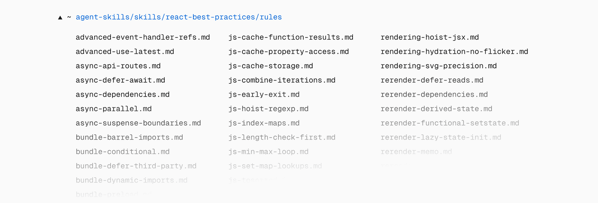
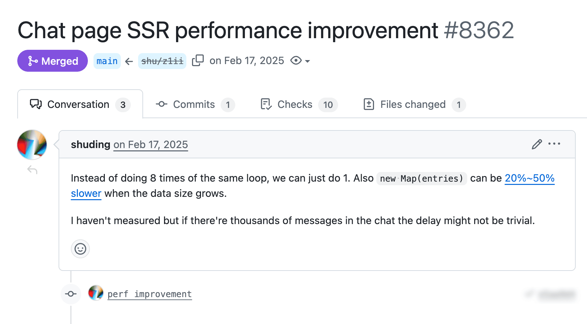

# React 最佳实践发布：Vercel 官方出品的性能优化指南

> 原文：[Introducing: React Best Practices](https://vercel.com/blog/introducing-react-best-practices)
>
> 翻译：[嘿嘿](https://blog.heyfe.org/blog)

我们将 10 多年来在 React 和 Next.js 优化方面积累的知识，浓缩成了 [react-best-practices](https://github.com/vercel-labs/agent-skills/tree/main/skills/react-best-practices) 项目。这是一个专门为 AI Agent 和大语言模型（LLM）优化的结构化知识库。



实话说，React 的性能优化工作通常都是“被动”的：版本发布了，发现应用变慢了，然后团队开始到处“救火”，去排查各种症状。这种方式不仅成本高昂，而且很容易优化错地方，导致事倍功半。

在过去十年的生产环境代码库中，我们反复看到同样的性能“病灶”：

*   异步任务不小心变成了串行（Sequential）执行。
*   客户端 Bundle 随着时间推移变得越来越臃肿。
*   组件进行了大量不必要的重复渲染。

其中的道理很简单：这些并不是什么“微优化”。它们会直接转化为用户的等待时间、页面卡顿以及每次用户访问时的重复成本。

因此，我们整理了这套 React 最佳实践框架，旨在让这些问题更容易被发现，并能更快速地得到解决。

### 核心理念：优先级顺序

大多数性能优化工作之所以失败，是因为切入点太低了。

如果一个请求瀑布流（Waterfall）增加了 600ms 的等待时间，那你再怎么优化 `useMemo` 也是白搭。如果你给每个页面都多发了 300KB 的 JavaScript，在循环里省下那几微秒根本无关痛痒。

性能问题是会累积的。你今天引入的一个细微的性能退化，在有人来清理这笔债务之前，都会变成每一次用户访问的长期“负担”。

所以，这套框架从两个最能显著提升现实指标的优化点开始：

1.  **消除瀑布流**
2.  **减小 Bundle 体积**

接着，它会延伸到服务端性能、客户端数据获取以及重复渲染优化。

该框架包含 8 个类别的 40 多条规则，按影响力从“至关重要（CRITICAL）”（如消除瀑布流、减小包体积）到“增量提升（INCREMENTAL）”（如高级模式）进行排序。

## 里面还有什么？

该仓库涵盖了八个性能类别：

*   消除异步瀑布流
*   Bundle 体积优化
*   服务端性能
*   客户端数据获取
*   重复渲染优化
*   渲染性能
*   高级模式
*   JavaScript 性能

每条规则都包含影响力评级（从 CRITICAL 到 LOW），帮助你排好修复的优先级，并附带代码示例，展示哪些写法会出问题以及该如何修复。

例如，下面是一个阻碍代码 Tree-shaking（无用代码消除）的常见模式：

*错误写法（两个分支都会被阻塞）：*

```typescript
async function handleRequest(userId: string, skipProcessing: boolean) {
  // 即使 skipProcessing 为 true，也会等待 fetchUserData
  const userData = await fetchUserData(userId)
  
  if (skipProcessing) {
    return { skipped: true }
  }
  
  // 只有这个分支才真正需要 userData
  return processUserData(userData)
}
```

*正确写法（仅在需要时阻塞）：*

```typescript
async function handleRequest(userId: string, skipProcessing: boolean) {
  if (skipProcessing) {
    return { skipped: true }
  }
  
  const userData = await fetchUserData(userId)
  return processUserData(userData)
}
```

这些独立的规则文件会编译成 `AGENTS.md`，这是一个单一文档，你的 AI Agent 在审查代码或提供优化建议时可以随时查阅。它的设计初衷就是为了被持续遵循（包括执行代码重构的 AI Agent），这样团队就能在大规模代码库中应用一致的决策标准。

## 这些实践是如何收集的？

这些规则并非纸上谈兵，它们全都源自生产环境代码库的真实性能优化案例。

举几个例子：



**合并循环迭代**

在一个聊天页面中，代码竟然对同一组消息列表进行了 8 次独立的遍历扫描。我们将其合并为一次遍历，当你有数千条消息时，这个提升是非常可观的。

**并行化 await**

某个 API 在等待一个数据库调用完成后才开始下一个，尽管它们之间并没有依赖关系。通过让它们同时运行，总等待时间直接减半。

**状态惰性初始化（Lazy State Initialization）**

一个组件在每次渲染时都会从 `localStorage` 解析一次 JSON 配置，尽管它只在初始化状态时需要它一次。通过将解析过程包裹在回调函数中（`useState(() => JSON.parse(...))`），成功消除了这些无用功。

### 在你的编程 Agent 中使用 `react-best-practices`

这些最佳实践也被打包成了 [Agent Skills](https://github.com/vercel-labs/agent-skills)，可以安装到 Opencode、Codex、Claude Code、Cursor 以及其他编程 Agent 中。当你的 Agent 发现级联的 `useEffect` 调用或沉重的客户端导入时，它可以引用这些模式并给出修复建议。

```bash
npx add-skill vercel-labs/agent-skills
```

快去 [react-best-practices](https://github.com/vercel-labs/agent-skills/tree/main/skills/react-best-practices) 仓库看看吧。