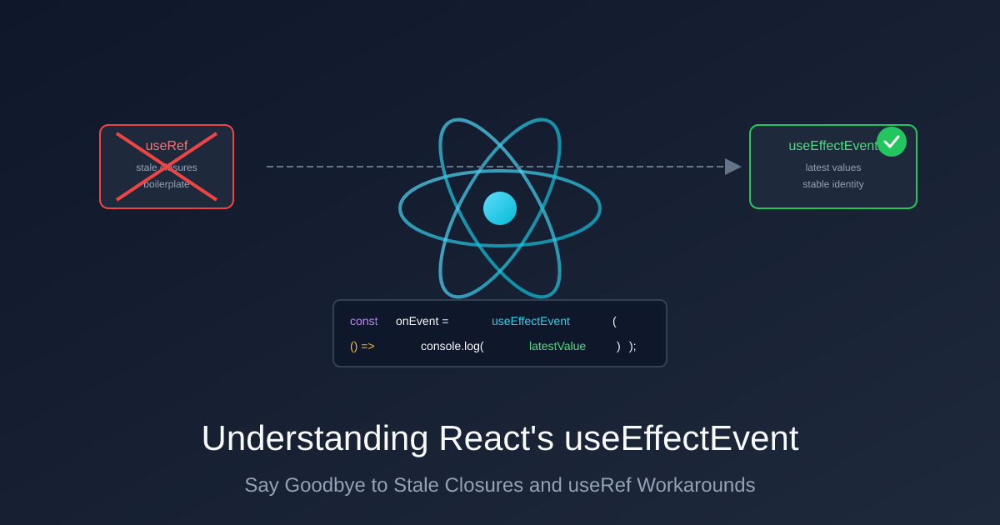

# 深入理解 React 的 useEffectEvent：解决闭包陷阱的终极指南

> 原文：[Understanding React's useEffectEvent: A Complete Guide to Solving Stale Closures | Peter Kellner's Blog](https://peterkellner.net/2026/01/09/understanding-react-useeffectevent-vs-useeffect/)
>
> 翻译：[嘿嘿](https://blog.heyfe.org/blog)

## 太长不看版

`useEffectEvent` 让你能在 Effect 内部读取最新的 props 或 state，同时又不需要把它们加到依赖数组（dependency array）里。这意味着，当这些值变化时，Effect 不会重新运行。[直接跳到第一个示例](#示例-1聊天室连接)。



---

## 核心问题

想象一下这种情况：你有一个 `useEffect` 负责处理一些比较“重”的逻辑——比如建立 WebSocket 连接、设置定时器或订阅某些数据。在这些逻辑中，你的回调函数需要读取一些 state。但是，你并不希望这些 state 变化时导致连接断开并重新构建。

**这种纠结在于：**

* 如果把 state 放到依赖数组里 → 导致 Effect 重新运行，连接重启（这很糟糕）。
* 如果不把 state 放到依赖数组里 → 回调函数看到的是旧的值，即“陈旧闭包（stale closure）”（这同样很糟糕）。

`useEffectEvent` 就是为了解决这个问题而生的。它提供了一个函数，这个函数在被调用时总能读取到最新的值，但它本身不会被当作响应式依赖。

---

## 示例 1：聊天室连接

我们来写一个聊天组件。当新消息到达时，我们想播放一段声音——但前提是用户没有开启“静音通知”。

### 错误示范（闭包陷阱）

```javascript
import { useEffect, useState } from "react";

function ChatRoom({ roomId }: { roomId: string }) {
  const [isMuted, setIsMuted] = useState(false);

  useEffect(() => {
    const connection = connectToRoom(roomId);

    connection.on("message", (message: string) => {
      // BUG：这里捕获的是 isMuted 的初始值
      // 就算用户切换了复选框，这里也永远感知不到更新！
      if (!isMuted) {
        playSound();
      }
    });

    return () => connection.disconnect();
  }, [roomId]); // ❌ 漏掉了 isMuted - 回调函数拿到的值是过期的！

  return (
    <div>
      <h1>Chat Room: {roomId}</h1>
      <label>
        <input
          type="checkbox"
          checked={isMuted}
          onChange={(e) => setIsMuted(e.target.checked)}
        />
        Mute notifications
      </label>
    </div>
  );
}
```

**哪里出错了：** 当 Effect 第一次运行时，回调函数捕获了当时的 `isMuted` 值。用户切换了静音？回调函数看到的还是老掉牙的旧值。这就是所谓的[闭包（closure）](https://developer.mozilla.org/zh-CN/docs/Web/JavaScript/Closures)过期了。

### 拆东墙补西墙的“修复”方案

你可能会想：“把 `isMuted` 加到依赖数组里不就得了！”

```javascript
useEffect(() => {
  const connection = connectToRoom(roomId);

  connection.on("message", (message: string) => {
    if (!isMuted) {
      playSound();
    }
  });

  return () => connection.disconnect();
}, [roomId, isMuted]); // ❌ 现在 isMuted 会触发重连了！
```

现在回调函数确实能拿到最新值了……但代价是每次 `isMuted` 变化时：

1. React 运行清理函数 → `connection.disconnect()`
2. React 重新运行 Effect → `connectToRoom(roomId)`
3. 重新注册消息处理器

**仅仅点一下静音复选框，居然会导致聊天重连！** 重连期间可能会丢失消息，服务器也会看到连接频繁断开又重连。这不仅浪费资源，而且体验很差。

### 终极解决方案：useEffectEvent

```javascript
import { useEffect, useState, useEffectEvent } from "react";

function ChatRoom({ roomId }: { roomId: string }) {
  const [isMuted, setIsMuted] = useState(false);

  // 创建一个 Effect Event —— 被调用时读取最新的 isMuted
  const onMessage = useEffectEvent((message: string) => {
    if (!isMuted) {
      playSound();
    }
  });

  useEffect(() => {
    const connection = connectToRoom(roomId);
    connection.on("message", onMessage);
    return () => connection.disconnect();
  }, [roomId]); // ✅ 只有 roomId 变化才会触发重连

  return (
    <div>
      <h1>Chat Room: {roomId}</h1>
      <label>
        <input
          type="checkbox"
          checked={isMuted}
          onChange={(e) => setIsMuted(e.target.checked)}
        />
        Mute notifications
      </label>
    </div>
  );
}
```

**现在的运行逻辑：**

* 修改 `roomId` → 重新连接（完全正确！）。
* 切换 `isMuted` → 对连接没有任何影响。
* 消息到达 → 执行 `onMessage`，它会检查**当前**那一刻的 `isMuted` 值。

Effect 现在只关心 `roomId`。而 `onMessage` 函数在被调用时会去读取 `isMuted`，拿到的永远是此时此刻的最新值。

---

## 示例 2：REST 轮询仪表盘

这是另一个常见场景：一个每 10 秒请求一次 API 的仪表盘。请求中包含一个用户可以切换的过滤选项。

### 错误示范（定时器重置）

```javascript
import { useEffect, useState } from "react";

function Dashboard({ teamId }: { teamId: string }) {
  const [includeArchived, setIncludeArchived] = useState(false);
  const [data, setData] = useState(null);

  useEffect(() => {
    const fetchData = async () => {
      const response = await fetch(
        `/api/team/${teamId}/tasks?archived=${includeArchived}`
      );
      const json = await response.json();
      setData(json);
    };

    fetchData(); // 立即获取
    const intervalId = setInterval(fetchData, 10000); // 之后每 10 秒获取一次

    return () => clearInterval(intervalId);
  }, [teamId, includeArchived]); // ❌ 切换复选框会重启定时器！

  return (
    <div>
      <h1>Team Dashboard</h1>
      <label>
        <input
          type="checkbox"
          checked={includeArchived}
          onChange={(e) => setIncludeArchived(e.target.checked)}
        />
        Include archived tasks
      </label>

      <ul>
        {data?.map((task) => (
          <li key={task.id}>{task.name}</li>
        ))}
      </ul>
    </div>
  );
}
```

**哪里出错了：** 每次用户切换“包含已归档”时：

1. Effect 清理函数运行 → `clearInterval(intervalId)`
2. Effect 再次运行 → 新的定时器从零开始计时

如果用户在 3 秒内点了 5 次，定时器就会被重置 5 次，根本没机会触发请求。直到用户停止点击，数据才会被获取。

### 终极解决方案：useEffectEvent

```javascript
import { useEffect, useState, useEffectEvent } from "react";

function Dashboard({ teamId }: { teamId: string }) {
  const [includeArchived, setIncludeArchived] = useState(false);
  const [data, setData] = useState(null);

  // Effect Event 在被调用时读取最新的 includeArchived
  const fetchData = useEffectEvent(async () => {
    const response = await fetch(
      `/api/team/${teamId}/tasks?archived=${includeArchived}`
    );
    const json = await response.json();
    setData(json);
  });

  useEffect(() => {
    fetchData();
    const intervalId = setInterval(fetchData, 10000);
    return () => clearInterval(intervalId);
  }, [teamId]); // ✅ 只有 teamId 变化才会重启定时器

  return (
    <div>
      <h1>Team Dashboard</h1>
      <label>
        <input
          type="checkbox"
          checked={includeArchived}
          onChange={(e) => setIncludeArchived(e.target.checked)}
        />
        Include archived tasks
      </label>

      <ul>
        {data?.map((task) => (
          <li key={task.id}>{task.name}</li>
        ))}
      </ul>
    </div>
  );
}
```

**现在的运行逻辑：**

* 修改 `teamId` → 重启定时器，获取新团队的数据（正确！）。
* 切换“包含已归档” → 定时器持续运行，不受干扰。
* 下一次轮询到达 → 使用当前的 `includeArchived` 值。

---

## 老办法：useRef

在 `useEffectEvent` 出现之前，标准的做法是把值镜像到 `useRef` 中：

```javascript
function Dashboard({ teamId }: { teamId: string }) {
  const [includeArchived, setIncludeArchived] = useState(false);
  const [data, setData] = useState(null);

  // 第一步：创建一个 ref
  const includeArchivedRef = useRef(includeArchived);

  // 第二步：保持 ref 与 state 同步
  useEffect(() => {
    includeArchivedRef.current = includeArchived;
  }, [includeArchived]);

  // 第三步：在 Effect 中读取 ref
  useEffect(() => {
    const fetchData = async () => {
      const response = await fetch(
        `/api/team/${teamId}/tasks?archived=${includeArchivedRef.current}`
      );
      const json = await response.json();
      setData(json);
    };

    fetchData();
    const intervalId = setInterval(fetchData, 10000);
    return () => clearInterval(intervalId);
  }, [teamId]);

  // ... JSX
}
```

**这种方法确实管用**，但是：

* 需要额外声明 `useRef`。
* 需要额外的 `useEffect` 来同步值。
* 必须记得读取 `.current` 而不是直接用 state。
* 每一个需要“逃逸”的值都要重复这一套动作。

`useEffectEvent` 实际上就是帮你把这一套模式自动化了。

---

## 关于函数一致性的说明

> **⚠️ 常见的困惑：返回的函数引用是稳定的吗？**
> 
> 你可能会想：`onMessage`（`useEffectEvent` 返回的函数）是稳定的吗？它会像 `useCallback` 提供的那样在每次渲染时保持相同的引用吗？
> 
> **不，它不稳定，但这并不重要。**
> 
> React 在每次渲染时都会返回一个新的 `onMessage` 函数。如果你把 `onMessage` 放到依赖数组里，你的 Effect 每次渲染都会重新运行——这说明你用错地方了。
> 
> **为什么它依然有效：** 虽然 `onMessage` 在渲染 1 和渲染 2 时是不同的函数实例，但它们都读取同一个内部的 ref。React 会负责更新这个 ref。因此，即使订阅逻辑调用的是渲染 1 时捕获的 `onMessage`，它执行时依然能读取到当前的最新值。
> 
> **一句话总结：** 别担心函数引用稳不稳定。只要遵循规则——在 Effect 内部调用它，永远不要把它列入依赖数组。

---

## 它是如何工作的

这里没有什么魔法。`useEffectEvent` 做的事情和你手动用 `useRef` 做的事情一模一样，只不过 React 帮你代劳了。

这是一个概念模型（并不是 React 的真实实现）：

```javascript
function useEffectEvent<T extends (...args: any[]) => any>(callback: T): T {
  const latestCallbackRef = useRef(callback);

  // React 实际上是在 commit 阶段更新它，而不是 render 阶段
  //（这里为了清晰做了简化）
  latestCallbackRef.current = callback;

  // 每次渲染都返回一个“新”函数——这是故意的！
  // 所有版本的函数都读取同一个 ref，所以它们都能拿到最新值
  return ((...args: Parameters<T>) => {
    return latestCallbackRef.current(...args);
  }) as T;
}
```

**关键点：** 所有函数实例共享同一个 ref。即便你的 Effect 捕获了渲染 1 时的“旧”函数，调用它时它依然会去 `latestCallbackRef.current` 里找东西——而那里指向的是最新的回调逻辑。

### 闭包陷阱问题图解


### useRef 如何解决它


### useEffectEvent 的原理


### 等效关系


---

## 规则与限制

使用 `useEffectEvent` 需要遵守一些重要的规则。[eslint-plugin-react-hooks](https://www.npmjs.com/package/eslint-plugin-react-hooks)（6.1.1+ 版本）会强制执行这些规则。

### 规则 1：只能在 Effect 内部调用 Effect Event

Effect Event 的设计初衷只有一个：在 Effect 内部被调用。

```javascript
// ✅ 正确：在 Effect 内部调用
const onMessage = useEffectEvent((msg: string) => {
  console.log(msg, latestState);
});

useEffect(() => {
  socket.on("message", onMessage);
  return () => socket.off("message", onMessage);
}, []);

// ❌ 错误：在事件处理器中调用
<button onClick={() => onMessage("hello")}>Click me</button>

// ❌ 错误：在渲染期间调用
return <div>{onMessage("rendered")}</div>;
```

React 会对此进行严密监控——如果你在 Effect 上下文之外调用 Effect Event，它会直接抛出错误。

对于常规的事件处理器（如 `onClick`、`onChange` 等），你不需要 `useEffectEvent`。因为这些处理器本身就是在每次交互时运行的，天然能拿到最新的值。

### 规则 2：不要把 Effect Event 传给其他组件

让 Effect Event 留在它所属的组件内部：

```javascript
// ❌ 错误：将 Effect Event 作为 prop 传递
function Parent() {
  const onTick = useEffectEvent(() => {
    console.log(latestCount);
  });

  return <Timer onTick={onTick} />; // 别这么干！
}

// ✅ 正确：保持本地化
function Parent() {
  const [count, setCount] = useState(0);

  const onTick = useEffectEvent(() => {
    console.log(count);
  });

  useEffect(() => {
    const id = setInterval(() => onTick(), 1000);
    return () => clearInterval(id);
  }, []);

  return <div>Count: {count}</div>;
}
```

### 规则 3：不要用 useEffectEvent 来通过 Lint 检查

这关乎你的初衷。问问自己：“当这个值变化时，Effect 应该重新运行吗？”

* **应该** → 它是依赖项，把它列出来。
* **不应该** → 把这部分逻辑封装进 Effect Event。

```javascript
// ❌ 错误：利用 useEffectEvent 逃避把 page 列为依赖
const fetchData = useEffectEvent(async () => {
  const data = await fetch(`/api/items?page=${page}`);
  setItems(data);
});

useEffect(() => {
  fetchData();
}, []); // “嘿嘿，现在我不需要把 page 放进依赖了！” <- 这种想法是错的！

// ✅ 正确：page 应该是依赖项 —— 页面变化时你当然想重新获取数据
useEffect(() => {
  async function fetchData() {
    const data = await fetch(`/api/items?page=${page}`);
    setItems(data);
  }
  fetchData();
}, [page]);
```

---

## 什么时候该用 useEffectEvent？

当你在 Effect 内部有一个回调函数，且该函数满足以下条件时，请使用它：

1. **该函数被传给了订阅逻辑、定时器或外部库**，而你不希望因此频繁地重新注册它们。
2. **该函数被调用时需要读取最新的 props 或 state**。
3. **这些值的改变不应该触发 Effect 重新运行**。

| 场景 | 响应式（触发 Effect） | 非响应式（Effect Event） |
| :--- | :--- | :--- |
| 聊天室连接 | roomId | isMuted, theme |
| 轮询仪表盘 | teamId | includeArchived, sortOrder |
| 埋点日志 | pageUrl | cartItemCount, userId |
| WebSocket 消息 | socketUrl | isOnline, preferences |
| 间隔定时器 | - (只运行一次) | count, step |

---

## React 版本说明

`useEffectEvent` 在 React 19.2 中正式成为稳定功能。如果你使用的是早期版本：

* **React 18.x 及更早版本**：使用上文提到的 `useRef` 模式。
* **React 19.0-19.1**：`useEffectEvent` 已存在但处于实验阶段。
* **React 19.2+**：放心大胆地用吧。

检查你的 React 版本：

```bash
npm list react
```

---

## 总结

`useEffectEvent` 解决了一个非常具体的问题：**在 Effect 回调中读取最新的值，同时又不让这些值导致 Effect 重新运行。**

这就是它的全部作用，没有其他玄学。

**核心心智模型：**

* **依赖数组（Dependencies）** 回答的是：“这个 Effect 什么时候该重新运行？”
* **Effect 事件（Effect Events）** 回答的是：“当 Effect 的回调执行时，我该读取哪些值？”

通过将这两个关注点分离，你的代码会变得更清晰，Bug 也会更少。

---

## 延伸阅读

* [React 文档：useEffectEvent 参考](https://react.dev/reference/react/useEffectEvent) - 官方 API 文档
* [React 文档：将事件从 Effect 中分离](https://react.dev/learn/separating-events-from-effects) - 深入的概念指南
* [React 文档：useEffect 参考](https://react.dev/reference/react/useEffect) - 详尽的 Effect 文档
* [MDN：闭包](https://developer.mozilla.org/zh-CN/docs/Web/JavaScript/Closures) - 了解闭包陷阱背后的 JS 基础概念
