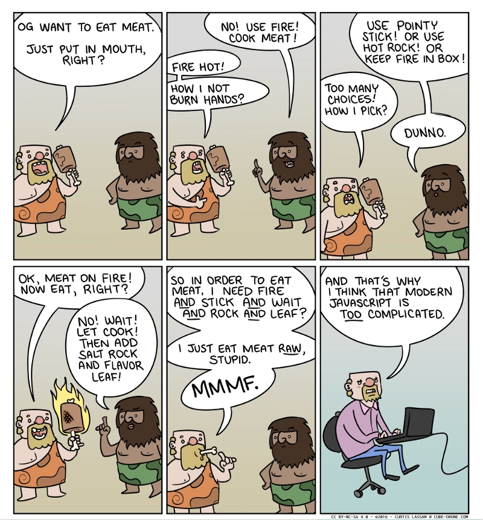

# JavaScript 框架——迈向 2026

> 原文： [JavaScript Frameworks - Heading into 2026](https://dev.to/this-is-learning/javascript-frameworks-heading-into-2026-2hel)
>
> 翻译： [樱吹雪](https://juejin.cn/user/1179091901098269)

我想，三年过去了，我对 JavaScript 框架的回顾现在可以算作是一个年度活动了。对于 2025 年，我感到这篇文章很难下笔，因为有一个清醒的现实摆在面前：我们尝试过的许多想法并不能带我们彻底抵达终点。但有时我们都需要认清现实，这是一种重置期望的方式。

这种情绪在今年延续了下来。[一些本不该再有新版本的库却发布了更新](https://x.com/htmx_org/status/1985421962827743574)。

React 这一年过得挺艰难，[经历了一些显眼的崩溃和安全漏洞](https://x.com/localhost_5173/status/1967203307853873363)。

今年发生了很多变化，但更多的是视角的转变。如果说 AI 以前还不够主流，那么在过去的一年里，它已经完全主导了对话。以至于真的没人再谈论新的 JavaScript 框架或框架特性了。但这并不意味着事物没有在进化。

我们在航行中已经到达了一个点：愿景比实现更重要。最初促使许多框架采用 Signals（信号）的性能关注点，已经让位于更具战略性的思考。因此，深入探讨这些方向似乎是开启我们要谈论的 2026 年话题的最佳切入点。

## AI 优先的框架

在过去的几年里，我曾评论说 AI 对 JavaScript 框架的开发方式影响甚微。虽然开发者不断使用新工具，且大语言模型（LLM）在生成各种框架代码方面变得越来越好，但框架本身并没有做太多改变。当然，它改变了我们查看文档的方式，一些工具也添加了 MCP 服务器。但它真的改变了我们设计框架的方式吗？

### 2025 年的视角

正如任何颠覆性技术一样，行业调整需要时间。我们可能首先关注的是该技术目前的能力，而不是它的全部潜力。就 LLM 而言，那就是利用它拥有最大训练集的地方。你可能听过这种说法：“React 是最后一个框架”。


这种论点认为，通过其编译器，React 可以在不需要任何新特性或语法更改的情况下变得更高效。但如果说我们在过去几年学到了什么，那就是这纯属痴人说梦。事物总是在变化的。

但这种现象是真实的。AI 就像是我们所拥有的最大的回声室（echo chamber），它将 React 这样的框架交到了那些原本永远不会选择它的人手中。

但也意味着每个框架都是其过往成功的受害者。LLM 每天都在提高为更广泛的工具生成代码的能力。是否会出现一个临界点，使得这些训练集的质量所产生的结果，[优于那些历史上更流行解决方案的纯粹数量优势？](https://x.com/devagrawal09/status/1968901043032342789)

因为如果 React（以其 2018 年的状态）真的是“最后一个框架”，那我们就有大麻烦了。

### 拥抱重设计

虽然如今新的 JavaScript 框架变少了，但有一个新框架确实投身于“AI 优先”的重设计中。Remix 3，不再建立在 React 之上，而是对全栈 Web 开发进行了彻底的重新思考。[其创建者 Ryan Florence 和 Michael Jackson 非常直言不讳地谈论了 AI 在设计和实现该框架中的作用。](https://x.com/mjackson/status/1958689049440657653)

但他们采取的最有趣的立场是：他们的目标是减少领域特定语言（DSL），[允许 AI 更容易地生成通用解决方案](https://x.com/SubtleGradient/status/1977731819995910366)。

观看他们的现场揭秘时，Ryan 会要求 AI 生成一个简单的例程，完全不涉及框架细节，然后他可以轻松地将其整合到他的演示中。

这与其他框架形成了鲜明对比，其他框架提供了语言原语来更好地描述意图。大多数框架最终都采用了类似的语言：状态、派生状态和副作用，尽管实现方式各不相同。

究竟是集成通用解决方案的便捷性，还是领域原语带来的保证能提供更好的结果，只有时间能证明。但感觉我们终于开始聚焦于正确的问题了。

## 同构优先的框架

去年，我们注意到 JavaScript 框架中对服务器驱动技术的抵触。虽然 Islands（孤岛架构）和 React Server Components 在电子商务和页面速度评分主导的时期兴起，但许多开发者发现这些解决方案不足以应对他们正在构建的复杂且高度交互的应用程序。

很多复杂性来自于服务器和客户端 UI 代码之间始终存在的边界，以及围绕 Islands 和 RSC 实际上是一种不同架构的困惑。在看待导航和 mutation 的方式上，它们更像是经典的多页应用。

因此，2024 年单页应用的技术升级继续在各个框架中传播也就不足为奇了。

我们看到 [Tanstack Start](https://x.com/davis7/status/1980775946757238993) 和 SvelteKit 都加入了 SolidStart 的行列，将诸如乱序流式传输、服务端函数、细粒度的乐观 UI 和单次往返 mutations 等模式引入各自的生态系统。

这再次确认了我所称的 “同构优先”架构。它可以是服务端渲染的，但应用程序的核心代码在两个环境中运行。这就是我们多年来做 SSR 的方式，只是利用了我们在 Server Components 等技术中看到的更新的工具和能力，而没有改变架构。

事实证明，你仍然可以在不改变架构的情况下利用服务器的大部分效率。随着我们迈入新的一年，我预计会看到这些框架在演进中包含它们自己版本的服务端渲染模板（即 Server Components）。

## 异步优先的框架

如果要我指出 2025 年 JS 框架思维最大的进化发生在哪里，那绝对是围绕 异步。

虽然我们看到像 [Angular 的 Resource API](https://x.com/angular/status/1903129479901249933) 这样专门的原语出现在最近采用 Signals 的框架中，但我所说的转变更为根本。

JS 框架的目标是让创建交互式用户界面更易于管理。大多数框架采取的方法是声明式的。你根据状态来描述 UI 应该是什么样子。你依赖框架来确保一致性和响应性，同时处理用户输入并同步状态。

做到这一点的最简单方法是围绕同步更新建立保证。这就是让虚拟 DOM 具有吸引力以及 Signals 强大的原因。相比之下，异步更新失去了这些保证，甚至如果被考虑到的话，通常也感觉像是生硬拼凑上去的。

如果情况并非如此呢？如果异步带有保证并且是体验的核心呢？

这些是 React 多年前通过 Concurrent 模式和 "Transitions" 提出的问题。但今年终于揭示了这条路将他们带向何方。Rick Hanlon 对 useOptimistic 和 "Actions" 的探索向我们展示了一个未来：每一个用户交互都被包裹在一个 Transition 中，协调显示更新（当值可用时），并确保一致性。

```js
// design.js
import { Suspense, use, useState, useOptimistic, startTransition } from 'react';
import * as React from 'react';

function AsyncSelectData({ options, value, action, emptyLabel, selectLabel }) {
  let data = options;
  if (options.then) {
    data = use(options);
  }
  const [optimisticValue, setOptimistcValue] = useOptimistic(value);
  function handleChange(e) {
    const newValue = e.target.value;
    startTransition(async () => {
      setOptimistcValue(newValue);
      await action(newValue);
    });
  }

  return (
    <select
      disabled={data.length === 0}
      value={optimisticValue || '_loading'}
      onChange={handleChange}
    >
      <option value="_loading" disabled hidden>
        {selectLabel}
      </option>
      {data.map((option) => (
        <option key={option} value={option}>
          {option}
        </option>
      ))}
    </select>
  );
}

function AsyncSelect({ options, value, action, loadingLabel, selectLabel }) {
  return (
    <Suspense
      fallback={
        <select disabled={true}>
          <option>{loadingLabel}</option>
        </select>
      }
    >
      <AsyncSelectData
        options={options}
        value={value}
        action={action}
        selectLabel={selectLabel}
      />
    </Suspense>
  );
}

export { AsyncSelect };
```

```js
// App.js
import { useState } from 'react';
import * as React from 'react';
import * as api from './api';
import * as Design from './design';

export default function App() {
  const [selection, setSelection] = useState({ state: '', city: '' });

  async function changeStateAction(state) {
    setSelection({ state, city: '' });
  }
  async function changeCityAction(city) {
    setSelection({ ...selection, city });
  }
  return (
    <>
      <Design.AsyncSelect
        loadingLabel="Loading states..."
        selectLabel="Select state"
        options={api.fetchStates()}
        value={selection.state}
        action={changeStateAction}
      />
      <Design.AsyncSelect
        loadingLabel="Loading cities..."
        selectLabel="Select a city"
        key={selection.state}
        options={api.fetchCities(selection.state)}
        value={selection.city}
        action={changeCityAction}
      />
      <p>
        {selection.state
          ? selection.city
            ? `Selected City: ${selection.city}, ${selection.state}`
            : `Selected State: ${selection.state}`
          : 'Choose a state'}
      </p>
    </>
  );
}
```

有趣的是，如果你稍微宏观一点看，这与 Svelte 中新的异步处理并没有太大不同，Svelte 虽然没有 Transitions，[但仍然将触发异步的更新组合在一起以确保屏幕上的一致性](https://svelte.dev/playground/fe4b93c45cb741feb54a106d77750e97?version=5.46.1)。这种行为上的相似性令人惊叹，即使 Svelte 是通过编译器而不是显式的包装器来实现这一点的。

这里仍需要一些改进。以 React 为例，要求设计系统采用这些模式可能对生态系统来说是一个巨大的负担。但显而易见的是，我们开始看到那些已经流传了大半个十年的想法的愿景正在展开。

这是一种影响巨大但又如此基础的变革，以至于几年之内，它将被视为框架的标配。请密切关注这个领域。

## JavaScript 框架的未来

我认为，相比近期记忆中的任何一年，2025 年都对框架在 Web 开发中的角色提出了挑战。人们渴望暂时从复杂性中抽身，但替代方案并不具吸引力。

你总是可以少做一点，直到你做不到为止。你总是可以使用更受限的抽象，直到你超越它的能力范围。这对学习来说是个很好的练习，作为框架作者，我经常这样做。但你可能可以更有效地利用你的时间。



所以我不是在谈论 HTMX、no-build、Web Components 或任何在其特定问题范围内完全够用的简化工具。我们大多数需要继续前进的人，无法回到更简单的时代。

我们只是通过规避“决策瘫痪”来避免复杂性。我们采用了元框架（metaframeworks），以及在元框架之上更有主见和默认设置的方案（例如 Redwood 和 create-t3-app）。我一直担心，虽然有价值，但这些很难保持更新。好吧，现在不用担心了，因为 AI 已经彻底瓦解了这一层。无论作者设计了多么巧妙的框架组件，AI 只会把东西砸在一起。

如果有的话，呼应前面的章节，这让焦点重新回到了更原始的模式上。并不是说 API 被锁死了。React 允许改变。本地 API 的更改是可以学习的。问题在于，缝合怪式实现的模块化需求，使得从整体上看待解决方案变得更加困难。

从某种意义上说，AI 正通过其“不足”来解决我们的复杂性问题。它做的是开发者在不理解系统时会做的事情：通过降低一个层级并坚持使用他们所知道的东西来绕过它。而现在主要负责将这些东西拼接在一起的开发者可能会顺应这种做法。

我们可以讨论这并非最优解。但解决这个问题是当务之急。这表明我们需要这样的解决方案：在局部提供显式控制，同时在整体上隐式地与系统良好协作。这就像是在团队中开发软件，即使只有一个开发者参与。它改变了遇到特定类型扩展性问题的节点。

幸运的是，无论是有意还是无意，这种系统性的重新思考正是这个领域正在发生的工作。无论是从根本上重新审视异步，还是寻找让大多数现有代码与同构模式协同工作的方法。

## 结论


这些话题都值得比我今天所做的更深入的探讨。过去这一年我本应该多写几篇文章。但我一直忙于做研究。

现在是从事 JavaScript 框架工作的一个令人难以置信的激动时刻。这不像 Islands、Resumability（可恢复性）或 RSC 突然出现在舞台上那样。这不仅仅是对未来技术能力的一瞥，那些改变我们在架构层面处理问题方式的技术。

这是一个核心提炼的时期。吸取教训，应用更普遍的真理。这种改变不仅影响我们写什么代码，还影响我们思考代码的方式。因为我们甚至可能不再是编写代码的人。

虽然过去几年人们一直在说类似的话，但在 2026 年，我认为我们将开始看到这转化为有形的东西。基石正在正确的层面上被铺设。

如果这些对你来说毫无意义，也没关系。给它一点时间。诚然，直到我能感觉到它对我自己领域内的决策产生牵引力时，它对我来说才有了意义。就像某个遥远的黑洞在极其微微地改变重力的轨迹。但在经历了几年在过去构造的复杂性中艰难跋涉之后，我已经准备好跟随这条路径，看看它将把我们带向何方。
