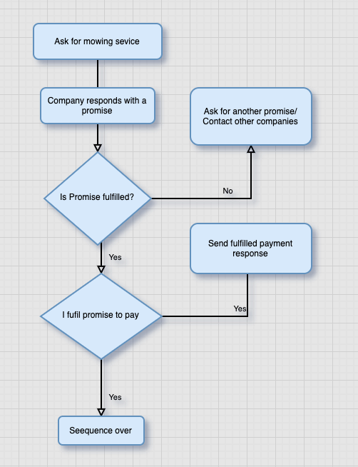

# TypeScript 中的 async/await 完全指南

> 原文：[A guide to async/await in TypeScript - LogRocket Blog](https://blog.logrocket.com/async-await-typescript/)
>
> 翻译：[嘿嘿](https://blog.heyfe.org/blog)

异步编程是一种编写代码的方式，它可以让任务彼此独立运行，而不需要等一个任务完成后再开始另一个。说到异步编程，你可以把它想象成“多任务处理”和“高效的时间管理”。

如果你正在读这篇文章，那你可能对 JavaScript 中的异步编程已经有所了解，并且想知道它在 TypeScript 中是如何运作的。这就是我们要在本指南中探讨的内容。

## 理解 TypeScript 中的 Promise

在深入研究 `async/await` 之前，必须先提一下 [Promise](https://developer.mozilla.org/en-US/docs/Web/JavaScript/Reference/Global%5FObjects/Promise)。它是 JavaScript 和 [TypeScript](https://blog.logrocket.com/understanding-typescripts-benefits-pitfalls/) 异步编程的基石。Promise 代表一个可能现在拿不到，但将来某个时间点会得到的值。一个 Promise 通常处于以下三种状态之一：

* **Pending（待定）**：初始状态，既没有完成也没有失败。
* **Fulfilled（已兑现）**：操作成功完成。
* **Rejected（已拒绝）**：操作失败。

以下是在 TypeScript 中创建和使用 Promise 的方法：

```typescript
// 类型安全的 Promise 创建
interface ApiResponse {
  data: string;
  timestamp: number;
}

const fetchData = new Promise<ApiResponse>((resolve, reject) => {
  try {
    // 模拟 API 调用
    setTimeout(() => {
      resolve({
        data: "成功!",
        timestamp: Date.now()
      });
    }, 1000);
  } catch (error) {
    reject(error);
  }
});
```

我们可以通过 `.then()` 处理成功操作，通过 `.catch()` 处理错误，从而实现 Promise 链式调用：

```typescript
fetchData
  .then(response => {
    console.log(response.data); // TypeScript 知道 response 是 ApiResponse 类型
    return response.timestamp;
  })
  .then(timestamp => {
    console.log(new Date(timestamp).toISOString());
  })
  .catch(error => {
    console.error('错误:', error);
  });
```

稍后我们会再次讨论 Promise，届时我们将探讨如何并行执行异步操作。

## TypeScript 中的 `async/await` 简介

TypeScript 是 JavaScript 的超集，因此 `async/await` 的行为在两者中是一致的，但 TypeScript 额外提供了静态类型的优势。它允许你定义和强制约束异步结果的结构，在编译时就能捕获类型错误，从而在开发早期发现 Bug。

从本质上讲，`async/await` 只是 Promise 的语法糖。一个 `async` 函数总是返回一个 Promise，即使你没有显式标注返回类型。在底层，编译器会自动将返回值包装在一个已解决（resolved）的 Promise 中。

看这个例子：

```typescript
// 代码片段 1
const myAsyncFunction = async <T>(url: string): Promise<T> => {
  const response = await fetch(url)
  return (await response.json()) as T
}

// 代码片段 2
const immediatelyResolvedPromise = <T>(url: string): Promise<T> => {
  return fetch(url).then(res => res.json() as Promise<T>)
}
```

虽然看起来不同，但上面两个代码片段基本是等价的：

`async/await` 让你能用更像“同步”的方式写代码，并在同一行代码中为你自动解包 Promise。在处理复杂的异步模式时，这非常强大。

为了充分发挥 `async/await` 的威力，你需要对 Promise 有个基本的认识。

## 深入了解 TypeScript 中的 Promise

如前所述，Promise 代表了对未来某件事发生的预期，它允许你的应用根据这个未来事件的结果来触发后续工作。

为了让这个概念更具体，我们来看一个现实生活中的例子，先用伪代码表示，再看实际的 TypeScript 实现。

假设我要割草。我联系了一家割草公司，他们**承诺（Promise）**在几小时内割完。作为回报，我也**承诺（Promise）**只要草割得好，我就立刻付钱。

你看到其中的模式了吗？关键点在于：第二个事件完全依赖于第一个。如果第一个 Promise 兑现了，第二个就开始。如果没有，流程要么被拒绝（rejected），要么一直处于待定（pending）状态。

让我们分步拆解这个序列，然后看代码。



## Promise 语法

在写完整代码之前，先看看 Promise 的语法——以一个解析为字符串的 Promise 为例。

我们使用 `new Promise` 关键字声明一个 `promise`，它接收 `resolve` 和 `reject` 参数。现在为上面的流程图写一个 Promise：

```typescript
// 我给公司发了个请求，这是同步的
// 公司回复一个 Promise
const angelMowersPromise = new Promise<string>((resolve, reject) => {
    // 几小时后 Promise 兑现
    setTimeout(() => {
        resolve('草割完了')
    }, 100000) // 100,000ms 后兑现
    reject("没法割草")
})

const myPaymentPromise = new Promise<Record<string, number | string>>((resolve, reject) => {
    // 一个已兑现的 Promise，包含 1000 欧元的付款对象和感谢语
    setTimeout(() => {
        resolve({
            amount: 1000,
            note: '谢谢',
        })
    }, 100000)
    // 拒绝并支付 0 欧元，附带一条不满意的留言
    reject({
        amount: 0,
        note: '抱歉，草割得不行',
    })
})
```

在上面的代码中，我们声明了公司和我们自己的 Promise。公司的 Promise 要么在 100,000 毫秒后兑现，要么被拒绝。一个 `Promise` 总是处于三种状态之一：如果没有错误就是 `resolved`（已解决），遇到错误就是 `rejected`（已拒绝），或者如果既没有拒绝也没有兑现就是 `pending`（待定）。在我们的例子中，它处于 `100000ms` 的待定期间。

但是我们如何按顺序并同步地执行任务呢？这就是 `then` 关键字派上用场的地方。如果不使用它，函数只会按照它们解析的顺序乱跑。

## 使用 `then` 进行顺序执行

Promise 链允许你使用 `then` 关键字按顺序运行它们。读起来就像大白话：先做这个，**然后（then）**做那个，接着下一步。

在下面的例子中，`angelMowersPromise` 先运行。如果成功兑现，`myPaymentPromise` 接着运行。如果其中任何一个失败，错误会被 `catch` 块捕获：

```typescript
angelMowersPromise
    .then(() => myPaymentPromise.then(res => console.log(res)))
    .catch(error => console.log(error)) 
```

来看一个更偏技术的例子。前端编程中的常见任务是发送网络请求并根据结果做出响应。

下面是一个从远程服务器获取员工列表的请求：

```typescript
const api = 'http://dummy.restapiexample.com/api/v1/employees'
fetch(api)
    .then(response => response.json())
    .then(employees => employees.forEach(employee => console.log(employee.id))) // 打印所有员工 ID
    .catch(error => console.log(error.message)) // 打印来自 Promise 的任何错误
```

有时你可能需要并行或按顺序执行大量的 Promise。在这种情况下，`Promise.all` 或 `Promise.race` 之类的结构特别有用。

例如，假设你需要获取 1,000 个 GitHub 用户，然后根据他们的 ID 为每个用户获取头像。你不想一个接一个地死等每个请求完成；你只需要在所有头像都准备好后拿到它们。稍后我们在讨论 `Promise.all` 时会深入探讨这种模式。

既然你对 Promise 有了扎实的理解，我们接着看 `async/await` 语法。

## 理解 `async/await`

`async/await` 语法简化了 JavaScript 中 Promise 的使用。它提供了一个简单的接口，让你能以同步的方式读写 Promise。

一个 `async` 函数总是返回一个 `Promise`。即使你省略了 `Promise` 关键字，编译器也会把函数包装在一个立即兑现的 `Promise` 中。这让你能把 `async` 函数的返回值当成 `Promise` 来处理，这在需要解析多个异步函数时非常有用。

顾名思义，`async` 总是和 `await` 结伴而行。也就是说，你只能在 `async` 函数内部使用 `await`。`async` 关键字告诉编译器这是一个异步函数。

如果把上面的 Promise 改写，语法如下：

```typescript
const myAsync = async (): Promise<Record<string, number | string>> => {
    await angelMowersPromise
    const response = await myPaymentPromise
    return response
} 
```

你会立刻发现，这看起来更易读，就像同步代码一样。我们告诉编译器在执行任何操作前先等待 `angelMowersPromise` 执行完毕。然后，我们返回 `myPaymentPromise` 的响应。

你可能注意到了我们省略了错误处理。在 Promise 中我们可以通过 `then` 后的 `catch` 块来实现，但在这里如果遇到错误怎么办？这就引出了 `try/catch`。

## 使用 `try/catch` 进行错误处理

由于网络请求特别容易失败，我们再回头看获取员工的例子，看看如何处理错误。

例如，服务器可能宕机，或者请求本身格式有误。在这种情况下，我们需要捕获错误并优雅地停止执行，防止应用崩溃。语法如下：

```typescript
interface Employee {
    id: number
    employee_name: string 
    employee_salary: number
    employee_age: number
    profile_image: string
}

const fetchEmployees = async (): Promise<Array<Employee> | string> => {
    const api = 'http://dummy.restapiexample.com/api/v1/employees'
    try {
        const response = await fetch(api)
        const { data } = await response.json()
        return data
    } catch (error) {
        if (error) {
            return error.message
        }
    }
}
```

我们将函数定义为 `async`，并期望它返回员工数组或包含错误消息的字符串。因此，函数的返回类型是 `Promise<Array<Employee> | string>`。

`try` 块内的代码在一切正常时运行。如果发生错误，执行权会跳到 `catch` 块，我们在那里返回错误对象的 `message` 属性。

这种方法确保了 `try` 块内抛出的第一个错误会被立即捕获并处理。不处理错误可能会导致难以调试的行为，甚至导致整个应用崩溃。

### 使用高阶函数进行错误处理

虽然传统的 `try/catch` 块在局部捕获错误很有效，但如果频繁使用，它们会变得很啰嗦并干扰核心业务逻辑。这就是高阶函数大显身手的地方。

[高阶函数](https://blog.logrocket.com/a-closer-look-at-javascript-closures-higher-order-functions-and-currying/)是指接收一个或多个函数作为参数，或者返回一个函数的函数。在错误处理的背景下，高阶函数可以包装一个异步函数并处理它可能抛出的任何错误，从而将 `try/catch` 逻辑从核心业务逻辑中抽离出来。

其核心思路是创建一个包装函数，它接收一个异步函数及其参数。在这个包装器内部实现 `try/catch` 块。这种方式让我们能以集中化的方式处理错误，使代码更简洁、更好维护。

参考获取员工的例子：

```typescript
// 用于处理异步错误的辅助函数
async function handleAsyncErrors<T, Args extends any[]>(
  fn: (...args: Args) => Promise<T>,
  ...args: Args
): Promise<T | null> {
  try {
    return await fn(...args);
  } catch (error) {
    console.error("捕获到错误:", error);
    return null;
  }
}

// 获取员工数据的异步函数
async function fetchEmployees(apiUrl: string): Promise<Employee[]> {
    const response = await fetch(apiUrl); 
    const data = await response.json();
    return data;
}

// 使用高阶函数包装 fetchEmployees
const safeFetchEmployees = (url: string) => handleAsyncErrors(fetchEmployees, url);

// 示例 API URL
const api = 'http://dummy.restapiexample.com/api/v1/employees';

// 使用包装后的函数获取员工
safeFetchEmployees(api)
    .then(data => {
        if (data) {
            console.log("成功获取员工数据:", data);
        } else {
            console.log("获取员工数据失败。");
        }
    })
    .catch(err => {
        // 这个 catch 块可能是多余的，取决于高阶函数内的策略
        console.error("safeFetchEmployees 发生错误:", err);
    });
```

在这个例子中，`safeFetchEmployees` 函数使用 `handleAsyncErrors` 高阶函数来包装原始的 `fetchEmployees` 函数。

这种设置会自动处理 API 调用期间可能发生的任何错误，记录它们并返回 `null` 表示错误状态。`safeFetchEmployees` 的调用者只需检查返回值是否为 `null` 即可判断操作是否成功。

## 使用 `Promise.all` 进行并发执行

正如之前提到的，有时我们需要 Promise 并行执行。
再看看我们的员工 API 例子。假设我们需要先获取所有员工，然后获取他们的名字，最后根据名字生成电子邮件。显然，我们需要以同步的方式执行函数，同时也需要并行执行，这样其中一个就不会阻塞另一个。

在这种情况下，我们会用到 `Promise.all`。根据 [Mozilla](https://developer.mozilla.org/en-US/docs/Web/JavaScript/Reference/Global%5FObjects/Promise/all) 的说法：“`Promise.all` 通常在启动了多个并发异步任务并为它们的结果创建了 Promise 之后使用，这样我们就可以等待所有任务完成。”
伪代码大概长这样：

* 获取所有用户 => `/employee`
* 等待所有用户数据。从每个用户中提取 `id`。获取每个用户详情 => `/employee/{id}`
* 根据用户名给每个用户生成一个邮箱

```typescript
const baseApi = 'https://reqres.in/api/users?page=1'
const userApi = 'https://reqres.in/api/user'

const fetchAllEmployees = async (url: string): Promise<Employee[]> => {
    const response = await fetch(url)
    const { data } = await response.json()
    return data
}

const fetchEmployee = async (url: string, id: number): Promise<any> => {
    const response = await fetch(`${url}/${id}`) 
    const { data } = await response.json() 
    return data 
} 

const generateEmail = (name: string): string => { 
    return `${name.split(' ').join('.').toLowerCase()}@company.com` 
}

const runAsyncFunctions = async () => { 
    try { 
        const employees = await fetchAllEmployees(baseApi) 
        const emails = await Promise.all( 
            employees.map(async user => { 
                const userData = await fetchEmployee(userApi, user.id) 
                return generateEmail(userData.first_name) 
            }) 
        )
        console.log(emails)
    } catch (error) { 
        console.log(error) 
    } 
} 

runAsyncFunctions()
```

在上面的代码中，`fetchEmployees` 从 `baseApi` 获取所有员工。我们 `await` 响应，将其转换为 `JSON`，然后返回转换后的数据。

最重要的概念是要记住：我们是如何在 `async` 函数中使用 `await` 关键字逐行按序执行代码的。如果我们尝试在数据还没 `await` 完就去转换 JSON，就会报错。`fetchEmployee` 也是同样的道理。更有意思的部分是 `runAsyncFunctions`，我们在那里并发运行了所有的异步函数。

首先，将 `runAsyncFunctions` 内部的所有方法包裹在 `try/catch` 块中。接着，`await` 获取所有员工的结果。我们需要每个员工的 `id` 来获取他们各自的数据。

这就是我们可以调用 `Promise.all` 来并发处理所有 `Promise` 的地方。每个 `fetchEmployee` 任务都针对所有员工并发执行。然后，这些获取到的员工信息被用来通过 `generateEmail` 函数为每人生成一封邮件。

如果发生错误，它会像往常一样传播，从失败的 Promise 到 `Promise.all`，最后变成我们在 `catch` 块中捕获的异常。

### 使用 `Promise.allSettled` 处理部分成功

当我们要求所有 Promise 都必须成功时，`Promise.all` 非常棒，但现实中的应用往往需要处理“部分失败、部分成功”的情况。考虑我们的员工管理系统：如果我们要更新多个员工记录，但其中一些由于验证错误或网络问题失败了怎么办？

这时候 `Promise.allSettled` 就派上用场了。与 `Promise.all` 不同（它只要有一个失败就全盘皆错），`Promise.allSettled` 会等待所有 Promise 完成，无论成功还是失败。它会告诉我们哪些操作成功了，哪些失败了。
让我们增强员工管理系统以处理批量更新：

```typescript
interface UpdateResult {
    id: number;
    success: boolean;
    message: string;
}

const updateEmployee = async (employee: Employee): Promise<UpdateResult> => {
    const api = `${userApi}/${employee.id}`;
    try {
        const response = await fetch(api, {
            method: 'PUT',
            body: JSON.stringify(employee),
            headers: {
                'Content-Type': 'application/json'
            }
        });
        return {
            id: employee.id,
            success: true,
            message: '更新成功'
        };
    } catch (error) {
        return {
            id: employee.id,
            success: false,
            message: error instanceof Error ? error.message : '更新失败'
        };
    }
};

const bulkUpdateEmployees = async (employees: Employee[]) => {
    const updatePromises = employees.map(emp => updateEmployee(emp));

    const results = await Promise.allSettled(updatePromises);

    // 处理结果并生成报告
    const summary = results.reduce((acc, result, index) => {
        if (result.status === 'fulfilled') {
            acc.successful.push(result.value);
        } else {
            acc.failed.push({
                id: employees[index].id,
                error: result.reason
            });
        }
        return acc;
    }, {
        successful: [] as UpdateResult[],
        failed: [] as Array<{id: number; error: any}>
    });

    return summary;
};
```

可以把 `Promise.allSettled` 想象成一个跟踪多个任务的项目经理。不同于一旦一个任务失败就叫停所有工作的经理（就像 [Promise.all](https://blog.logrocket.com/promise-all-modern-async-patterns/) 那样），这个经理会持续监控所有任务，并提供一份完整的报告，列出哪些成功了，哪些失败了。这在以下场景特别有用：

* 同时更新多条员工记录
* 即使部分数据获取失败也要生成报告
* 处理多个允许部分成功的 API 请求

### 使用 `for await...of` 处理数据流

有时我们需要处理分块或分页的大量数据。想象一下，你正在从一个大型企业系统中导出员工数据——为了防止内存超限，成千上万条记录可能会分批传来。

`for await...of` 循环非常适合这种场景，而且在现代 AI 开发框架中变得越来越流行。无论你是从 OpenAI GPT、Claude 还是 Gemini 等语言模型流式传输生成的文本，这种模式都非常好用。

它允许我们逐块处理异步数据流，使代码既高效又易读。以下是使用 [Vercel AI SDK](https://ai-sdk.dev/docs/introduction#why-use-the-ai-sdk) 流式传输 AI 生成文本的实际例子：

```typescript
import { streamText } from 'ai'
async function generateStory() {
  const result = streamText({
    model: yourModel,
    prompt: '写一个小故事，关于一个正在学习 TypeScript 的开发者',
  })
  // 文本一生成就立即流式处理
  for await (const chunk of result.textStream) {
    process.stdout.write(chunk)
  }
}
```

当 AI 模型生成每一小段文本时，它会立即对你的应用可用。你不需要等待整个响应生成完才向用户展示内容。

你也可以将 `for await...of` 用于任何异步可迭代对象，包括分页 API 响应：

```typescript
async function fetchAllUsers() {
  const users: any[] = []
  let page = 1
  // 为分页创建一个异步生成器
  async function* userPages() {
    while (true) {
      const response = await fetch(`/api/users?page=${page}`)
      const data = await response.json()
      if (data.users.length === 0) break
      yield data.users
      page++
    }
  }
  // 每一页数据到达时就处理它
  for await (const pageUsers of userPages()) {
    users.push(...pageUsers)
    console.log(`目前已加载 ${users.length} 个用户...`)
  }
  return users
}
```

把 `for await...of` 想象成工厂里的传送带。我们不需要等所有产品（数据）都生产出来才开始打包（处理），而是在每个产品从传送带下来时就立即打包。这种方法有几个好处：

* **内存高效**：逐块处理，而不是把所有东西都加载到内存中
* **更好的用户体验**：内容一可用就立即展示
* **实时反馈**：在漫长的操作过程中监控进度并提供更新

## 使用 `AbortController` 控制异步流程

在现代 Web 开发中，尤其是处理昂贵的操作（如 AI 模型调用、耗时的数据处理或网络请求）时，你经常需要取消不再需要的操作。这就是 [AbortController](https://developer.mozilla.org/en-US/docs/Web/API/AbortController) 和 [AbortSignal](https://developer.mozilla.org/en-US/docs/Web/API/AbortSignal) API 大显身手的地方，它们提供了一种优雅的取消方式。

`AbortController` 允许你在执行中途终止一个或多个异步操作。这在以下情况特别有用：

* 用户离开页面时取消 API 请求
* 结果不再需要时停止昂贵的计算
* 实现请求超时
* 在 React 组件中管理资源清理

### 将 `AbortSignal` 用于超时

下面是一个简单的例子，演示如何使用 `AbortController` 自动实现请求超时：

```typescript
async function fetchWithTimeout(url: string, timeoutMs: number = 5000) {
  const controller = new AbortController()
  // 设置超时
  const timeoutId = setTimeout(() => controller.abort(), timeoutMs)
  try {
    const response = await fetch(url, {
      signal: controller.signal,
    })
    return await response.json()
  } catch (error) {
    if (error instanceof Error && error.name === 'AbortError') {
      throw new Error(`请求在 ${timeoutMs}ms 后超时`)
    }
    throw error
  } finally {
    clearTimeout(timeoutId)
  }
}

// 使用示例
try {
  const data = await fetchWithTimeout('https://api.example.com/data', 3000)
  console.log(data)
} catch (error) {
  console.error('获取失败:', error.message)
}
```

### 手动取消请求

你也可以在不再需要操作时手动取消它们，比如用户在文件上传过程中点击了取消按钮。这是一个 React.js 中的例子：

```typescript
import { useState, useRef } from 'react'

function ImageUploader() {
  const [uploading, setUploading] = useState(false)
  const abortControllerRef = useRef<AbortController | null>(null)

  const uploadImage = async (file: File) => {
    const controller = new AbortController()
    abortControllerRef.current = controller
    setUploading(true)
    try {
      const formData = new FormData()
      formData.append('image', file)
      const response = await fetch('/api/upload', {
        method: 'POST',
        body: formData,
        signal: controller.signal,
      })
      const result = await response.json()
      console.log('上传完成:', result)
      setUploading(false)
    } catch (error) {
      if (error instanceof Error && error.name === 'AbortError') {
        console.log('用户取消了上传')
      } else {
        console.error('上传失败:', error)
      }
      setUploading(false)
    }
  }

  const cancelUpload = () => {
    abortControllerRef.current?.abort()
  }

  return (
    <div>
      <input
        type='file'
        onChange={(e) => e.target.files?.[0] && uploadImage(e.target.files[0])}
        disabled={uploading}
      />
      {uploading && <button onClick={cancelUpload}>取消上传</button>}
    </div>
  )
}
```

## 理解结构化并发（Structured Concurrency）

在了解了 `AbortController` 之后，让我们看看它是如何实现结构化并发模式的。虽然 JavaScript 不像某些语言那样内置了结构化并发，但理解这些概念非常有用，因为它们会影响我们思考异步操作的方式。结构化并发旨在以以下方式组织并发操作：

* 操作具有明确的父子关系
* 在所有子操作完成之前，父操作不会结束
* 取消信号能在层级结构中正确传播
* 资源清理更容易

我们可以使用 `AbortController` 并配合函数式编程的方法在 TypeScript 中实现结构化并发。

首先，定义我们的类型和核心任务运行器结构。`TaskRunner` 将持有 `AbortController` 实例并跟踪所有正在运行的任务：

```typescript
// Task 是一个接收 AbortSignal 并返回 Promise 的函数
type Task<T> = (signal: AbortSignal) => Promise<T>
interface TaskRunner {
  controller: AbortController
  runningTasks: Set<Promise<any>>
}
// 创建新任务运行器的函数
const createTaskRunner = (): TaskRunner => ({
  controller: new AbortController(),
  runningTasks: new Set(),
})
```

接下来，我们需要一种运行任务的方法。下面的 `runTask` 函数包装了执行过程，确保任务接收到信号并被记录在 `runningTasks` 集合中：

```typescript
const runTask = <T>(runner: TaskRunner, task: Task<T>): Promise<T> => {
  // 将控制器的信号传递给任务
  const taskPromise = task(runner.controller.signal)
  // 跟踪运行中的任务
  runner.runningTasks.add(taskPromise)
  // 任务完成（无论成功或失败）后将其从跟踪中移除
  return taskPromise.finally(() => {
    runner.runningTasks.delete(taskPromise)
  })
}
```

现在我们可以创建一个 `runTaskGroup` 函数来并发执行多个任务。如果其中一个任务失败，我们希望取消其他所有任务：

```typescript
const runTaskGroup = async <T>(
  runner: TaskRunner,
  tasks: Array<Task<T>>
): Promise<T[]> => {
  const taskPromises = tasks.map((task) => runTask(runner, task))
  try {
    // 等待所有任务完成
    return await Promise.all(taskPromises)
  } catch (error) {
    // 如果任何一个任务失败，触发 abort 控制器以取消其他所有任务
    runner.controller.abort()
    throw error
  }
}
```

这个实现突出了结构化并发的一个关键优势。标准的 `Promise.all` 采用“快速失败”机制，只要一个 Promise 失败就立即拒绝。然而，它会让其他 Promise 在后台继续运行，从而在那些结果会被忽略的操作上浪费资源。

通过在 `catch` 块中结合 `Promise.all` 和 `AbortController`，我们将“快速失败”升级为了“快速失败并取消”。一旦一个任务报错，我们立即通知所有兄弟任务停止，节省网络带宽和处理能力。

最后，我们需要一个清理机制。`shutdown` 函数会中止所有剩余任务并等待它们平息：

```typescript
const shutdown = async (runner: TaskRunner): Promise<void> => {
  runner.controller.abort()
  // 等待所有任务结束（完成或拒绝）
  await Promise.allSettled(Array.from(runner.runningTasks))
  console.log('所有任务已完成或已取消')
}
```

看看如何在员工工作流中把这些整合起来：

```typescript
const processEmployeeWorkflow = async () => {
  const taskRunner = createTaskRunner()
  try {
    // 并发运行这三个任务
    const results = await runTaskGroup(taskRunner, [
      async (signal) => {
        const response = await fetch('/api/employees', { signal })
        return response.json()
      },
      async (signal) => {
        const response = await fetch('/api/analytics', {
          method: 'POST',
          signal,
        })
        return response.json()
      },
      async (signal) => {
        const response = await fetch('/api/reports', { signal })
        return response.json()
      },
    ])
    console.log('所有工作流任务成功完成')
    return results
  } catch (error) {
    console.error('工作流失败:', error)
    throw error
  } finally {
    // 确保清理资源
    await shutdown(taskRunner)
  }
}
```

这种函数式模式在三个关键方面改进了标准的 Promise 管理：

* **停止资源浪费**：如果一个任务失败，它会自动取消所有兄弟任务，节省带宽和处理能力。
* **简化组合**：纯函数比互相关联的类更容易组合、重用和测试。
* **增强安全性**：封装的状态和严格的类型检查可以防止常见的悬挂状态 Promise 和内存泄漏陷阱。

## 在高阶函数中集成 `async/await`

将高阶函数与 `async/await` 结合，可以创造出处理异步操作的强大模式。

在处理员工管理系统时，我们经常需要异步处理数组数据。让我们看看如何有效地在数组方法中使用 `async/await`：

```typescript
// 异步过滤：仅保留活跃员工
async function filterActiveEmployees(employees: Employee[]) {
    const checkResults = await Promise.all(
        employees.map(async (employee) => {
            const status = await checkEmployeeStatus(employee.id);
            return { employee, isActive: status === 'active' };
        })
    );

    return checkResults
        .filter(result => result.isActive)
        .map(result => result.employee);
}

// 异步归约（Reduce）：计算部门总工资
async function calculateDepartmentSalary(employeeIds: number[]) {
    return await employeeIds.reduce(async (promisedTotal, id) => {
        const total = await promisedTotal;
        const employee = await fetchEmployeeDetails(id);
        return total + employee.salary;
    }, Promise.resolve(0)); // 初始值必须是一个 Promise
}
```

在使用这些数组方法时，有一些重要的注意事项：

* 带有异步操作的 `map` 会返回一个 Promise 数组，通常需要用 `Promise.all` 处理。
* `filter` 需要特殊处理，因为你不能直接把 Promise 的结果当作过滤条件。
* 带有异步操作的 `reduce` 需要对累加器进行细致的 Promise 处理。

### 自定义高阶函数

在某些情况下，我们需要工具函数来对异步调用的返回响应进行某些操作。我们可以创建可重用的高阶函数，用这些额外功能来包装异步操作：

```typescript
// 用于缓存异步结果的高阶函数
function withCache<T>(
    asyncFn: (id: number) => Promise<T>,
    ttlMs: number = 5000
) {
    const cache = new Map<number, { data: T; timestamp: number }>();

    return async (id: number): Promise<T> => {
        const cached = cache.get(id);
        const now = Date.now();

        if (cached && now - cached.timestamp < ttlMs) {
            return cached.data;
        }

        const data = await asyncFn(id);
        cache.set(id, { data, timestamp: now });
        return data;
    };
}

// 使用示例
const cachedFetchEmployee = withCache(async (id: number) => {
    const response = await fetch(`${baseApi}/employee/${id}`);
    return response.json();
});
```

在上面的代码片段中，`withCache` 高阶函数为任何通过 ID 获取数据的异步函数添加了缓存功能。如果在五秒内（默认 TTL）多次请求同一个 ID，该函数会返回缓存的结果，而不是再次发起 API 调用。当短时间内多次需要同一个员工数据时，这能显著减少不必要的网络请求。

## `Awaited` 类型

`Awaited` 是一个工具类型，用于模拟 `async` 函数中 `await` 的操作。它会解构 Promise 的已解决值，丢弃 Promise 本身。它是递归运行的，因此会移除任何嵌套的 Promise 层。

`Awaited` 类型代表了你在 `await` 一个 Promise 后预期得到的值类型。它能帮你的代码理解：一旦你用了 `await`，你处理的就不再是 Promise，而是你真正想要的实际数据。

基本语法如下：

```typescript
type MyPromise = Promise<string>;
type AwaitedType = Awaited<MyPromise>; // AwaitedType 将会是 'string'
```

`Awaited` 类型并不完全等同于 Promise 的 `then` 方法。在 `async` 函数中使用 `then` 时，`Awaited` 会很有用。如果你在 `then` 回调内部使用 `await`，`Awaited` 有助于推断 await 后的值类型，从而避免额外的类型标注。

> `Awaited` 可以帮助理清 `async` 函数中数据和 `awaitedValue` 的类型，即使在 Promise 链式调用中使用 `then` 时也是如此。不过，它本身并不能替代 `then` 的功能。

## 结语

在 TypeScript 中精通 `async/await` 是构建现代化、高性能应用的基石。我们涵盖了 Promise 的基础知识、使用 `try/catch` 进行错误处理，以及像 `Promise.all` 这样并发执行的高阶模式。我们还探讨了如何通过 `for await...of` 实现高效的数据流处理，以及使用 `AbortController` 管理取消和超时的手段。结合 TypeScript 的类型安全性，这些工具能帮你编写出既可靠、高效，又易于维护和调试的异步代码。