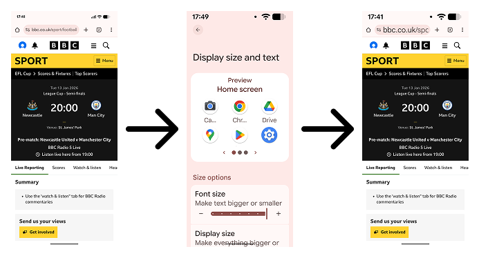
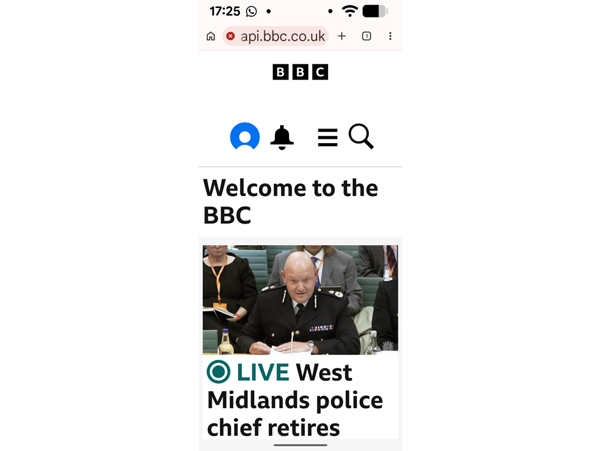
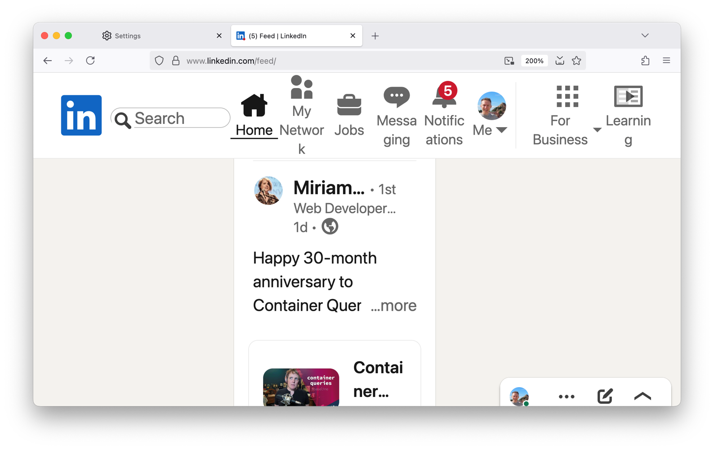
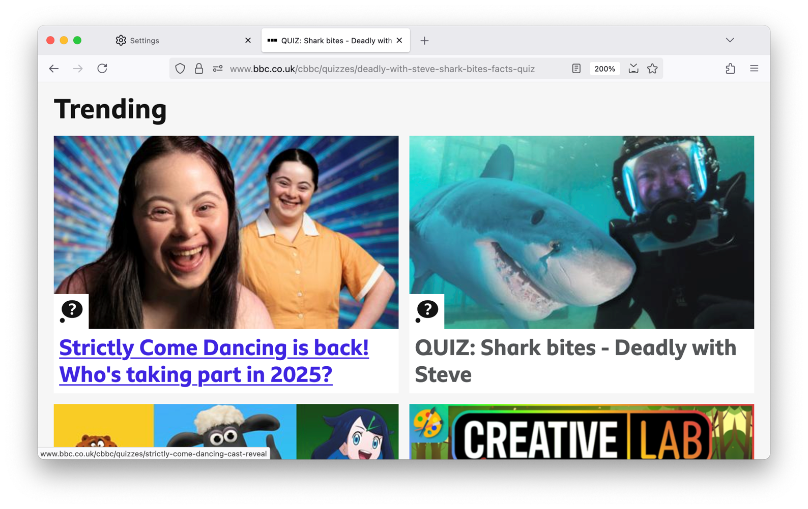

# 在 Chrome Canary 中体验文本缩放支持
      
> 原文：[Try text scaling support in Chrome Canary - Josh Tumath](https://www.joshtumath.uk/posts/2026-01-27-try-text-scaling-support-in-chrome-canary/)
>
> 翻译：[嘿嘿](https://blog.heyfe.org/blog)

如果你安装了 Chrome Canary，并且开启了 “Experimental Web Platform features”（实验性 Web 平台特性）标志，那么你现在就可以尝试一个新的 HTML `meta` 标签了：

```html
<meta name="text-scale" content="scale" />
```

这是我在 2024 年夏天向 CSS 工作组提议的一个特性，并在 Google Chrome 团队的 David Grogan 和 Philip Rogers 的大力帮助下开发完成。[你可以在这里阅读完整的说明文档。](https://github.com/w3c/csswg-drafts/blob/main/css-env-1/explainers/meta-text-scale.md) 我非常高兴它终于进入了 [CSS Fonts 5 规范](https://drafts.csswg.org/css-fonts-5/#text-scale-meta)，并且已经有浏览器在实验性标志下支持了它！

## 这是什么？

你有没有注意到，当你在 iOS 或 Android 手机的辅助功能设置中调大系统字体大小时，除了网页之外，几乎所有地方的文字都变大了？

在 Safari 和 Chrome 上，这玩意儿根本没反应。



不过有趣的是，在 Android 版 Firefox 上，浏览器会执行全页缩放（full page zoom）。但这和单纯的文本缩放（text scaling）完全是两码事。

这体验可不太好，因为 [Appt 的研究](https://appt.org/en/stats/font-size)显示，大约 37% 的 Android 用户和 34% 的 iOS 用户修改过系统级别的默认文本缩放比例。而目前的 Web 开发者却没法适配这种偏好。

新推出的 `<meta name=text-scale>` 标签就是为了解决这个问题。就像 `<meta name=viewport>` 标签是告诉浏览器你的网站是为小屏幕设计的，`<meta name=text-scale>` 则是在告诉浏览器：“嘿，我已经设计好了我的网站，就算用户调大了系统字体，它也能正常显示。”

计划是这样的：一旦你的页面中包含了 `<meta name=text-scale>`，网页文本就会遵循用户的字体大小偏好。

下面是 BBC 网站在使用了 `<meta name=text-scale>` 后的样子：



## 为什么我必须手动开启它？浏览器不能默认支持吗？

这东西不能在所有地方默认开启。相信我，那绝对是个馊主意。

桌面浏览器的用户其实已经可以调大网站的字体大小了，但如今这算是个隐藏功能。看看如果有人在 Firefox 中把 LinkedIn 的字体大小翻倍会发生什么：



简直是翻车现场。我并不是针对 LinkedIn，这样的例子到处都是。事实上，我们大多数人的网站可能看起来都会是这个样子。

而且这还是在宽大的桌面视口下。想象一下，如果我们直接在移动设备上开启这个功能，会发生什么！

即使在较小的视口上，用户也应该能在不产生水平滚动条的情况下，将文本大小调大到 200%。相关的 WCAG 2.2 指南是 [1.4.4 调整文本大小（Resize Text）](https://www.w3.org/TR/WCAG22/#resize-text) 和 [1.4.10 自动折行（Reflow）](https://www.w3.org/TR/WCAG22/#reflow)。

所以，我们需要显式地“选择性开启（Opt-in）”。就像 2008 年第一批智能手机问世时，我们需要显式开启对移动端视口的支持一样。

## 我该如何在网站上支持文本缩放？

你不需要等到所有浏览器都支持 `<meta name=text-scale>` 才开始支持文本缩放。这本来就是我们应该支持的东西，只是以前可能没怎么测试过。桌面浏览器最近一直把“文本缩放”功能藏起来，取而代之的是“页面缩放（Zoom）”。所以我们平时大概率一直在测页面缩放。

页面缩放会放大所有东西，包括图片、内边距（padding）、外边距（margin）和间隙（gap）。**所有东西。** 不管你用的是 `em` 单位还是 `px` 单位，它统统都会放大。

真正的文本缩放（Text scaling）则不同。它只改变默认的字号（font size）。

你可能听说过类似这样的最佳实践：在 CSS 中始终使用字体相对单位（如 `em` 或 `rem`），而不要用绝对单位（如 `px` 或 `cm`）。如果你用了 `px` 单位，你的网站就无法支持文本大小调整。

这话基本没错，但并不意味着你 *永远* 不能用 `px`。

以下是我关于支持文本缩放的三个基本建议：

### 建议 1：不要覆盖初始字号

默认字号来自于 CSS `font-size` 属性的初始值。如果开发者不指定大小，初始 `font-size` 就是 `medium`。那 `medium` 是多大？通常是 16px。但在桌面浏览器上，用户可以随心所欲地更改它。

这最终就是 `<meta name=text-scale>` 标签所做的事情：当标签存在且浏览器支持时，移动端用户也将能够更改默认字号。

所以，如果你手动覆盖了默认字号，`<meta name=text-scale>` 标签就会失效。

```html
<!-- 👎 别这么干 -->

<meta name="text-scale" content="scale" />

<style>
  :root {
    /* 这会硬编码字号，导致系统设置失效 */
    font-size: 16px;
  }
</style>
```

理想情况下，别去动它。或者使用百分比值来修改它。

### 建议 2：只对内容使用字体相对单位

文本缩放不需要复刻页面缩放的效果。如果你在所有设置长度的地方都用 `em` 和 `rem`，那么所有东西都会像页面缩放一样按比例变大。

相反，应该只在文本、图片和图标这类“内容”上使用字体相对单位。你不需要在 `margin`、`padding` 或 `gap` 等属性上使用它们。

如果你这样做，内容就会有更多的空间，这对于竖屏移动设备来说尤为重要。

那 `border-width` 呢？我觉得边框通常也算作内容，但你需要根据实际情况考虑。按钮或文本框的边框变厚一点挺好，但列表项之间的分割线更多是视觉层面的，你大可以用 `px` 单位来定义它的宽度。



### 建议 3：测试，测试，再测试

尝试模拟一个拿着廉价智能手机并将文本缩放翻倍的用户。

在桌面浏览器上，打开开发者工具中的视口测试工具，将视口宽度设为 320px。然后，将文本缩放改为 200%。[查看 env(preferred-text-scale) 说明文档，了解如何在各个浏览器中进行设置。](https://github.com/w3c/csswg-drafts/blob/main/css-env-1/explainers/env-preferred-text-scale.md#ua-level-font-setting)

一旦你这样做了，你很快就会发现哪些地方出问题了。思考一下如何调整布局，才能塞下超级大的文字。

## 下一步计划？

还有很多细节值得深思，但我希望这些已经足够让你入门了！

希望今年晚些时候其他浏览器也会开始支持它，不过目前我还没收到任何消息。

还有一个问题我们仍在思考：如何让大号文本（如标题）的缩放比例低于正文文本。正文从 16px 缩放到 32px 挺好，但标题真的有必要从 32px 缩放到 64px 吗？那实在太大了。如果你有什么想法，请务必告诉我！

我将在 6 月份的 [CSS Day 2026](https://cssday.nl/) 上更多地讨论这个话题。希望能在那儿见到你！我也相信今年晚些时候会有更多关于文本缩放的文档发布。我觉得这是一个大家普遍缺乏经验的领域，毕竟我们依赖浏览器全页缩放已经太久了。