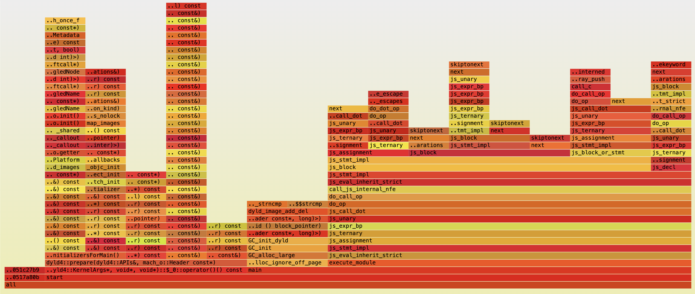
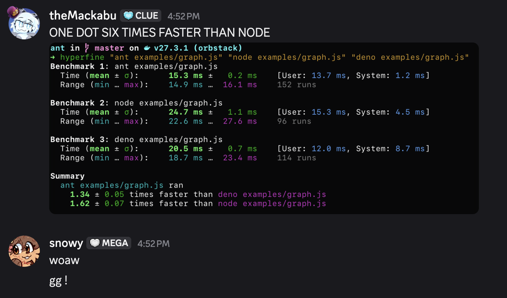

# 我用一个月写了个 JavaScript 运行时

> 原文：[themackabu.dev](https://themackabu.dev/blog/js-in-one-month)
>
> 翻译：[嘿嘿](https://blog.heyfe.org/blog)

**TLDR**：我写了一个只有 2MB 大小的 JavaScript 运行时，名字叫 Ant。你可以在 [我的 GitHub 上](https://github.com/themackabu/ant/) 找到完整的源代码、测试用例和文档。

11 月初刚开始这个项目时，我脑子里只有一个简单的想法：能不能搞一个足够小、能嵌入到 C 程序里，但又足够完整、能运行真实代码的 JavaScript 引擎？那种不需要像 V8 或 Node 那样动辄拖着几百 MB 依赖就能分发的玩意儿。我以前试过精简版的 Deno，但总觉得不够味。

我没想过这会花掉一个月的时间。我也没想过一个月内真的能搞成。但这就是在没有截止日期的情况下做东西的奇妙之处：你会一直写下去。

### 第一周：求生模式

我是边学边做的，说白了就是“试错驱动开发”，一边踩坑一边把错误的代码提交上去。工作是从最基础的东西开始的：添加数值运算、内置的字符串函数，甚至是一个简陋的 CommonJS 模块系统。每一次提交（commit）都像是从虚无中夺回的一场小胜。

核心难题是解析（parsing）。在任何东西跑起来之前，你得先写个解析器，而解析器的复杂程度远超想象。JavaScript 尤其多坑。你知道“自动分号插入（ASI）”是规范里必须处理的一部分吗？你知道 `this` 的绑定会根据语境变化吗？你知道“变量提升（hoisting）”意味着用 `var` 声明的变量在赋值之前就已经存在了吗？甚至连 `window.window.window` 这种写法都是合法的……

头几天我光是让基础流程跑通就费尽了心思，那会儿它更像个带函数的计算器。但我没停下，因为那种势头一旦起来就停不住。核心代码长这样：

```c
typedef uint64_t jsval_t;
```

在这个运行时里，每个 JavaScript 的值都是一个 64 位整数。这就是 **NaN 封箱（NaN boxing）**。IEEE 754 浮点数规范里有个奇怪的坑：大概有 2^53 个可能的 NaN（非数字）值，而大多数根本没被用到。所以，我就把它们“偷”过来了 :3。

如果你把这些位（bits）解释为双精度浮点数，它看起来像个 NaN；但只要它的指数和尾数遵循你控制的特定模式，你就可以在这些位里编码一个标签（tag）。这样就有空间放一个指针和一个类型。你把对象引用和标签打包进 64 位里，突然间，每个 JavaScript 值都能装进一个机器字（machine word）里了。

编译时的检查证明了这一点：

```c
_Static_assert(sizeof(double) == 8, "NaN-boxing requires 64-bit IEEE 754 doubles");
_Static_assert(sizeof(uint64_t) == 8, "NaN-boxing requires 64-bit integers");
_Static_assert(sizeof(double) == sizeof(uint64_t), "double and uint64_t must have same size");
```

这成了运行时表示所有值的核心。每一个数字、对象、字符串、函数、Promise、参数、作用域，全都是这玩意儿。没有判别联合（discriminated unions），没有虚函数表（vtables），不需要为元数据在堆上分配空间。全是位操作。我花了几天时间迭代才搞定这套东西，但一旦跑通了，其他所有操作都变快了。虽然 NaN 和 Infinity 值本身会带来一些麻烦，但稍微调整一下封箱的布局就解决了。

大概第四天，我搞定了变量。第五天，函数跑通了。第六天，我能跑循环了。早期的提交记录很乱。紧接着我就加上了箭头函数、IIFE（立即调用函数表达式）、可选链，甚至空值合并运算符（nullish coalescing）。我总是在不同的功能之间跳来跳去，因为我是一边翻 MDN 文档，想到什么还没写就顺手加上。

### 垃圾回收带来的灾难

接着，大麻烦来了：内存管理。

JavaScript 运行时必须有垃圾回收（GC）。你不能要求用户手动释放对象。所以在第二周左右，我尝试实现自己的 GC。简直是场噩梦。要么是我加功能时把 GC 搞坏了，要么是 GC 拖累了性能，要么是我想集成别人的 GC 却发现太复杂。

那个阶段我挣扎得很痛苦。那个手写的空闲列表（free-list）式 GC 被我反复开启和禁用几百次，每次尝试都会搞崩某个核心部分。那几天我明显心烦意乱。凌晨 3 点还在调试，想弄明白为什么协程栈没被正确保护、为什么内存泄漏、为什么加上 JSON 支持后一切都崩了。

转折点在于我放弃了手动回收，转向了 **bdwgc**。这是一个其他语言也在用的生产级垃圾回收器。我把它和我手写的带前向引用跟踪的内存压缩方案结合在一起。它能标记位、处理转发哈希表，干所有生产级 GC 该干的活。一旦集成了它，内存问题基本就消失了。我的进度开始加速，心情也变好了。东西开始能用了，我加上了 `process` 模块和更友好的错误信息。这是节奏开始起飞的转折点。

### Promise 是另一头猛兽

`async/await` 看起来很简单，直到你试着去实现它。你需要 Promise，Promise 需要微任务（microtasks）和定时器，这些需要一个事件循环（event loop），而事件循环又需要一个地方来存储异步操作的状态。

我花了几天时间死磕这个。要让异步工作，你需要协程（coroutines），但协程需要调度，调度需要事件循环，而事件循环需要知道协程什么时候结束。如果一个协程在等待 I/O，你不能阻塞主线程；如果一个协程挂了，它不应该锁死整个系统。

看一眼提交记录就能感受到那种痛苦：“*async promise pushback*”、“*event loop empty 时发生段错误*”、“*防止死掉的任务阻塞*”。这些问题在你动手实现到一半之前是根本预料不到的。

难点在于 JavaScript 的 Promise 并不简单。它们得处理 `.then()` 链式调用，得能正确捕获 rejection，还得配合异步函数工作——而异步函数本身只是生成器（generators）的语法糖，生成器又是 Promise 和回调函数的语法糖。

第十天左右，我引入了 `minicoro` 来支持协程。这个决定可能救了整个项目。`minicoro` 非常优雅，你定义基于栈的协程，让系统在它们之间切换。有了协程，我终于能让异步真正跑起来了。

```c
typedef struct coroutine {
  struct js *js;
  coroutine_type_t type;
  jsval_t scope;
  jsval_t this_val;
  jsval_t awaited_promise;
  jsval_t result;
  jsval_t async_func;
  jsval_t *args;
  int nargs;
  bool is_settled;
  bool is_error;
  bool is_done;
  jsoff_t resume_point;
  jsval_t yield_value;
  struct coroutine *prev;
  struct coroutine *next;
  mco_coro* mco;
  bool mco_started;
  bool is_ready;
} coroutine_t;
```

关于异步执行的一切都被追踪在这个结构体里：作用域、`this` 值、正在等待哪个 Promise、是否报错。剩下的就是调度这些玩意儿并管理好事件循环。

一旦有了协程，Promise 就变真实了。`.then()` 链式调用通了，`await` 真的能暂停执行并在稍后恢复。运行时的异步部分终于成型。我开始添加完善的 Promise 处理逻辑，随后所有的 Promise 内置方法都飞速实现了，因为最硬的骨头已经啃下来了。

### 那些奇葩的 JavaScript 边缘情况

中间那两周，我发现 JavaScript 奇葩的地方远超我的想象。

不可配置属性（non-configurable properties）、冻结（frozen）和密封（sealed）对象、边缘情况下的可选链、严格模式的语义。这些听起来简单，但每一个都代表着长达几十年的规范，以及开发者依赖的微妙行为。

我一个一个去啃。处理冻结/密封对象，添加对不可配置属性的支持，第十次修复解构赋值，在属性查找中添加 Getter 和 Setter 访问器支持。每天都在撞各种边缘情况。有时候一天要发好几个补丁，因为我刚实现一个功能，跑一遍一致性测试，就发现三个 Bug，修完之后又冒出五个我听都没听过的 Bug。

你知道 JavaScript 有多少种方法可以访问原型链吗？`__proto__`、`Object.getPrototypeOf()`、`Object.setPrototypeOf()`，还有内部的 `[[Prototype]]` 插槽。你得处理所有这些情况，而且它们还得能和谐共处。那次名为“使用描述符表（descriptor tables）处理 Getter/Setter/属性”的简短提交，背后其实是几周的工作。

解构看起来很简单：`const [a, b] = arr`。但如果是稀疏数组呢？对象的可枚举属性呢？嵌套解构呢？默认值呢？`...rest` 参数呢？每次修复似乎都会搞坏另一个东西，每一个坑点都是一个深不见底的兔子洞。

一致性测试（conformance tests）简直是“良药苦口”。每次运行，它们都会在我根本不知道存在的功能上挂掉。然后我修好它，再迎接下一个挑战。这个循环重复了几十次。

### 下半场：渐入佳境

到了第二周，我手里已经有一个能跑代码的 JavaScript 运行时了。虽然还不完整，但它是个真家伙。于是我开始添加让它真正有用的功能。

文件系统操作、路径工具、URL 模块，还有让 Bun 名声大噪的那种内置 HTTP 服务器。突然间，真实的程序可以在 Ant 上跑了。你只需要写这么点代码就能搞个 Web 服务器：

```javascript
import { join } from 'ant:path';
import { readFile } from 'ant:fs';
import { createRouter, addRoute, findRoute } from 'rou3';

const router = createRouter();

addRoute(router, 'GET', '/status/:id', async c => {
  await new Promise(resolve => setTimeout(resolve, 1000));

  const result = await Promise.resolve('Hello');
  const name = await readFile(join(import.meta.dirname, 'name.txt'));

  const base = '{{name}} {{version}} server is responding with';
  const data = { name, version: Ant.version() };

  // 使用模板字符串替换并返回
  return c.res.body(`${base.template(data)} ${result} ${c.params.id}!`);
});

async function handleRequest(c) {
  console.log('request:', c.req.method, c.req.uri);
  const result = findRoute(router, c.req.method, c.req.uri);

  if (result?.data) {
    c.params = result.params;
    return await result.data(c);
  }

  c.res.body('not found: ' + c.req.uri, 404);
}

console.log('started on http://localhost:8000');
Ant.serve(8000, handleRequest);
```

```bash
$ ant examples/server/server.js
started on http://localhost:8000

$ curl http://localhost:8000/status/world
Ant 0.3.2.6 server is responding with Hello world!
```

这是在 Ant 里运行的真实 JS。有 `async/await`，有文件 I/O，有 HTTP，有带参数的路由，有网络请求，有字符串操作。

节奏越来越快。每天我都更有信心，动作更利索，修掉更多 Bug，加更多功能。接着进入了“冷门但必须有”阶段。我加了 Proxy 支持、Reflect、Symbol，甚至还有类（class）里的私有字段和方法。这些都是 ES6+ 的功能，虽然平时没多少人用，但规范说有，那就得有。

我最喜欢的功能之一：原子操作（atomic operations）：

```javascript
const sharedBuffer = new SharedArrayBuffer(256);

const int32View = new Int32Array(sharedBuffer);
Atomics.store(int32View, 0, 42);
const value = Atomics.load(int32View, 0);
console.log('stored 42, loaded:', value);

Atomics.store(int32View, 1, 10);
const oldValue = Atomics.add(int32View, 1, 5);
console.log('old value:', oldValue);

Atomics.store(int32View, 2, 100);
const result = Atomics.compareExchange(int32View, 2, 100, 200);
console.log('exchanged, new value:', Atomics.load(int32View, 2));
```

```bash
$ ant examples/atomics.js
stored 42, loaded: 42
old value: 10
exchanged, new value: 200
```

### 最后一周：势如破竹

一旦 Ant 的核心跑通了，GC 稳了，Promise 也行了，其他一切就像多米诺骨牌一样顺理成章。小问题被修掉，缺失的方法补全了，边缘情况被覆盖。

我成功重新加入了数组长度校验，甚至修复了对象的属性缓存失效（cache invalidation）问题。研究了一下如何提高哈希性能，结果一头扎进了一堆复杂的算法和安全隐患里。做这些是因为我已经在打磨一个已经成型的作品了。

到了第 28 天，我正在给这个已经成真了的东西做最后的润色。一个完整的 JavaScript 运行时：支持 `async/await`、完善的内存管理、网络支持、文件 I/O，完全兼容 ES1 到 ES5 规范，还附带了一大堆更新的特性。

我甚至还“想起来”开启了链接时优化（LTO）和其他编译器标志，多亏了别人的提醒 😅。


### 到底搞成了什么

一个月。Ant 现在作为一个 JavaScript 运行时，已经能够：

通过 `javascript-zoo` 测试套件中所有的 ES1 到 ES5 一致性测试。这意味着完全兼容过去 25 年的 JavaScript 规范。

*   实现了带微任务处理的 `async/await` 和 Promise。
*   拥有一个真正起作用且不泄露内存的垃圾回收器。
*   能利用 `libuv`（和 Node 一样）跑 Web 服务器进行网络通信。
*   可以像这样通过 FFI 调用库：

```javascript
import { dlopen, suffix, FFIType } from 'ant:ffi';

const sqlite3 = dlopen(`libsqlite3.${suffix}`);

sqlite3.define('sqlite3_libversion', {
  args: [],
  returns: FFIType.string
});

console.log(`version: ${sqlite3.sqlite3_libversion()}`);
```

```bash
$ ant examples/ffi/basic/sqlite.js
version: 3.43.2
```

*   支持读写文件和异步 I/O。
*   有正确的作用域、提升和变量遮蔽（shadowing）机制。
*   支持类（classes）、箭头函数、解构、展开运算符、模板字符串、可选链。
*   能处理绝大多数人根本不会想到的奇葩边缘情况：`__proto__` 赋值、属性描述符、不可配置属性、冻结和密封对象（参考 [tests/__proto__.js](https://github.com/themackabu/ant/blob/master/tests/%5F%5Fproto%5F%5F.js)）。
*   实现了能导入导出代码的 ES 模块系统。
*   支持 Symbol、Proxy、Reflect、WeakMap、WeakSet、Map、Set。
*   支持共享内存和并发编程的原子操作。

读完这些，你会发现自己面对的是一个完整的 JavaScript 运行时，几乎不再是个玩具了。

### 代价是什么？

我不知道代价是什么。可能是睡眠，可能是健康，也可能是本来可以用来干任何其他事情的大把时间。

有些日子我连续工作 10 个小时以上。有些日子会有 20 多个提交。项目并没有变慢，反而一直在加速。每一天我都更自信，跑得更快，修更多 Bug。

到最后，我开始撞上那些需要去翻 ECMAScript 规范、理解 V8 内部机制、研究其他引擎如何处理特殊情况的问题。改进 Symbol 计数、优化类、甚至像 V8 那样把内部属性迁移到“插槽（slots）”。这些都是只有在代码库稳定后才该进行的性能优化和架构改进。然而，它们都发生在最后一周，因为地基已经打牢了，我有余力去搞。

### 发布之后：优化阶段

初次发布是在 11 月 26 日。然后是一段沉寂，那种发布完大作后特有的空虚感。到了 12 月 20 日左右，工作继续。

这次不一样了。运行时能跑了，测试也过了。但优化是永无止境的。`xctrace` 揭示了真正的痛点。12 月底到 1 月初的提交记录显示了一种模式：发现瓶颈，修复，测量改进。



我先是为类型化数组（TypedArray）添加了 **Arena 分配器**。以前这些数组散落在堆的各处，现在我把它们整合在一起，分配更快，缓存局部性更好。

接着我改用 **描述符表（descriptor tables）** 来处理 Getter/Setter/属性。我不再为每个属性描述符单独分配空间，而是把它们批量放入表中。分配更少，指针跳转也更少。

在点操作符里添加属性引用支持挺烦人的。属性查找之前每次都要走完整的解析流程。于是我加了一个引用表，跳过重复访问时的多余工作。

我超爱 **跳转表（dispatch tables）**。我在 FFI、JSON 等地方切换到了 **计算跳转（computed goto）**。这让 CPU 能直接跳转到正确的处理器，少了一次分支预测，少了一次查找。

将属性（props）迁移到 **插槽（slots）** 是最伤筋动骨的重构。之前对象用的是一套灵活但缓慢的属性系统。插槽是每种对象类型固定的结构。运行时可以做更多假设，减少了间接寻址。

在这期间我还和 Node 做了对比。跑同样的基准测试。Ant 表现如何？结果看起来不错，非常不错。近到让你开始怀疑：我是不是真的能在某些方面打败 Node？



在优化 Ant 的过程中，我给每个工作版本都做了快照。如果优化搞坏了东西，我还能退回去。循序渐进，每个提交都比上一个快一点点。有的优化管用，有的没用，但模式始终如一：分析、优化、测量、提交。

然后是对垃圾回收器的改进。虽然第一个月就集成了 `bdwgc`，但在优化阶段它被禁用了。运行时一直在漏内存。于是我重新加入了**延迟垃圾回收**，并取消了大部分旧 GC 代码的注释。

但这次不是老路子，而是一个 **标记-拷贝（mark-copy）压缩型垃圾回收器**，它能真正解决内存碎片问题。旧 GC 总是在错误的时间运行，导致热点路径卡顿。所以我把它改成了可延迟的，在逻辑工作单元之间进行回收，并配合前向引用跟踪，这样对象在内存里移动时就不会弄断指针。GC 回来了，而且变得更聪明了。它会延迟回收直到可以安全暂停，一旦运行就会压缩堆空间。

### 为什么要做这个

老实说，我也不知道。可能是因为赌气，可能想证明点什么，也可能纯粹是某种执念。那种进入“心流”的状态——你埋头苦干，突然抬头发现八个小时过去了，已经是凌晨 4 点，然后你提交代码，第二天接着干。

这个项目之所以存在，是因为我心里的某个声音决定它应该存在，并且在它完成之前绝不罢休。

它不完美。代码里肯定还有我没发现的 Bug。肯定还有没优化的性能坑。肯定还有我漏掉的规范。但它能跑。你可以写出真实的 JavaScript 并在上面执行。你可以用 `async/await`。你可以写服务器。你可以把它用在实处。

如果你曾好奇一个人凭借足够的决心和完全紊乱的作息能做出什么，答案是一个兼容规范的 JavaScript 引擎。这就是可能发生的事情。

*完整的源代码、测试用例和文档已发布在 [我的 GitHub 上](https://github.com/themackabu/ant/)。*