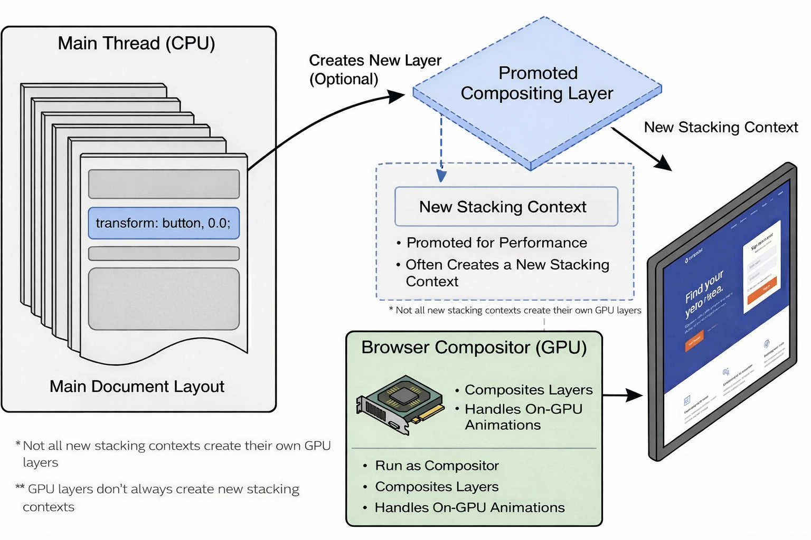
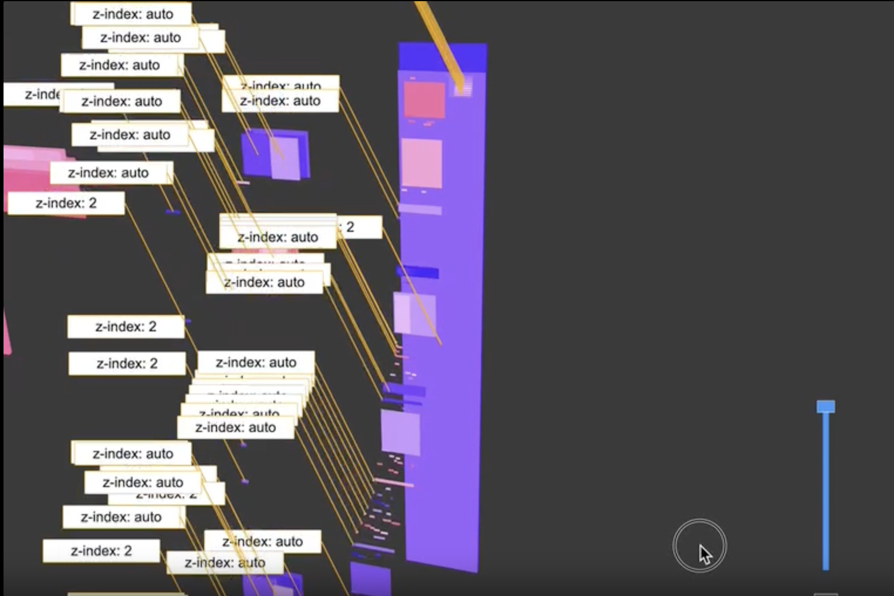
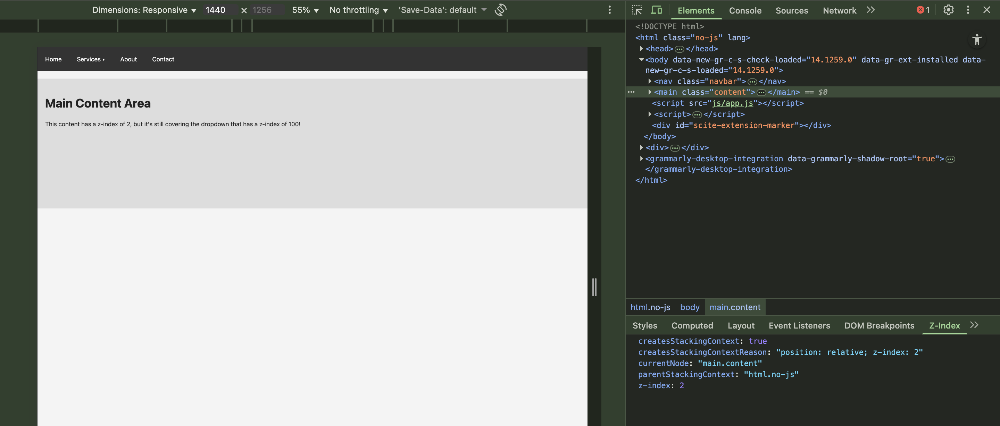
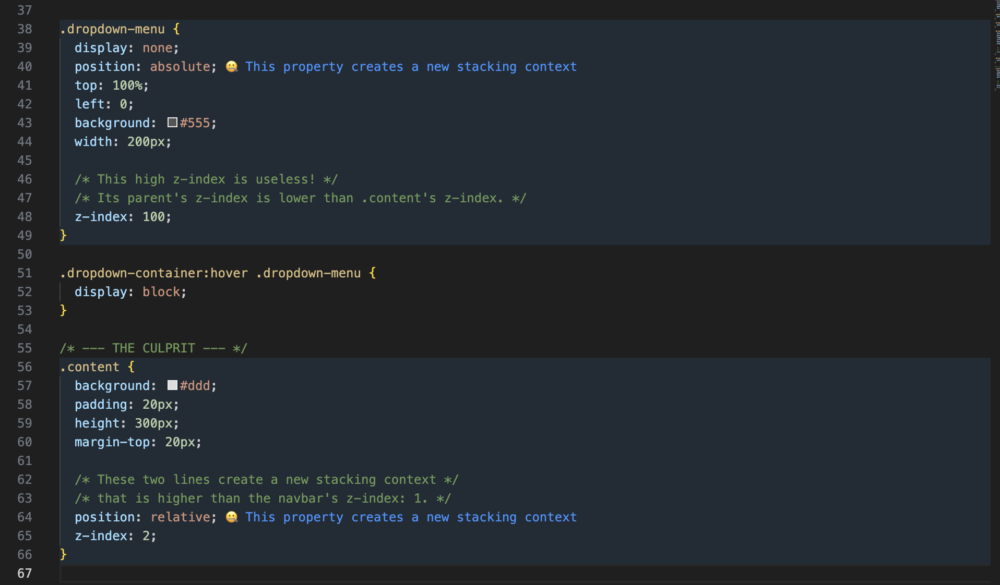

# 拆解 CSS 堆叠上下文

> 原文：[Unstacking CSS Stacking Contexts](https://www.smashingmagazine.com/2026/01/unstacking-css-stacking-contexts/)  
> 作者：Gabriel Shoyombo  
> 日期：2026-01-27  
> 翻译：田八  

在 CSS 中，我们可以创建“堆叠上下文（stacking context）”，让元素在视觉上以一种三维的方式一层压一层地摆放，从而产生“深度”的感觉。堆叠上下文非常有用，但它也经常被误解，并且很容易在不知不觉中被创建出来，进而引发一系列棘手的布局问题。

你有没有遇到过这种情况：给某个元素写了 `z-index: 99999`，但它还是没能盖在其它元素上面？按理说，这么大的值应该能让它轻松压过任何东西——前提是其它元素的值更小，或者根本没设置。

网页通常是在二维平面里呈现的；但当我们应用某些 CSS 属性时，就会引入一条想象中的 z 轴，用来表达“深度”。这条轴垂直于屏幕，用户会通过它感知元素的前后顺序：哪个在上、哪个在下。这个“想象中的 z 轴”以及用户对层叠的感知，本质上就是由一组 CSS 属性共同作用形成的——也就是我们所说的 **堆叠上下文**。

接下来我们会聊聊：网页上的元素是如何“堆叠”的、堆叠顺序由什么决定，以及在需要时有哪些实用方法可以把元素“解栈（unstack）”。

## 关于堆叠上下文

把你的网页想象成一张桌子。你不断往页面里加 HTML 元素，就像不断往桌子上放纸张，一张接一张。最后放上去的那张纸（也就是最新加入的 HTML 元素）会在最上面，盖住之前的纸。这就是常规的文档流——嵌套元素也是一样。

桌子本身代表根堆叠上下文（root stacking context），由 `<html>` 元素形成，它包含了所有其它“文件夹”。

接下来，特定的 CSS 属性开始发挥作用。

像 `position`（配合 `z-index`）、`opacity`、`transform`、`contain` 等属性，就像一个文件夹。这个文件夹会把某个元素及其所有子元素从“主堆”里拿出来，单独分到一个子堆里，从而创建出一个 **堆叠上下文**。

- 对于定位元素：当我们声明一个非 `auto` 的 `z-index` 时，就会发生这种分组。
- 对于 `opacity`、`transform`、`filter` 等属性：当设置了某些特定值时，浏览器会自动创建堆叠上下文。


当浏览器决定“谁在上面”时，它会先堆叠这些“文件夹”，而不是文件夹里的每一张纸。这就是很多开发者忽视的堆叠上下文“黄金法则”。（[大图预览](./assets/1-stacking-context-order.png)）

> 请理解这一点：一旦一张纸（也就是子元素）进了一个文件夹（也就是父元素的堆叠上下文），它就再也不可能离开这个文件夹，也不可能插到另一个文件夹里的纸张之间。它的 `z-index` 从此只在自己的文件夹内部才有意义。

在下图中，纸张 B 现在被放进了文件夹 B 的堆叠上下文里，于是它只能和这个文件夹里的其它纸张一起排序。


（[大图预览](./assets/2-stacking-contexts.png)）

想象一下，你桌上有两个文件夹：

```html
<div class="folder-a">Folder A</div>
<div class="folder-b">Folder B</div>
```

```css
.folder-a { z-index: 1; }
.folder-b { z-index: 2; }
```

我们稍微更新一下标记：在 Folder A 里有一张特殊页面，`z-index: 9999`；在 Folder B 里有一张普通页面，`z-index: 5`。

```html
<div class="folder-a">
   <div class="special-page">Special Page</div>
</div>

<div class="folder-b">
  <div class="plain-page">Plain Page</div>
</div>
```

```css
.special-page { z-index: 9999; }
.plain-page { z-index: 5; }
```

哪一张在最上面？

答案是 Folder B 里的 `.plain-page`。浏览器会忽略“子纸张”，先把两个文件夹堆叠出来：它看到 Folder B（`z-index: 2`）会盖住 Folder A（`z-index: 1`），因为 2 大于 1。与此同时，尽管 `.special-page` 的 `z-index: 9999` 看起来大得离谱，它依然处在更底层，因为它被“困”在 `z-index: 1` 的文件夹里。

堆叠上下文也可以嵌套（文件夹里还有文件夹），形成一个“家谱树”。同样的原则适用：子元素永远逃不出父元素的文件夹。

既然你已经理解了堆叠上下文就像“文件夹”一样，会把图层分组并重新排序，那么就值得进一步问：为什么某些属性（例如 `transform` 和 `opacity`）会创建新的堆叠上下文？

关键在于：这些属性创建堆叠上下文并不是因为“看起来像”，而是因为浏览器底层实现的方式决定的。当你应用 `transform`、`opacity`、`filter` 或 `perspective` 时，你是在告诉浏览器：*“嘿，这个元素可能会移动/旋转/渐隐渐现，所以你最好提前准备好！”*



（[大图预览](./assets/3-diagram-stacking-context.png)）

当你使用这些属性时，浏览器会创建一个新的堆叠上下文以更高效地管理渲染。这样浏览器就可以把动画、变换、视觉效果独立处理，减少它们和页面其它部分交互时需要重新计算的次数。可以把它理解成浏览器在说：*“我把这个文件夹单独处理，这样文件夹里发生变化时，就不必每次都把整张桌子重排一遍。”*

但这也有副作用：一旦浏览器把某个元素“提”到独立图层里，它就必须把其中的内容“压扁（flatten）”为一个整体，于是形成了新的堆叠上下文。这就像把一个文件夹拿离桌面单独处理——文件夹里的一切都被打包在一起，浏览器在决定谁盖住谁时，会把它当作一个整体。

所以，尽管 `transform` 和 `opacity` 可能看起来不会影响堆叠顺序，但它们确实会。这是为了性能优化。其它一些 CSS 属性也会出于类似原因创建堆叠上下文。若想深入了解，MDN 提供了一个完整列表：

- [创建堆叠上下文的特性列表（MDN）](https://developer.mozilla.org/en-US/docs/Web/CSS/CSS_positioned_layout/Stacking_context#features_creating_stacking_contexts)

这个列表相当长，也更说明了一件事：我们很容易在不自知的情况下创建堆叠上下文。

## “解栈（Unstacking）”问题

堆叠问题出现的原因很多，但有些比其它更常见。模态框（Modal）就是一个经典模式：它需要在“打开”时切换到最顶层，盖在所有元素之上；在“关闭”时再从顶层移除。

我很确定我们都遇到过这样的情况：打开一个 modal，但不知为何它就是不出现。并不是它没打开，而是它被放在某个更低的堆叠层里，根本看不见。

这就让人纳闷：“怎么会？”因为你明明写了：

```css
.overlay {
  position: fixed; /* creates the stacking context */
  z-index: 1; /* puts the element on a layer above everything else */
  inset: 0;
  width: 100%;
  height: 100vh;
  overflow: hidden;
  background-color: #00000080;
}
```

看起来都没问题。但如果包含 modal 触发器的父元素，是另一个父元素的子元素，并且那个父元素也设置了 `z-index: 1`，那么从技术上讲，它就把 modal 放进了一个子层里——会被更高层的“主文件夹”遮住。

我们来看看这个具体场景，以及其它一些常见的堆叠上下文陷阱。你会发现：不小心创建堆叠上下文有多容易；更重要的是，我们会学到如何管理它们、以及如何回到一个可控的状态——而具体用哪种方法，取决于实际场景。

### 场景 1：被困住的模态框

- CodePen： [Scenario 1: The Trapped Modal (Problem) [forked]](https://codepen.io/smashingmag/pen/pvbddjd)

如果你点击 header 里的 “Open Modal” 按钮，会发现 overlay 和 modal 出现在主内容的后面。这是因为 modal 是 header 容器的子元素，而 header 的堆叠上下文顺序（`z-index: 1`）低于 main 容器（`z-index: 2`）。即使 modal overlay 和 modal 的 `z-index` 分别是 `9998` 和 `9999`，拥有 `z-index: 2` 的主容器仍然在它们上面。

### 场景 2：被淹没的下拉菜单

- CodePen： [Scenario 2: The Submerged Dropdown (Problem) [forked]](https://codepen.io/smashingmag/pen/zxBPPvm)

这里的问题和场景 1 类似。当你把鼠标悬停到 “services” 链接上时，下拉菜单确实出现了，但它出现在主容器的后面。我特意把主容器的 `margin-top` 设成 `20px`，让你能看到下拉菜单“冒出来”，但又刚好被主容器压住。这也是前端开发者经常遇到的问题之一，根源同样是堆叠上下文。不过它和场景 1 虽然相似，但解决方式会有点不同，我们后面会讲。

### 场景 3：被裁剪的提示（Tooltip）

这次就不是“谁的 `z-index` 更大”的问题了，而是 `overflow: hidden` 在做它该做的事：阻止内容在视觉上逃出容器——哪怕这个内容写着 `z-index: 1000`。

- CodePen： [Scenario 3: The Clipped Tooltip (Problem) [forked]](https://codepen.io/smashingmag/pen/GgqOOoo)

谁能想到 `overflow: hidden` 能挡住 `z-index: 1000`？但它确实挡住了，正如上面的 CodePen 所示。

我觉得开发者太信任 `z-index` 了，以至于期待它能把元素从任何“遮挡”里拽出来。但现实并不是这样。并不是说它不强大，而是还有其它因素决定了它能不能把你的元素推到最上层。

所以，在你随手给元素拍一个 `z-index` 之前，记住：它也许能帮你暂时脱困，但也可能把你推到一个更大的坑里——那个坑里甚至连 `z-index: infinity` 都救不了你：

- [Never lose a z-index battle again](https://www.matuzo.at/blog/2025/never-lose-a-z-index-battle-again)

在尝试修复之前，我们先搞清楚问题。

## 找出被困住的图层

当你遇到上面那些问题时，搞清楚一点会很有帮助：元素并不是“中邪”了；而是某个祖先元素“犯了错”，子孙在替它还债。用更不玄学的话说：被遮住的元素通常不是问题本身；真正的问题是某个祖先元素创建了一个更低层级的堆叠上下文，导致它的子元素整体都被压在另一个更高层级堆叠上下文的子元素之下。

一个很好的排查方式是：打开浏览器 DevTools 检查该元素，并沿着 DOM 向上逐层查看父元素，在每一层检查是否存在会触发堆叠上下文的属性，以及它和兄弟元素相比处于什么顺序。我们先做一个检查清单，把步骤排好。

### 你的调试检查清单

1. **检查问题元素。**  
   右键你“消失”的元素（modal、dropdown、tooltip），点击 “Inspect”。
2. **检查元素样式。**  
   在 “Styles” 或 “Computed” 面板中确认它确实有你期望的高 `z-index`（比如 `z-index: 9999;`）。
3. **沿 DOM 树向上爬。**  
   在 “Elements” 面板里查看它的直接父元素，点击选中。
4. **调查父元素样式。**  
   在 “Styles” 面板里查看父元素的 CSS。现在你要找的是任何会创建新堆叠上下文的属性：定位相关、视觉效果相关、containment 相关。
5. **重复。**  
   如果直接父元素没问题，就继续点它的父元素（也就是“祖父元素”），重复第 4 步。一直向上，直到找到罪魁祸首。

下面我们把这份清单应用到三个场景。

### 问题 1：被困住的模态框

1. **Inspect：** 检查 `.modal-content`。
2. **Check Styles：** 我们看到 `z-index: 9999`，所以这不是问题。
3. **Climb：** 看它的父元素 `.modal-container`，没有“困住”的属性。
4. **继续向上：** 看它的父元素 **`.header`**。
5. **Investigate：** 检查 `.header` 的样式，找到了罪魁祸首：`position: absolute` 和 `z-index: 1`。这个元素创建了堆叠上下文。我们找到陷阱了：modal 的 `z-index: 9999` 被困在一个 `z-index: 1` 的文件夹里。

### 问题 2：被淹没的下拉菜单

1. **Inspect：** 检查 `.dropdown-menu`。
2. **Check Styles：** 我们看到 `z-index: 100`。
3. **Climb：** 检查它的父元素 `li`，再到 `ul`，再到它们的父元素 **`.navbar`**。
4. **Investigate：** 我们发现 `.navbar` 有 `position: relative` 和 `z-index: 1`，它创建了堆叠上下文 A。
5. **Analyse Siblings：** 但这还不是全部。为什么它会在内容下面？我们继续检查 `.navbar` 的兄弟元素 `.content`，发现它有 `position: relative` 和 `z-index: 2`（堆叠上下文 B）。浏览器会堆叠这些“文件夹”：`.content`（2）在 `.navbar`（1）之上。根因找到了。

### 问题 3：被裁剪的提示

1. **Inspect：** 检查 `.tooltip`。
2. **Check Styles：** 我们看到 `z-index: 1000`。
3. **Climb：** 检查它的父元素 `.tooltip-trigger`，没问题。
4. **继续向上：** 检查它的父元素 **`.card-container`**。
5. **Investigate：** 扫描样式发现罪魁祸首：`overflow: hidden`。这是另一种特殊陷阱：不管 `z-index` 多高，只要子元素试图渲染到容器边界之外，它就会被裁剪掉。

### 进阶工具

沿 DOM 树向上排查虽然有效，但可能很慢。下面这些工具能让你更快定位问题。

#### DevTools 3D View

一些浏览器（例如 Microsoft Edge 的 “More Tools” 菜单，以及 Firefox 的 “Inspector” 标签页）提供 “3D View” 或 “Layers” 面板。这个工具非常救命：它会把网页拆成不同图层的 3D 爆炸图，让你清楚看到堆叠上下文如何分组。



Microsoft Edge 3D Stacking Context View.（[大图预览](./assets/4-microsoft-edge-stacking-context.png)）

你可以立刻看到你的 modal 被困在较低层级的图层里，并快速锁定那个父元素。

#### 浏览器扩展

也有聪明的开发者做了扩展来帮忙。比如这个 **“CSS Stacking Context Inspector”** Chrome 扩展，会在 DevTools 里新增一个 `z-index` 标签页，显示哪些元素创建了堆叠上下文以及相关信息。

- [“CSS Stacking Context Inspector” Chrome extension](https://chrome.google.com/webstore/detail/z-context/jigamimbjojkdgnlldajknogfgncplbh)



（[大图预览](./assets/5-browser-extensions.png)）

#### IDE 扩展

你甚至可以在开发阶段就发现问题。比如 VS Code 的这个扩展，会在编辑器里直接高亮潜在的堆叠上下文问题：

- [Better CSS Stacking Contexts (VS Code)](https://marketplace.visualstudio.com/items?itemName=mikerheault.vscode-better-css-stacking-contexts)



Better CSS Stacking Contexts Extension.（[大图预览](./assets/6-ide-extensions.png)）

## 解栈并重新夺回控制权

当我们找到了根因，下一步就是着手处理。有好几种处理方式，我会按顺序列出来：你可以选择任意层级的方式——它们彼此之间没有谁高谁低，也不存在谁能阻止谁。

### 改变 HTML 结构

这被认为是最理想的修复方式。你之所以会遇到堆叠上下文问题，往往是因为你把某些元素放在了 HTML 结构里“不太对劲”的位置。重构页面能帮助你重塑 DOM，从源头消除堆叠上下文问题。

做法是：找到出问题的元素，把它从“困住它的元素”里挪出去。比如场景 1“被困住的模态框”，我们可以把 `.modal-container` 从 header 里挪出来，直接放到 `<body>` 下作为独立节点。

```html
<header class="header">
  <h2>Header</h2>
  <button id="open-modal">Open Modal</button>
  <!-- Former position -->
</header>
<main class="content">
  <h1>Main Content</h1>
  <p>This content has a z-index of 2 and will still not cover the modal.</p>
</main>

<!-- New position  -->
<div id="modal-container" class="modal-container">
  <div class="modal-overlay"></div>
  <div class="modal-content">
    <h3>Modal Title</h3>
    <p>Now, I'm not behind anything. I've gotten a better position as a result of DOM restructuring.</p>
    <button id="close-modal">Close</button>
  </div>
</div>
```

当你点击 “Open Modal” 按钮时，modal 就会像它应该的那样出现在所有内容之前。

- CodePen： [Scenario 1: The Trapped Modal (Solution) [forked]](https://codepen.io/smashingmag/pen/azZVVNP)

### 在 CSS 中调整父级堆叠上下文

如果某个元素挪不了——挪了会破坏布局——该怎么办？这时更好的思路是直面问题：**父元素决定上下文。**

找到触发堆叠上下文的 CSS 属性并移除它；如果它确实有用途无法移除，那就让父容器的 `z-index` 比它的兄弟元素更高，从而把整个容器一起抬上去。父容器 `z-index` 更高时，父容器会被放到更靠上的层级，它的子元素也就会更接近用户。

基于我们在“被淹没的下拉菜单”里学到的内容，我们不可能把 dropdown 移出 navbar（那样不合理）。但我们可以把 `.navbar` 的 `z-index` 提高到比 `.content` 的 `z-index` 更大。

```css
.navbar {
  background: #333;
  /* z-index: 1; */
  z-index: 3;
  position: relative;
}
```

这样一来，`.dropdown-menu` 就会稳稳地显示在内容之前。

- CodePen： [Scenario 2: The Submerged Dropdown (Solution) [forked]](https://codepen.io/smashingmag/pen/YPWEEWz)

### 如果你在用框架，试试 Portal

在像 [React](https://react.dev/reference/react-dom/createPortal) 或 [Vue](https://www.digitalocean.com/community/tutorials/vuejs-portal-vue) 这样的框架里，Portal 是一种特性：它允许你把组件渲染到 DOM 树中“正常父子层级之外”的位置。Portal 就像组件的瞬移装置：你可以把组件的 HTML 渲染到文档中的任意位置（通常是 `document.body`），但在逻辑上仍然和原父组件保持联系（props、state、事件都还是通的）。这非常适合用来逃离堆叠上下文陷阱，因为渲染输出会真正出现在那个“问题父容器”之外。

```javascript
ReactDOM.createPortal(
  <ToolTip />,
  document.body
);
```

这能确保你的 dropdown 内容不会被父元素遮住——哪怕父元素有 `overflow: hidden` 或者较低的 `z-index`。

在前面的“被裁剪的 tooltip”场景中，我用 Portal 把 tooltip 从 `overflow: hidden` 的裁剪中救出来：把它放到 document body 中，再把它定位到容器里的触发元素上方。

- CodePen： [Scenario 3: The Clipped Tooltip (Solution) [forked]](https://codepen.io/smashingmag/pen/myEqqEe)

## 在不引入副作用的情况下创建堆叠上下文

上一节介绍的所有方法都是为了把元素从问题堆叠上下文中“解栈”。但有些时候，你其实需要（或想要）创建一个堆叠上下文。

创建新的堆叠上下文很容易，但大多数做法都有副作用。唯一的例外是使用 [`isolation: isolate`](https://css-tricks.com/almanac/properties/i/isolation/)。当它应用在一个元素上时，该元素子元素的堆叠上下文会在这个元素内部相对确定，而不会被外部元素影响。一个典型场景是给子元素设置负值，例如 `z-index: -1`。

想象你有一个 `.card` 组件。你希望添加一个装饰形状：它要在 `.card` 文本之后，但又在卡片背景之上。如果 `.card` 本身没有堆叠上下文，那么 `z-index: -1` 会把这个形状送到根堆叠上下文（整页）的最底下，从而让它“消失”在 `.card` 的白色背景下面。

- CodePen： [Negative z-index (problem) [forked]](https://codepen.io/smashingmag/pen/QwEOOEM)

要解决它，我们在父元素 `.card` 上声明 `isolation: isolate`：

- CodePen： [Negative z-index (solution) [forked]](https://codepen.io/smashingmag/pen/MYeOOeG)

这样 `.card` 自身就成为一个堆叠上下文。当它的子元素（比如 `:before` 伪元素上创建的装饰形状）设置了 `z-index: -1` 时，它会掉到父元素堆叠上下文的最底部——刚好在文本后面、背景上面，达到我们想要的效果。

## 结论

记住：下次当你觉得 `z-index` 失控时，十有八九是遇到了一个“被困住的堆叠上下文”。

### 参考资料

- [Stacking context（MDN）](https://developer.mozilla.org/en-US/docs/Web/CSS/CSS_positioned_layout/Stacking_context)
- [Z-index and stacking contexts（web.dev）](https://web.dev/learn/css/z-index)
- [How to Create a New Stacking Context with the Isolation Property in CSS（freeCodeCamp）](https://www.freecodecamp.org/news/the-css-isolation-property/)
- [What The Heck, z-index??（Josh Comeau）](https://www.joshwcomeau.com/css/stacking-contexts/)

### SmashingMag 延伸阅读

- [Managing CSS Z-Index In Large Projects](https://www.smashingmagazine.com/2021/02/css-z-index-large-projects/)
- [Sticky Headers And Full-Height Elements: A Tricky Combination](https://www.smashingmagazine.com/2024/09/sticky-headers-full-height-elements-tricky-combination/)
- [Managing Z-Index In A Component-Based Web Application](https://www.smashingmagazine.com/2019/04/z-index-component-based-web-application/)
- [The Z-Index CSS Property: A Comprehensive Look](https://www.smashingmagazine.com/2009/09/the-z-index-css-property-a-comprehensive-look/)
