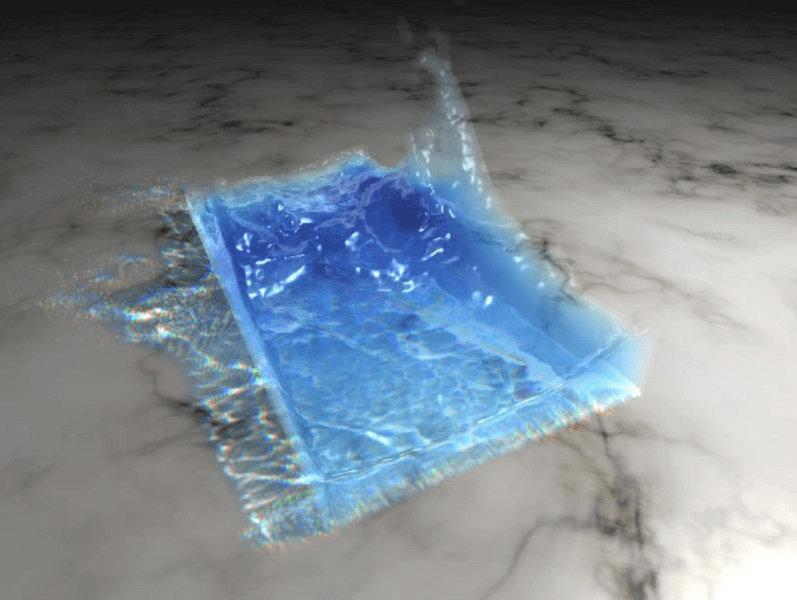
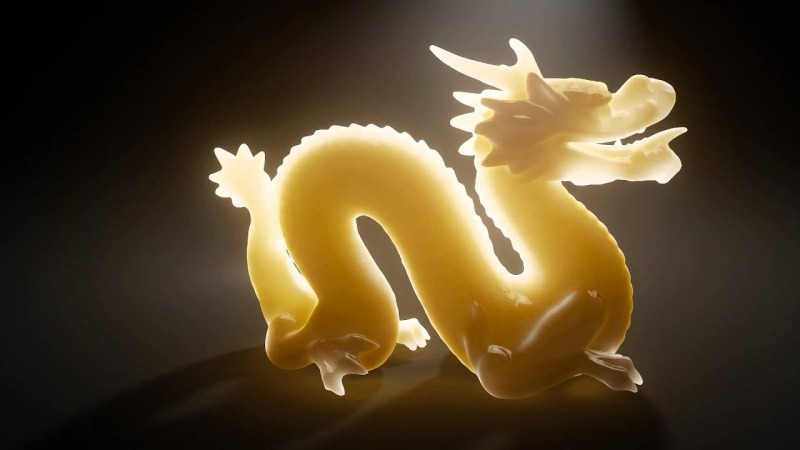

# 粒子、进展与坚持：一次 WebGPU 流体之旅

原文：[Particles, Progress, and Perseverance: A Journey into WebGPU Fluids](https://tympanus.net/codrops/2025/01/29/particles-progress-and-perseverance-a-journey-into-webgpu-fluids/)

作者：[Hector Arellano](https://tympanus.net/codrops/author/hector/)

日期：2025年1月29日

翻译：[TUARAN](https://github.com/TUARAN)

> 欢迎关注 [前端周刊](https://github.com/TUARAN/frontend-weekly-digest-cn)，每周更新国外论坛的前端热门文章，紧跟时事，掌握前端技术动态。

本文是一段回顾式的长旅程：作者用十多年的时间不断尝试“浏览器里做流体”，从 WebGL 时代的各种 Hack，一路走到 WebGPU 让许多“现代图形 API 能力”变得可用。

- Demo：<https://tympanus.net/Tutorials/WebGPUFluid/>
- Code：<https://github.com/HectorArellanoDev/WebGPUFluids>

编者按：如果你关注过 Web 图形圈子，可能知道 Hector Arellano（又名 [Hat](https://x.com/hector_arellano)）。这篇文章不仅是技术拆解，更是一段关于坚持、试错、与 Web 图形演进的故事。

注意：Demo 依赖 **WebGPU**，并非所有浏览器都支持。请使用支持 WebGPU 的浏览器（例如最新版 Chrome / Edge，并确保 WebGPU 已启用）。

在继续阅读之前……先去拿杯喝的——*这篇很长*。

## 13 年前……

我正盯着电脑屏幕发呆（无聊得很），一个很要好的朋友 [Felix](https://x.com/Sirokos) 打电话给我，非常认真又兴奋地说：Gathering Party 刚发布了一个[新 Demo](https://www.youtube.com/watch?v=LTOC_ajkRkU)。它有流体模拟、粒子动画、惊艳的着色方案——最重要的是，它真的很美。

那时候 WebGL 还算“新东西”，把硬件加速的 3D 图形带进浏览器，看起来会打开很多门。我天真地以为：WebGL 也许能做出 Felix 给我看的那种东西。

但我开始研究那个 Demo 的实现方式时，就撞上了残酷现实：里面用到了一堆我从没听过的 API/特性——“Atomics（原子操作）”“Indirect Draw Calls（间接绘制调用）”“Indirect Dispatch（间接派发）”“Storage Buffers（存储缓冲区）”“Compute Shaders（计算着色器）”“3D Textures（三维纹理）”。

它们属于现代图形 API 的能力，但在当时的 WebGL 里基本不存在。

更别提它还用了很多听起来就很复杂的算法/技术：用 **SPH（Smoothed Particle Hydrodynamics，平滑粒子流体动力学）** 驱动粒子动画、用 **histopyramids** 做流压缩（我当时还想：我为什么需要这个？）、用 GPU 上的 **marching cubes**（从粒子生成三角形？？？）等等。

我完全不知道从哪里开始。更糟的是，Felix 跟我打赌：这种流体效果不可能在浏览器里“可用于生产”。

## 10 年前……

又过了三年，Felix 说他还有一个[更炸裂的 Demo](https://www.youtube.com/watch?v=i8hSZGTXTx8)一定要我看。除了流体模拟，它还用实时光线追踪渲染了几何体——材质很震撼、画面很惊人。

这下挑战更大了：我不仅想模拟流体，我还想用光追去渲染它，得到漂亮的反射与折射。

我花了大概 3 年才把这些东西理解到能在 WebGL 里“硬凿”出来：

- 我用 SPH 让粒子行为像流体；
- 我用 marching cubes 从粒子生成网格（见图 1 的描述）。

当时没有 atomics，我就用多次 draw call 把数据塞进纹理的 RGBA 通道来“分层”；没有 storage buffer 和 3D 纹理，我就用纹理存数据，并用二维层来“模拟” 3D 纹理；没有 indirect draw，我就干脆按预期数量发起 draw call；没有 compute shader，我就用顶点着色器做 GPGPU 的数据重排……虽然也做不出那种“在 buffer 里随意写多个内存位置”的事，但至少我能在 GPU 里生成一个加速结构。

实现是能跑，但离“美”差得很远（Felix 直接评价：丑。确实丑，你可以想象图 2）。我那时也不太懂距离场，也不知道怎么把 shading 做得更有趣，基本就是老派 phong。

性能也限制了很多高级效果：环境光遮蔽、更复杂的反射折射……但至少我能渲染出点东西。

## 7 年前……

再过三年，我又做了一些进展：实现了一个混合式光追。思路是：marching cubes 先生成三角形，然后用光追去算二次射线做反射/折射；同一个光追还能遍历加速结构去做焦散。这些基本都沿用了 [Matt Swoboda](https://x.com/mattswoboda) 的想法（那些 Demo 的原作者）。我的工作大部分就是：把他的点子尽量在 WebGL 里跑起来（祝你好运）。

效果在视觉上还不错（类似图 3），但需要非常强的 GPU。当时我用的是 NVidia 1080GTX。也就是说：即使 WebGL 可行，也不可能拿去做“生产”。手机不行，普通笔记本也扛不住。

看得到“结果”，却用不到真实项目里，这种挫败感很强。我花了太多时间，最后也没有达到期望。至少，这套代码库还能继续帮我学习。

于是我停了。

Felix 赢了赌局。

这段铺垫对一篇“教程”来说太长了，但我想把背景交代清楚：有些 Demo 看起来像“几天搞定”，实际可能是多年积累；你要花时间学很多技术，也经常要借鉴别人的想法——最后也可能仍然失败。

## WebGPU 登场

还记得那些“现代图形 API 的关键词”吗？WebGPU 基于现代 API 标准，这意味着我不必再靠 Hack：

- 我可以用 compute shader 直接操作 storage buffer；
- 我可以用 atomics 做邻域搜索、流压缩时的索引写入；
- 我可以用 dispatch indirect 来只生成必要数量的三角形，并用同样的方式绘制它们。

我想学习 WebGPU，于是决定把之前的流体工作迁移过来，顺便理解新范式：怎么组织 pipeline 和 binding、怎么管理 GPU 内存与资源……做一个小 Demo 很适合练手。

需要先讲清楚：本文的 Demo **并不适合生产**。在 M3 Max 这类比较强的 MacBook Pro 上它可能能跑到 120fps；M1 Pro 上大概 60fps；其它不错的机器也许 50fps……但如果你拿去跑在 MacBook Air 上，“浏览器流体梦”会很快破碎。

那它为什么仍然有价值？

因为它其实是一组可拆解的技术集合。你可能对其中某个部分感兴趣：粒子动画、从势场生成表面（避免 ray marching）、间接光、世界空间 AO……你可以把仓库里的代码拿出来，只取你需要的部分来构建自己的想法。

这个 Demo 大致可以拆成 4 个主要阶段：

- **流体模拟**：用粒子模拟（基于 Position Based Dynamics 思路）驱动流体的运动。
- **几何生成**：用 GPU 上的 marching cubes，从粒子生成渲染用三角形。
- **几何渲染**：使用距离场估算几何厚度以做次表面散射（SSS），并用体素锥追踪（Voxel Cone Tracing）计算 AO。
- **合成**：地面反射模糊、调色与 Bloom 等后期。

## 流体模拟

很多年前，如果你想在图形圈子里“显得很酷”，你得证明你能自己做流体模拟：做 2D 就很强，做 3D 就是“封神”（当然这是我脑内的中二设定）。为了“封神”（也为了赢赌局），我开始疯狂读 3D 模拟相关的资料。

做流体的方法很多，其中一种叫 **SPH**。理性做法应该是先评估哪个方法更适合 Web，但我当时选它就因为名字听起来很酷。SPH 是粒子法，这一点长期来看很有好处，因为后来我把 SPH 换成了 position based 的方法。

如果你做过“群体行为（steering behaviors）”或 flocking，会更容易理解 SPH。

Three.js 有很多 flocking 示例，它基于吸引、对齐、排斥等 steering 行为。用不同的权重/函数，根据粒子之间的距离决定粒子受哪些行为影响。

SPH 的做法也有点类似：你先算每个粒子的密度，再用密度算压力；压力就像 flocking 里的吸引/排斥，使粒子靠近或远离。密度又是邻域粒子距离的函数，所以压力本质上也是“由距离间接决定的”。

SPH 的粘性项（viscosity）也类似 flocking 的对齐项（alignment）：让粒子速度趋向邻域的平均速度场。

为了（过度）简化，你可以把 SPH 理解成：给 flocking 套上一组更“物理正确”的参数，让粒子更像流体。当然 SPH 还会涉及表面张力等更多步骤，且其核函数/权重远比这里描述复杂，但如果你能把 flocking 做好，理解 SPH 会更轻松。

SPH/群体行为都有一个共同难点：朴素实现是 $O(n^2)$，粒子多就会爆炸。你需要一个加速结构只查询附近粒子，让复杂度从 $O(n^2)$ 降到 $O(k\cdot n)$（$k$ 是每个粒子要检查的邻居数）。常见做法是体素网格：每个体素格子存最多 4 个粒子索引。

在这个示例里，算法会检查粒子周围 27 个体素，每个体素最多 4 个粒子，所以最多 108 次邻域检查。听起来也不少，但比检查 8 万个粒子要好太多。

但邻域遍历仍然昂贵。SPH 还要求多次 pass：密度、压力/位移、粘性、表面张力……当你意识到 GPU 绝大部分算力都在“驱动粒子”时，性能就会变得非常重要。

而且 SPH 很难调参，你得理解很多工程/物理参数才能做得好看。

后来 NVidia 提出了一套粒子动力学方法：**Position Based Dynamics（PBD）**，其中包含刚体、软体、流体、碰撞等。[课程笔记在这里](https://mmacklin.com/2017-EG-CourseNotes.pdf)。

PBD 通过“约束（constraints）”直接修正粒子位置，结果稳定、调参相对容易。这让我从 SPH 转向 **PBF（Position Based Fluids）**。核心差别在于：PBF 用约束来定义位移，而不是像 SPH 那样先算密度。

PBF 的参数更“无量纲”，更好理解。

但它也有代价：PBD 往往要迭代多次才能得到更好结果（计算约束、应用位移、计算粘性……反复执行），稳定但更慢。

而我不想只渲染粒子，我要渲染网格：GPU 还要算三角形、做渲染。我没有足够预算做多轮迭代，所以我必须“砍角”。

幸运的是，PBD 有一种很便宜的碰撞计算方式：在施加力（forces）后做一次 pass 即可。我选择：

- 用重力作为主力；
- 用 curl noise 作为辅助力，增加流体感；
- 用鼠标驱动一个很强的斥力（repulsion）；
- 让碰撞负责避免粒子聚成奇怪的团。

curl + 重力提供“像流体”的整体趋势，碰撞避免粒子聚团。它不如 PBF 那么真实，但更快。

实现上只需要一次 pass 应用所有力，同时在 storage buffer 里生成网格加速结构；atomics 写索引只需要几行代码。你可以在仓库的 `PBF_applyForces.wgsl` 里读到力与网格构建的实现。

粒子位置更新在 `PBF_calculateDisplacements.wgsl`：负责遍历邻域做碰撞，也负责和环境（不可见包围盒）碰撞。

pipeline 与绑定在 `PBF.js`：模拟只用三个 shader——施力、位移更新、速度积分。位置更新后，速度通过“新位置 - 旧位置”的差值得到。

最后一个 shader `PBF_integrateVelocity.wgsl` 还会设置一个包含粒子信息的 3D 纹理，后续会用于 marching cubes 生成势场。

流体模拟效果（本地视频）：[pbf.mp4](./assets/videos/pbf.mp4)

## Marching Cubes（几何生成）

当年我第一次用 SPH 把粒子跑起来时兴奋得不行，在办公室到处吹（基本到处都是）。Felix 当然知道怎么治我：他把我赶回去继续做“表面生成”，因为只有把流体渲染成液体表面而不是点，才算“像样”。

从粒子场渲染表面常见有三种思路：

- Point Splatting
- Raymarching
- Marching Cubes

Point splatting 是最简单也最快的一种：屏幕空间效果，渲染粒子后结合可分离模糊与深度来生成法线。效果很不错，还能做焦散，实时性能也好。

Raymarching 很有趣，能做多次反射折射等复杂效果，但非常慢：你需要从粒子生成距离场，再在距离场里做步进采样（过去还没有 3D 纹理，只能软插值）。即使硬件支持三线性插值，性能也依然不太理想。画面很美，但不适合实时。

Marching cubes 听起来很吸引人：从粒子生成的势场（potential field）里提取等值面生成网格。优点是网格可直接栅格化，在高分辨率下也能稳定渲染；并且有了网格，很多“反射”就能更便宜地实现。与前两种方案相比，它更容易作为世界空间几何体融入场景。

Three.js 有 marching cubes 的例子，但那些是 CPU 上生成表面；而我的粒子数据在 GPU。我去读 Matt Swoboda 的分享，了解他如何在 GPU 上做 marching cubes，但里面有很多我当时还不懂的问题：

- 如何从粒子场生成势场？
- 间接 dispatch 是怎么回事？
- 如何在 GPU 上生成三角形？

先把路线图讲清楚。Marching cubes 本质是从势场提取等值面（iso-surface）。关键步骤有：

1. 从粒子生成势场（potential）。
2. 在体素网格上评估势值，决定每个体素对应 256 种“case”里哪一种（每个体素会生成 0 到 5 个三角形）。
3. GPU 上把满足条件的体素写入连续 buffer（用 atomics 追加）。
4. 根据体素信息生成三角形。

### 势场生成（Potential Generation）

如果你了解 point splatting，会发现“模糊”很关键：它能把点云平滑成近似表面。同样思路也适用于 3D 纹理：对 3D 纹理做 blur，就能得到一种“穷人版距离场”。

你也可以用 Jump Flood 算法生成更精确的距离场（粒子也可以），看起来还可能比 3D blur 更快——但它有个致命缺点：它**太精确**了。

Jump Flood 的结果更像是一组球体的距离场，等值面阈值不同会把球“连起来”，但不会以一种“好看”的方式平滑。你得有非常多的粒子才会像连续表面，而那种情况下你倒不如直接用 point splatting。

3D blur 反而会把粒子“抹开”，去掉高频的颗粒感，让它更像表面。blur 次数越多，表面越平滑；你也能尝试不同 blur 方式混合出不同的表面效果。奇妙的是：这个简单办法在这里反而更快、更实用。

（图 7：不同 blur 步数对表面平滑度的影响）

实现上，blur 用 compute shader `Blur3D.wgsl`，沿三个轴各 dispatch 一次；绑定与 dispatch 在 `Blur3D.js`。

### 体素筛选（Checking voxels）

势场生成后，我用另一个 compute shader 扫描体素网格，找出会生成三角形的体素。仓库里的 `MarchCase.wgsl` 会遍历整个体素网格，为需要生成三角形的体素计算 marching cubes case，并用 atomics 把该体素的 3D 坐标与 case 连续写入 storage buffer。

然后 `EncodeBuffer.wgsl` 读取上一步得到的体素数量，编码出用于“间接 dispatch”的参数（三角形生成需要多少顶点）以及“间接 draw”的参数（需要绘制多少三角形）。

### 三角形生成（Triangles Generation）

负责生成顶点/法线的 shader 是 `GenerateTriangles.wgsl`。它根据每个线程的全局索引定位到对应体素和要生成的顶点，并通过 `EncodeBuffer.wgsl` 产生的间接 dispatch 来运行。

体素信息用于在边的两个角点之间做线性插值，得到顶点位置；法线则来自边两端角点梯度（gradient）的线性插值。

势场生成、体素收集、三角形生成这些步骤在 `TrianglesGenerator.js` 的 `generateTriangles` 函数里串起来，每次粒子位置更新后都会调用。

## 渲染

这些年我最大的错误之一，是把“模拟/GPGPU 技术”看得比“视觉美感”更重要。我太执着于证明自己能做复杂东西，而忽略了最终画面。

Felix 经常在我准备发布 Demo 之前拦住我：花更多时间把画面打磨得更舒服，别只做成那种“只有四个人会觉得很酷”的技术展示。

相信我：你可以做很强的物理模拟、很复杂的材质——但如果看起来很糟糕，那它就是糟糕。

流体的难点在于：你已经把大量 GPU 时间花在粒子动力学和表面生成上了，留给渲染效果的预算不多；还要给场景里其它东西留时间。所以实时流体一般很难做到“极致画质”。

实时渲染液体的最优解通常是 point splatting：反射、折射、阴影、焦散都能做，而且很“便宜”。不信可以看看这个很棒的 Demo：<https://webgpu-ocean.netlify.app/>

如果你要的是不透明/半透明但不需要“真正透明”的液体（比如颜料），marching cubes 是不错选择：你可以用 PBR 得到很好看的视觉，而且它是世界空间几何，和场景整合更简单。

在这个 Demo 的范围里，我想利用现成的体素结构（用于三角形生成）以及用于生成三角形的势场（可视作距离场），做一些“相对便宜但有效”的视觉提升。

我先做了基于体素锥追踪（Voxel Cone Tracing，VCT）的 AO。VCT 通常要求先把三角形体素化，但这个 Demo 反过来：我们本来就是从体素生成三角形。所以 VCT 所需的一大块工作已经在流程里。

我只需要稍微改一下 `MarchCase.wgsl`：用离散化方式更新体素网格——有三角形的体素标记为 1，没有的标记为 0；同时把地面以下一定高度的体素标 0.5 来模拟地面 AO。只多加两行代码就能准备好 VCT 的信息。

体素网格更新后，再对 3D 纹理做 mipmap（`MipMapCompute.wgsl`，绑定在 `CalculateMipMap.js`）。

（图 8：加入 AO 的材质，并测试反射）

本地视频：[ao.mp4](./assets/videos/ao.mp4)

你会注意到我也做了地面反射：marching cubes 生成的是网格，做反射很直接——算反射矩阵，把网格绘制两遍即可。若用 ray marching 做同样效果会贵很多。

这时我还有一点 GPU 预算，于是继续问朋友：还有什么特性值得加？有人建议做次表面散射（Subsurface Scattering，SSS），像下面这种效果。

SSS 做得好非常加分，难点在于要知道几何体的厚度（thickness），才能决定光在内部散射的程度。

很多 SSS demo 用“厚度贴图”，但流体表面无法烘焙厚度，必须实时计算。

幸运的是，我们在生成三角形之前已经有势场，它可以当距离场用来实时估算表面厚度。概念上类似 Iñigo Quilez 做 AO 的方式：在距离场里 ray marching，看表面距离如何影响遮蔽。

我采用类似思路，但把光线沿“进入几何内部”的方向发射，从而估算内部光传播被遮挡的程度——厚的地方散射弱，薄的地方散射强。效果出乎意料地好。

（图 10：应用 SSS 的材质）

本地视频：[SSS.mp4](./assets/videos/SSS.mp4)

几何材质在 `RenderMC.wgsl`：顶点着色器使用存储在 storage buffer 的顶点位置与法线。因为 CPU 不知道 marching cubes 实际生成了多少三角形，所以用 `EncodeBuffer.wgsl` 编码出的间接 draw 来绘制。

绑定里我用了两套矩阵：一套用于正常视角，另一套用于反射网格；这些在 `Main.js` 完成。

到这一步，模拟、表面生成、材质都有了，接下来该谈合成（composition）。

## 合成（Composition）

你可能觉得自己是很厉害的图形开发者：会用 Three.js / Babylon.js / PlayCanvas 做酷炫效果……也可能你更强，很多东西自己写。

我想说的是：我不是。

我为什么知道？

因为我曾在 Active Theory（<https://activetheory.net/>）工作，身边是非常优秀的图形开发和 3D 艺术家。他们让我看清自己的短板，也帮助我把交付物推到更好的状态。

如果你能争取和他们共事，对你的职业发展非常有帮助——你会学到很多。

其中最关键的一点是：**合成决定一切。**

我请曾在 Active Theory 共事的 Paul-guilhem Repaux（<https://x.com/arpeegee>）帮我做合成建议。他指出了几个关键问题：

- 地面反射过于清晰，应该更粗糙（更模糊）。
- 黑色背景无法体现光从哪里来；背景应该营造更“有情绪”的氛围。
- 缺少把几何体与环境融合的光效。
- 字母之间的过渡缺乏合理性。
- 需要调色。

（当然还有很多能改的地方，他只是很友好地挑了最关键的。）

### 反射

第一点可以用后期解决：根据几何体到地面的距离决定反射的模糊程度——离地越远越模糊，从而得到“粗糙度”效果。

但如果只在“有几何体高度信息”的区域模糊，周围空白区域会不模糊，结果会很怪。

为了解决这个问题，我先做了一个预处理 pass：把反射几何体做一个偏移，并把“最近的高度”写入一张纹理，用来在空白区域也决定模糊强度。

（图 11：为反射模糊做偏移）

本地视频：[blur.mp4](./assets/videos/blur.mp4)

深红色是未反射几何体，绿色是反射几何体（包含偏移），你会看到绿色更“厚”。高度编码在红色通道里，可视为从地面到上方的渐变。

### 背景与光

SSS 的实现假设光源始终从几何体背后打过来——即便镜头移动，这个方向也得成立，否则 SSS 不明显。

这对背景设计反而是好事：背景可以做一个“背光渐变”，自然地解释光来自背后；同时背景色也可以和材质更接近，让整体更融合。

（图 12：用简单渐变做背光背景）

本地视频：[backgroundIntegration.mp4](./assets/videos/backgroundIntegration.mp4)

### 光效融合

最后，为了让背景与几何体的光融合得更好，我加了 Bloom：在几何体更薄的区域，Bloom 更强，从而强化 SSS 的视觉。

（图 13：Bloom 效果）

（顺带一提：我还尝试过把字母动画和 Codrops 的 Logo 对齐，但看起来像儿童识字应用，于是放弃。）

### 过渡（Transitions）

过渡能给交互提供节奏，也能强化“字母在变形”的概念。我试过一些过渡：例如无重力漂浮再成型。

（图 14：漂浮过渡）

本地视频：[floating.mp4](./assets/videos/floating.mp4)

也试过“引导流”生成字母。

（图 15：引导流过渡）

本地视频：[guided.mp4](./assets/videos/guided.mp4)

但它们都缺乏一个说得通的概念。后来我围绕“codrops”里的 *drops* 想到了“下落”，事情突然就顺了：让字母像液体一样坠落并变形。

（图 16：下落过渡）

本地视频：[falling.mp4](./assets/videos/falling.mp4)

我还尝试把“下落”概念延伸到背景，做了多种背景过渡，并测试不同字母风格。

（图 17：scanline 背景过渡 + 调色测试）

本地视频：[transition1-1.mp4](./assets/videos/transition1-1.mp4)

scanline 的方案看起来太像 3dsMax 老式扫描线渲染器，于是丢弃。

（图 18：列（columns）背景过渡）

本地视频：[transition2.mp4](./assets/videos/transition2.mp4)

columns 的想法是：新字母由柱子抬升生成，但它对交互和视觉干扰太大，也放弃。

（图 19：小写字母与 emoji 测试）

### 调色与氛围

最后我加了亮度、对比度、gamma 校正，选择偏暖的配色让氛围更柔和。后期由多个 compute shader 完成，在 `Main.js` 里调用。

完整代码库：<https://github.com/HectorArellanoDev/Codrops>

简化版仓库：<https://github.com/HectorArellanoDev/CodropsBasic>

你可以通过在 Demo URL 末尾加 `/?word=something` 来更改展示的单词。

## 结语

本文没有深入性能优化，我觉得也没必要：这个 Demo 本来就面向强 GPU，不是移动端。

WebGPU 的 timestamp query 让定位瓶颈变得更容易（例如 `Blur3D.js` 里就有注释掉的查询）。

这并不意味着“这套方案能直接上生产”。Felix 做过一个用 SPH 做字母的探索，非常快也很酷，你可以看看：<https://fluid.felixmartinez.dev/>

总之，这么多年过去，Felix 还是赢着赌局，而我还在努力扭转结果……希望你也能遇到一个让你说出 *“hold my beer”* 的人。
