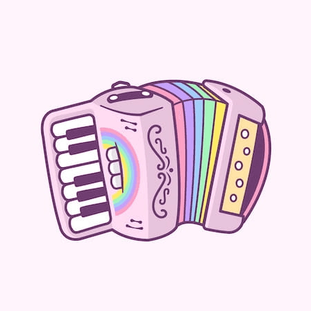

# 纯 CSS 实现高度自适应的动画手风琴

> 原文：[CSS-only animated accordion with dynamic content height](https://krasimirtsonev.com/blog/article/css-only-animated-accordion-with-dynamic-content-height)  
> 作者：Krasimir Tsonev  
> 日期：2026年02月01日  
> 翻译：田八  



多年来，CSS 变得越来越强大，使开发者无需依赖 JavaScript 也能创建交互式组件。其中一个典型组件，就是带动画效果的手风琴（accordion）：它能在展开与折叠内容区块时保持平滑过渡。

在本文中，我们将一起探索如何创建一个“纯 CSS”的动画手风琴，它能根据内部内容动态调整高度。

## 问题是什么

仅用 CSS 来做手风琴并不容易，尤其是在“内容区域高度的动画”这件事上。CSS 的 `height` 属性无法从 `0` 过渡到 `auto`（或 `fit-content`），但动态内容高度又恰恰需要这种能力。

考虑下面的标记（markup）：

```html
<div class="accordion">
  <input type="checkbox" id="accordion-box" />
  <label for="accordion-box">
    CSS stands for Cascading Style Sheets.
  </label>
  <div class="content">
    <p>... long text here ...</p>
  </div>
</div>
```

我们的目标是：当勾选框（checkbox）切换时，`.content` 这个 div 能展开/收起。

```css
.accordion [type="checkbox"] {
  position: absolute;
  opacity: 0;
  z-index: -1;
}
.accordion [type="checkbox"] + label {
  cursor: pointer;
}
.accordion [type="checkbox"]:checked ~ .content {
  /* do some magic here */
}
```

由于 `label` 正确地与 checkbox 关联，点击 `label` 就会切换 checkbox 的状态。并且借助 `:checked` 伪类，我们可以选中 `.content` div，从而控制它显示或隐藏。

然而，想把 `.content` 的高度从 `0` 动画到 `auto` 并不能直接实现。比如下面这种写法不会生效：

```css
.accordion .content {
  height: 0;
  overflow: hidden;
  transition: height 0.35s ease;
}
.accordion [type="checkbox"]:checked ~ .content {
  height: auto; /* This won't animate */
}
```

## 使用 CSS Grid 为动态高度做动画

要让动态内容也能平滑过渡高度，我们可以用 CSS Grid 的 `grid-template-rows` 属性。

思路是：把内容区域定义成一个网格（grid）的“行”，然后把行高从 `0` 动画到 `1fr`。这样内容就能占据它所需要的空间。

```css
.accordion .content {
  display: grid;
  grid-template-rows: 0fr;
  overflow: hidden;
  transition: grid-template-rows 0.35s ease;
}
.accordion [type="checkbox"]:checked ~ .content {
  grid-template-rows: 1fr;
}
```

这做法看起来有点怪，但确实可用。这里有个 CodePen 演示：

- https://codepen.io/Krasimir-Tsonev/pen/qENopPe

## 用 `<details>` 与 `<summary>` 做到更好的可访问性

更妙的是，我们可以使用 HTML 的 `<details>` 与 `<summary>` 元素来实现手风琴，甚至完全不需要 checkbox。

`<details>` 元素自带展开/收起内容的内置行为，而 `<summary>` 元素则充当可点击的头部。可以这样写：

```html
<details class="accordion">
  <summary>
    CSS stands for Cascading Style Sheets.
  </summary>
  <div class="content">
    <p>... long text here ...</p>
  </div>
</details>
```

`summary` 默认就是可点击的，`details` 则负责管理打开/关闭的状态。

然后我们就能通过 `<details>` 元素的 `open` 属性来控制动画：

```css
.accordion .content {
  display: grid;
  grid-template-rows: 0fr;
  transition: grid-template-rows 0.3s ease;
}
.accordion .content p {
  overflow: hidden;
}
.accordion[open] .content {
  grid-template-rows: 1fr;
}
```

这里是使用 `<details>` 与 `<summary>` 后更新版的 CodePen 演示：

- https://codepen.io/Krasimir-Tsonev/pen/WbxyBgy
