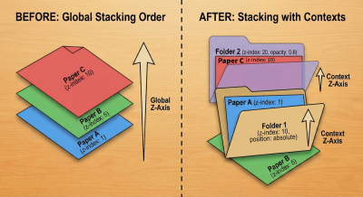
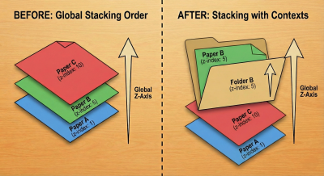
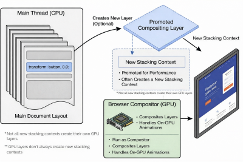
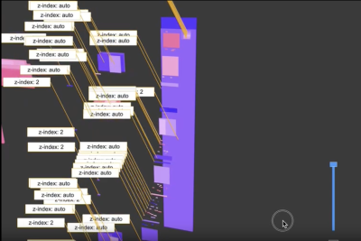
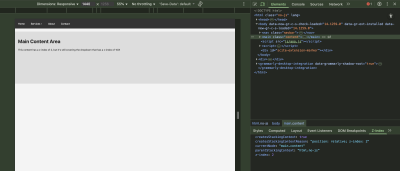

# 解密 CSS 层叠上下文：让你的 z-index 重新听话

> 原文：[Unstacking CSS Stacking Contexts — Smashing Magazine](https://www.smashingmagazine.com/2026/01/unstacking-css-stacking-contexts/)
>
> 翻译：[嘿嘿](https://blog.heyfe.org/blog)

在 CSS 中，我们可以创建“层叠上下文（Stacking Contexts）”，让元素在三维空间中视觉化地一个叠在另一个上面，从而产生深度感。层叠上下文非常有用，但也确实被误解得很惨，经常有人在无意中创建了它，导致一堆排版问题，修起来还特别头大。

你有没有过这种经历：在 CSS 里给一个元素设置了 `z-index: 99999`，结果它还是没能盖住其他元素？按理说，这么大的值应该能让它轻松“登顶”，只要其他元素的值比它小或者没设值就行。

网页通常被看作是一个二维平面，但通过应用特定的 CSS 属性，我们可以引入一条虚构的 Z 轴来表达深度。这条轴垂直于屏幕，用户通过它来感知元素的堆叠顺序。这个虚构的 Z 轴背后，以及用户对元素堆叠的感知，其实是由一系列 CSS 属性共同构成的，我们称之为**层叠上下文**。

今天我们就来聊聊网页上的元素是怎么“叠”起来的，靠什么控制顺序，以及在需要的时候如何通过“解构（Unstack）”来解决问题。

把你的网页想象成一张办公桌。当你添加 HTML 元素时，就像是在桌子上放一张张纸，一张压着一张。最后放上去的那张纸，就相当于最近添加的 HTML 元素，它会盖在之前放的所有纸上面。这就是普通的文档流（Document Flow），嵌套元素也是这个逻辑。而桌子本身，就代表由 `<html>` 元素形成的根层叠上下文，它装着所有的内容。

现在，一些特定的 CSS 属性要登场了。

像 `position`（配合 `z-index`）、`opacity`、`transform` 和 `contain` 这些属性，作用起来就像是一个“文件夹”。这个文件夹会把一个元素及其所有子元素打包，从主堆栈中抽出来，组成一个独立的子堆栈。这就是我们说的**层叠上下文**。对于定位元素，当你声明一个非 `auto` 的 `z-index` 值时，就会发生这种情况。而对于 `opacity`、`transform` 和 `filter` 等属性，只要应用了特定值，层叠上下文就会自动创建。

[](https://files.smashing.media/articles/unstacking-css-stacking-contexts/1-stacking-context-order.png)

当浏览器决定谁在上层时，它会**先堆叠文件夹**，而不是文件夹里单张的纸。这是很多开发者都会忽略的层叠上下文“金科玉律”。

> 请务必理解这一点：一旦一张纸（即子元素）进入了一个文件夹（即父元素的层叠上下文），它就永远无法跑出那个文件夹，也无法夹在另一个文件夹的纸张之间。它的 `z-index` 现在只在自己的文件夹内部有效。

在下图中，纸张 B 现在处于文件夹 B 的层叠上下文中，它只能和文件夹内的其他纸张排序。

[](https://files.smashing.media/articles/unstacking-css-stacking-contexts/2-stacking-contexts.png)

想象一下，如果你的桌子上有两个文件夹：

```html
<div class="folder-a">文件夹 A</div>
<div class="folder-b">文件夹 B</div>
```

```css
.folder-a { z-index: 1; }
.folder-b { z-index: 2; }
```

我们稍微改一下内容。文件夹 A 里有一张特殊的纸，`z-index: 9999`；文件夹 B 里有一张普通的纸，`z-index: 5`。

```html
<div class="folder-a">
   <div class="special-page">特殊纸张</div>
</div>

<div class="folder-b">
  <div class="plain-page">普通纸张</div>
</div>
```

```css
.special-page { z-index: 9999; }
.plain-page { z-index: 5; }
```

哪张纸会在最上面？

答案是文件夹 B 里的 `.plain-page`。浏览器会忽略里面的子元素，先给两个文件夹排序。它看到文件夹 B 的 `z-index` 是 2，文件夹 A 是 1，既然 2 大于 1，文件夹 B 就在上面。哪怕 `.special-page` 设成了 `z-index: 9999`，它也只能待在堆栈的最底层，因为它被困在了较低层级的“文件夹”里。

层叠上下文也可以嵌套（文件夹套文件夹），形成一个“家族树”。原则是一样的：子元素永远跑不出父元素的文件夹。

既然你已经明白层叠上下文就像文件夹一样会对层级进行分组和重排，那你可能会问：为什么某些属性——比如 `transform` 和 `opacity`——会创建新的层叠上下文呢？

其实是这么回事：这些属性之所以会创建层叠上下文，并不是因为它们看起来长啥样，而是因为浏览器底层的运行机制。当你应用 `transform`、`opacity`、`filter` 或 `perspective` 时，你实际上是在告诉浏览器：“嘿，这个元素可能会移动、旋转或变淡，准备好！”

[](https://files.smashing.media/articles/unstacking-css-stacking-contexts/3-diagram-stacking-context.png)

当你使用这些属性时，浏览器会创建一个新的层叠上下文来更高效地管理渲染。这让浏览器能独立处理动画、变换和视觉效果，而不需要频繁重新计算这些元素与页面其余部分的交互。你可以把它想象成浏览器在说：“这个文件夹我单独处理，这样文件夹里的内容变动时，我就不用把整张桌子都翻乱了。”

但这有一个副作用。一旦浏览器把一个元素提升到它自己的层级，它就必须“扁平化”其中的所有内容，从而创建一个新的层叠上下文。这就像把一个文件夹从桌子上拿起来单独处理；文件夹里的一切都被归为一类，浏览器在决定谁压着谁时，会把它看作一个整体。

所以，即使 `transform` 和 `opacity` 看起来并不直接影响元素的层叠方式，但为了性能优化，它们确实会这样做。还有其他几个 CSS 属性也会因为类似的原因创建层叠上下文。[MDN 提供了一个完整的列表](https://developer.mozilla.org/zh-CN/docs/Web/CSS/CSS_positioned_layout/Stacking_context#%E5%88%9B%E5%BB%BA%E5%B1%82%E5%8F%A0%E4%B8%8A%E4%B8%8B%E6%96%87)，如果你想深挖可以看看。列表还挺长的，这正说明了在无意中创建层叠上下文是多么容易的一件事。

## “被困住”的排版问题

层叠问题可能由多种原因引起，但有些比其他的更常见。模态框（Modal）组件就是一个经典案例，因为它需要切换到“开启”状态并位于所有元素之上的顶层，然后在“关闭”时消失。

我敢肯定，大家都遇到过这种情况：打开一个模态框，结果它没出来。并不是它没正常开启，而是因为它躲在层叠上下文的底层，被挡住了。

你可能会纳闷：“不应该啊？” 毕竟你设置了：

```css
.overlay {
  position: fixed; /* 创建了层叠上下文 */
  z-index: 1; /* 把元素放在比其他东西都高的层级 */
  inset: 0; 
  width: 100%; 
  height: 100vh; 
  overflow: hidden;
  background-color: #00000080;
}
```

这看起来没毛病，但如果包含模态框触发器的父元素是另一个父元素的子元素，且那个父元素也设了 `z-index: 1`，那么模态框在技术上就被放在了一个被主文件夹遮挡的子层级里。让我们看看这个具体场景以及其他几个常见的坑。你会发现，无意中创建层叠上下文是多么简单，管理不当又是多么容易出错。当然，如何解决它们取决于具体情况。

### 情景一：被困住的模态框

查看 Pen [Scenario 1: The Trapped Modal (Problem) [forked]](https://codepen.io/smashingmag/pen/pvbddjd)，作者：Shoyombo Gabriel Ayomide。

如果你点击页头（header）里的“Open Modal”按钮，你会发现遮罩层和模态框出现在了主体内容的后面。这是因为模态框是页头容器的子元素，而页头的层叠顺序（`z-index: 1`）低于主体内容容器（`z-index: 2`）。尽管模态框遮罩和模态框本身的 `z-index` 分别是 `9998` 和 `9999`，但 `z-index: 2` 的主体内容依然死死地压在它们上面。

### 情景二：被淹没的下拉菜单

查看 Pen [Scenario 2: The Submerged Dropdown (Problem) [forked]](https://codepen.io/smashingmag/pen/zxBPPvm)，作者：Shoyombo Gabriel Ayomide。

这里的情况和情景一类似。当你把鼠标悬停在“services”链接上时，下拉菜单出现了，但在主体内容容器后面。我特意把主体容器的 `margin-top` 设为 `20px`，好让你能看到它确实出现了，只是被挡住了。这是前端开发者经常遇到的另一个层叠问题。虽然它和第一个场景类似，但稍后我们会探讨另一种解决方法。

### 情景三：被裁剪的工具提示（Tooltip）

这个很有意思。这回不是 `z-index` 谁高谁低的问题，而是 `overflow: hidden` 在“履行职责”：[阻止内容超出容器](https://www.smashingmagazine.com/2021/04/css-overflow-issues/)，哪怕这个内容设了 `z-index: 1000` 也不行。

查看 Pen [Scenario 3: The Clipped Tooltip (Problem) [forked]](https://codepen.io/smashingmag/pen/GgqOOoo)，作者：Shoyombo Gabriel Ayomide。

谁能想到 `overflow: hidden` 居然能拦住 `z-index: 1000`？如你所见，它确实做到了。

我觉得开发者太迷信 `z-index` 了，总觉得它能解决所有的遮挡问题，但现实并非如此。不是说它不强大，而是还有其他因素决定了它是否真的能把元素推到顶端。

在你随手给元素打上 `z-index` 之前，请记住，这虽然可能帮你解决当下的麻烦，但也可能把你推进更大的坑里，[到时候哪怕设成 `z-index: infinity`（无穷大）也救不了你](https://www.matuzo.at/blog/2025/never-lose-a-z-index-battle-again)。

在尝试修复之前，让我们先试着理解问题所在。

## 识别被困住的层级

当你遇到上面列出的这类问题时，明白一点很有帮助：元素本身没问题，是它的某个祖先元素“欠了债”，得让孩子来还。通俗点说，被挡住的元素不是元凶；是某个祖先元素创建了一个较低级别的层叠上下文，导致其子元素永远被压在了更高级别层叠上下文的子元素下面。

追踪这个“元凶”的好办法是打开浏览器的开发者工具（DevTools），检查该元素并顺着 DOM 树向上找，检查每一级父元素，看哪个属性触发了层叠上下文，并对比它与兄弟元素的顺序。我们可以列一个调试清单：

### 调试清单

1. **检查问题元素**  
   右键点击被挡住的元素（模态框、下拉菜单、工具提示），选择“检查”。
2. **确认它的样式**  
   在“样式（Styles）”或“已计算（Computed）”面板中，确认它确实拥有预期的超高 `z-index`（例如 `z-index: 9999;`）。
3. **顺着 DOM 树往上爬**  
   在“元素（Elements）”面板中，查看它的直接父级，点击它。
4. **排查父级样式**  
   查看父级 CSS，寻找任何能创建新层叠上下文的属性。重点关注定位、视觉效果和容器控制（containment）相关的属性。
5. **重复步骤**  
   如果直接父级没问题，就看它的父级（即祖父级）。重复第 4 步。一级一级往上找，直到发现“元凶”。

现在，让我们把这个清单应用到刚才的三个场景中。

### 问题 1：被困住的模态框

1. **检查：** 检查 `.modal-content`。
2. **确认样式：** `z-index: 9999`，没问题。
3. **上爬：** 查看父级 `.modal-container`，没有限制属性。
4. **再爬：** 查看它的父级 **`.header`**。
5. **排查：** 发现元凶：`position: absolute` 和 `z-index: 1`。这个元素创建了一个层叠上下文。抓到你了！模态框的 `z-index: 9999` 被困在了这个 `z-index: 1` 的文件夹里。

### 问题 2：被淹没的下拉菜单

1. **检查：** 检查 `.dropdown-menu`。
2. **确认样式：** `z-index: 100`。
3. **上爬：** 检查父级 `li`，然后是 `ul`，最后是 **`.navbar`**。
4. **排查：** 发现 `.navbar` 设了 `position: relative` 和 `z-index: 1`。这创建了层叠上下文 A。
5. **分析兄弟节点：** 还没完。为什么它在主体内容下面？检查 `.navbar` 的兄弟节点 `.content`。发现它有 `position: relative` 和 `z-index: 2`（层叠上下文 B）。浏览器在排序“文件夹”：`.content`(2) 压住了 `.navbar`(1)。根源找到了。

### 问题 3：被裁剪的工具提示

1. **检查：** 检查 `.tooltip`。
2. **确认样式：** `z-index: 1000`。
3. **上爬：** 检查父级 `.tooltip-trigger`，没问题。
4. **再爬：** 检查它的父级 **`.card-container`**。
5. **排查：** 扫描样式，发现元凶：`overflow: hidden`。这是一种特殊的陷阱，它会裁剪任何试图跑出边界的子元素，不管 `z-index` 有多高。

### 高级工具推荐

虽然手动爬 DOM 树可行，但效率有点低。这里有一些可以加速的工具：

#### 浏览器 DevTools 3D 视图

有些浏览器，比如 Microsoft Edge（在“更多工具”菜单里）和 Firefox（在“检查器”选项卡里），提供了“3D 视图”或“层级（Layers）”面板。这简直是救星。它能把网页视觉化地炸开成不同的层级，让你看清层叠上下文是怎么分组的。

[](https://files.smashing.media/articles/unstacking-css-stacking-contexts/4-microsoft-edge-stacking-context.png)

Microsoft Edge 3D 视图。

你可以一眼看到模态框被困在了哪个低层级里。

#### 浏览器扩展

聪明的开发者已经造好了轮子。比如 [“CSS Stacking Context Inspector” 这个 Chrome 扩展](https://chrome.google.com/webstore/detail/z-context/jigamimbjojkdgnlldajknogfgncplbh)，会在你的 DevTools 里加一个 `z-index` 选项卡，显示创建了层叠上下文的元素信息。

[](https://files.smashing.media/articles/unstacking-css-stacking-contexts/5-browser-extensions.png)

#### IDE 扩展

你甚至可以在开发阶段就通过 [VS Code 的这类扩展](https://marketplace.visualstudio.com/items?itemName=mikerheault.vscode-better-css-stacking-contexts) 发现问题，它直接在编辑器里高亮潜在的层叠上下文隐患。

[](https://files.smashing.media/articles/unstacking-css-stacking-contexts/6-ide-extensions.png)

## 解构并夺回控制权

找到根源后，下一步就是解决它。你可以尝试几种方法，我按推荐顺序排列如下。

### 调整 HTML 结构

这被认为是最佳修复方案。之所以会遇到层叠上下文问题，通常是因为你在 HTML 里把元素放错了位置。重构页面可以调整 DOM 结构，从源头上消除问题。找到那个有问题的元素，把它从那个“困住”它的父元素里拎出来。例如，在“被困住的模态框”场景中，我们可以把 `.modal-container` 移出 header，直接放在 `<body>` 下面。

```html
<header class="header">
  <h2>页头</h2>
  <button id="open-modal">打开模态框</button>
  <!-- 原本的位置 -->
</header>
<main class="content">
  <h1>主体内容</h1>
  <p>即使这里 z-index 是 2，也挡不住模态框了。</p>
</main>

<!-- 新位置 -->
<div id="modal-container" class="modal-container">
  <div class="modal-overlay"></div>
  <div class="modal-content">
    <h3>模态框标题</h3>
    <p>现在我谁也不怕了，重构 DOM 让我重获自由！</p>
    <button id="close-modal">关闭</button>
  </div>
</div>
```

现在点击按钮，模态框就能如期出现在最前面了。

查看 Pen [Scenario 1: The Trapped Modal (Solution) [forked]](https://codepen.io/smashingmag/pen/azZVVNP)，作者：Shoyombo Gabriel Ayomide。

### 在 CSS 中调整父级层叠上下文

如果这个元素不能随便乱动（动了布局就乱了）怎么办？那就解决那个**建立上下文的父元素**。找到引起上下文的 CSS 属性并移除它。如果该属性有特定用途不能删，那就给这个父元素一个更高的 `z-index`，让整个“文件夹”都浮到上面去。

在“[被淹没的下拉菜单](https://www.smashingmagazine.com/scl/fi/ue0rufxffviprc9858j25/Debugging-CSS-Stacking-Contexts.paper?rlkey=ezbdaiq6mojvb7xzezxlds29b&dl=0#:uid=376729122027939635792428&h2=Problem-2:-The-Submerged-Dropd)”中，把下拉菜单移出导航栏是不现实的。但我们可以提高 `.navbar` 容器的 `z-index`，使其大于 `.content` 的值。

```css
.navbar {
  background: #333;
  /* z-index: 1; 原本的值 */
  z-index: 3; /* 改成比 content 高的值 */
  position: relative;
}
```

这样改完，`.dropdown-menu` 就能正常显示在内容上方了。

查看 Pen [Scenario 2: The Submerged Dropdown (Solution) [forked]](https://codepen.io/smashingmag/pen/YPWEEWz)，作者：Shoyombo Gabriel Ayomide。

### 使用框架的 Portal（传送门）

如果你在使用 [React](https://zh-hans.react.dev/reference/react-dom/createPortal) 或 [Vue](https://cn.vuejs.org/guide/built-ins/teleport.html)，Portal 是一个神器，它允许你将组件渲染到 DOM 树中正常层级之外的地方。Portal 就像是组件的“传送阵”，让 HTML 渲染在文档的任何地方（通常直接扔进 `document.body`），但在逻辑上（props、状态、事件）它依然归属于原来的父组件。这对于逃离层叠上下文陷阱来说简直完美，因为渲染结果在物理上已经跑到了那个“有毒”的父容器外面。

```javascript
ReactDOM.createPortal(
  <ToolTip />,
  document.body
);
```

这能确保你的下拉内容不会被挡住，哪怕父元素设了 `overflow: hidden` 或 `z-index` 极低。

在之前的“被裁剪的工具提示”场景中，我就用了 Portal 把工具提示救了出来，把它放在 `body` 下并定位到触发器上方。

查看 Pen [Scenario 3: The Clipped Tooltip (Solution) [forked]](https://codepen.io/smashingmag/pen/myEqqEe)，作者：Shoyombo Gabriel Ayomide。

## 如何无副作用地引入层叠上下文

前面说的都是如何从有问题的上下文里“解构”，但在某些情况下，你确实需要主动创建一个层叠上下文。

创建一个新的层叠上下文不难，但大多数方法都有副作用。唯一的例外是 [isolation: isolate](https://css-tricks.com/almanac/properties/i/isolation/)。应用了它之后，子元素的层叠关系就只在内部计算，不会受到外部元素的影响。一个经典的例子是使用负值，比如 `z-index: -1`。

想象你有一个 `.card` 组件，你想加一个装饰性形状，放在卡片文字后面，但要压在卡片背景上面。如果卡片没有层叠上下文，`z-index: -1` 会把这个形状扔到根上下文的最底层（也就是整个页面的最底下）。这会导致它消失在 `.card` 的白色背景后面：

查看 Pen [Negative z-index (problem) [forked]](https://codepen.io/smashingmag/pen/QwEOOEM)，作者：Shoyombo Gabriel Ayomide。

要解决这个问题，给父级 `.card` 加上 `isolation: isolate` 即可：

查看 Pen [Negative z-index (solution) [forked]](https://codepen.io/smashingmag/pen/MYeOOeG)，作者：Shoyombo Gabriel Ayomide。

现在，`.card` 元素本身变成了一个层叠上下文。当它的子元素（由 `:before` 伪元素创建的装饰形状）设为 `z-index: -1` 时，它会去到父级上下文的最底层，完美地待在文字后面、背景上面。

## 结语

记住了：下次如果你的 `z-index` 不听使唤，那准是遇到了“被困住”的层叠上下文。

### 参考资料

* [层叠上下文](https://developer.mozilla.org/zh-CN/docs/Web/CSS/CSS_positioned_layout/Stacking_context) (MDN)
* [Z-index 和层叠上下文](https://web.dev/learn/css/z-index) (web.dev)
* “[How to Create a New Stacking Context with the Isolation Property in CSS](https://www.freecodecamp.org/news/the-css-isolation-property/)”, Natalie Pina
* “[What The Heck, z-index??](https://www.joshwcomeau.com/css/stacking-contexts/)”, Josh Comeau

### SmashingMag 推荐阅读

* “[Managing CSS Z-Index In Large Projects](https://www.smashingmagazine.com/2021/02/css-z-index-large-projects/)”, Steven Frieson
* “[Sticky Headers And Full-Height Elements: A Tricky Combination](https://www.smashingmagazine.com/2024/09/sticky-headers-full-height-elements-tricky-combination/)”, Philip Braunen
* “[Managing Z-Index In A Component-Based Web Application](https://www.smashingmagazine.com/2019/04/z-index-component-based-web-application/)”, Pavel Pomerantsev
* “[The Z-Index CSS Property: A Comprehensive Look](https://www.smashingmagazine.com/2009/09/the-z-index-css-property-a-comprehensive-look/)”, Louis Lazaris
